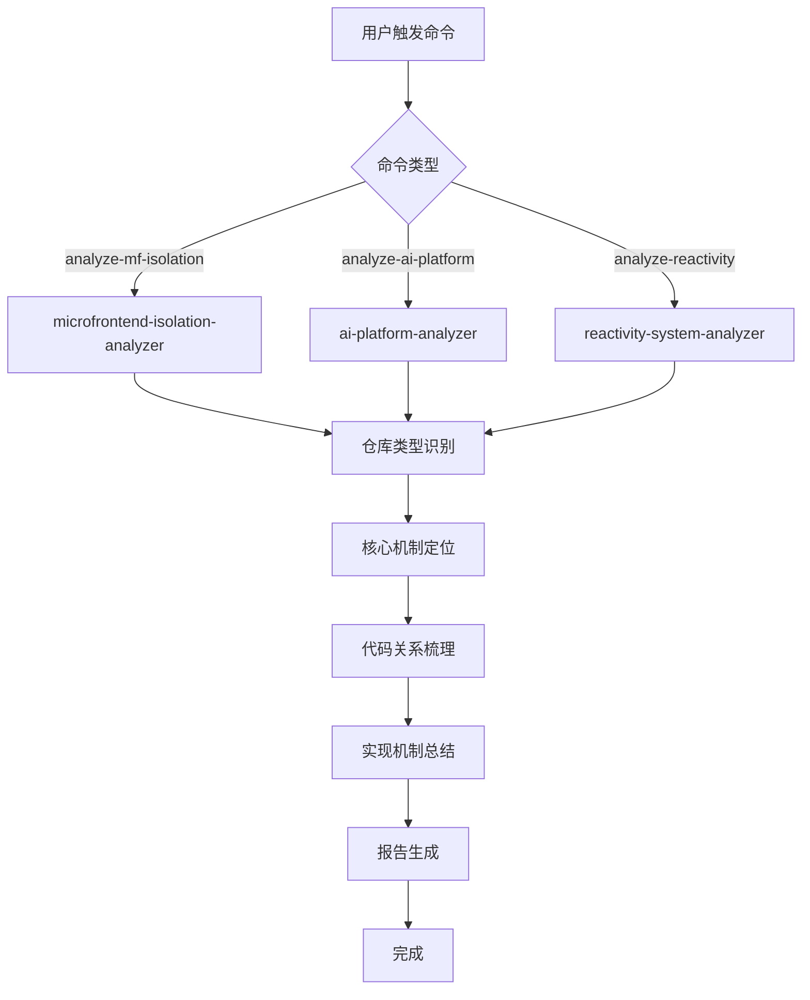
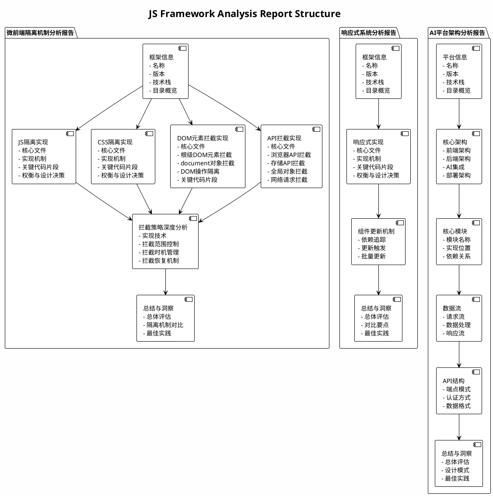

# 技术方案 003: JS Framework Repository Analyzer - 技术设计

## 文档信息

- **编号**: TECH-003
- **标题**: JS框架源码仓库分析器技术设计
- **版本**: 1.0.0
- **创建日期**: 2026-01-11
- **状态**: 待实现
- **依赖**: REQ-003 (JS框架源码仓库分析器需求)

## 1. 技术架构概述

### 1.1 整体设计思路

**核心理念**：通过探索式代码分析，自动发现和梳理三种类型JavaScript源码仓库的核心实现机制，帮助开发者快速理解复杂框架的内部运作原理。

**技术路线**：
```
仓库类型识别 → 核心机制定位 → 代码关系梳理 → 实现机制总结 → 报告生成
```

**设计原则**：
- **探索优先**：不预设具体实现方式，通过代码探索发现实际机制
- **自适应分析**：根据代码特征动态调整分析策略
- **通用性**：分析策略适用于各类框架，不预设具体框架列表

### 1.2 插件架构设计

```
js-framework-analyzer/
├── .claude-plugin/
│   └── plugin.json              # 插件元数据和配置
├── skills/                      # 核心技能模块
│   ├── microfrontend-isolation-analyzer/
│   │   └── SKILL.md             # 微前端隔离机制分析技能
│   ├── ai-platform-analyzer/
│   │   └── SKILL.md             # AI平台架构分析技能
│   ├── reactivity-system-analyzer/
│   │   └── SKILL.md             # 响应式系统分析技能
│   └── structure-explainer/
│       └── SKILL.md             # 代码结构解释技能
├── commands/                    # 用户命令接口
│   ├── analyze-mf-isolation.md  # 分析微前端隔离机制
│   ├── analyze-ai-platform.md   # 分析AI平台架构
│   └── analyze-reactivity.md    # 分析响应式系统
├── README.md                    # 英文文档
└── README-zh.md                 # 中文文档
```

## 2. 核心技能详细设计

### 2.1 报告语言支持策略

**核心要求**：所有分析报告必须同时提供英文和中文两个版本，确保双语文档的完整性和一致性。

**实现策略**：

1. **默认行为**：所有分析命令默认生成中英文双语报告
2. **可选控制**：通过 `--language` 参数控制输出语言
   - `--language both` (默认)：生成英文和中文两个文件
   - `--language en`：仅生成英文报告
   - `--language zh`：仅生成中文报告
3. **文件命名规范**：
   - 英文版：`{report-name}-en.md`
   - 中文版：`{report-name}-zh.md`
4. **内容一致性**：中英文报告内容必须完全对应，信息等价

**报告语言模板**：

```typescript
interface ReportLanguageConfig {
  language: 'both' | 'en' | 'zh';
  default: 'both';
}

interface BilingualReport {
  englishReport: string;
  chineseReport: string;
}
```

### 2.2 microfrontend-isolation-analyzer (微前端隔离机制分析技能)

**功能职责**：
- 分析微前端框架的JS隔离实现机制
- 分析微前端框架的CSS隔离实现机制
- 识别核心隔离相关文件和代码
- 生成隔离机制分析报告

**实现思路**：

```typescript
interface MicrofrontendIsolationAnalysisResult {
  frameworkInfo: {
    name: string;
    version: string;
    techStack: string[];
  };
  jsIsolation: {
    coreFiles: string[];           // 核心隔离文件路径
    mechanism: string;              // 隔离机制描述
    keyCodeSnippets: {
      file: string;
      lineRange: string;
      code: string;
      explanation: string;
    }[];
  };
  cssIsolation: {
    coreFiles: string[];           // 核心样式隔离文件路径
    mechanism: string;             // CSS隔离机制描述
    keyCodeSnippets: {
      file: string;
      lineRange: string;
      code: string;
      explanation: string;
    }[];
  };
  domInterception: {
    coreFiles: string[];           // DOM拦截核心文件路径
    htmlBodyHeadInterception: string; // html、body、head元素拦截机制
    documentInterception: string;   // document对象拦截机制
    domOperationIsolation: string; // DOM操作隔离机制
    keyCodeSnippets: {
      file: string;
      lineRange: string;
      code: string;
      explanation: string;
    }[];
  };
  apiInterception: {
    coreFiles: string[];           // API拦截核心文件路径
    browserApiInterception: string; // 浏览器原生API拦截
    storageApiInterception: string;  // 存储API拦截
    globalObjectInterception: string; // 全局对象拦截
    networkApiInterception: string;  // 网络请求拦截
    keyCodeSnippets: {
      file: string;
      lineRange: string;
      code: string;
      explanation: string;
    }[];
  };
  interceptionStrategy: {
    techniques: string;            // 拦截实现技术
    scope: string;                // 拦截范围控制
    timing: string;               // 拦截时机管理
    recovery: string;             // 拦截恢复机制
  };
}
```

**分析策略**：

**JS隔离分析流程**：
1. **框架识别**：通过package.json、目录结构、代码特征识别框架
2. **关键词搜索**：搜索与隔离相关的通用关键词
3. **核心文件定位**：基于搜索结果定位相关核心文件
4. **代码关系分析**：分析隔离机制的调用链和依赖关系
5. **机制总结**：用自然语言描述发现的隔离策略

**CSS隔离分析流程**：
1. **样式文件搜索**：搜索样式处理相关文件
2. **关键词搜索**：搜索与样式隔离相关的通用关键词
3. **处理逻辑分析**：分析样式加载、转换、隔离的处理逻辑
4. **机制总结**：用自然语言描述发现的CSS隔离策略

**DOM拦截分析流程**：
1. **DOM拦截文件搜索**：搜索与DOM操作拦截相关的文件
2. **根级元素拦截分析**：分析对html、body、head元素访问的拦截实现
3. **document对象拦截分析**：分析对document相关方法的拦截和代理
4. **DOM操作隔离分析**：分析DOM操作范围限制和隔离策略
5. **机制总结**：用自然语言描述发现的DOM拦截策略

**API拦截分析流程**：
1. **API拦截文件搜索**：搜索与API拦截相关的文件
2. **浏览器API拦截分析**：分析对location、history等浏览器API的拦截
3. **存储API拦截分析**：分析对localStorage、sessionStorage等存储API的拦截
4. **全局对象拦截分析**：分析对window、global等全局对象的拦截
5. **网络请求拦截分析**：分析对fetch、XMLHttpRequest等网络API的拦截
6. **机制总结**：用自然语言描述发现的API拦截策略

**拦截策略深度分析流程**：
1. **拦截技术识别**：分析使用的拦截技术（Proxy、Object.defineProperty等）
2. **拦截范围分析**：分析拦截的API范围和放行策略
3. **拦截时机分析**：分析拦截发生的时机和生命周期管理
4. **恢复机制分析**：分析应用卸载时的拦截恢复机制

### 2.2 ai-platform-analyzer (AI Platform Architecture Analyzer) **[NOT AVAILABLE]**

**功能职责**：
- 分析AI应用平台的整体架构设计
- 识别核心功能模块的实现位置
- 分析各模块之间的交互方式
- 生成平台架构分析报告

**实现思路**：

```typescript
interface AIPlatformAnalysisResult {
  platformInfo: {
    name: string;
    techStack: string[];
  };
  architecture: {
    frontendTech: string[];       // 前端技术栈
    backendTech: string[];        // 后端技术栈
    aiIntegration: string[];      // AI集成方式
    deployment: string;          // 部署架构
  };
  coreModules: {
    moduleName: string;
    location: string;            // 实现位置
    description: string;
    dependencies: string[];       // 依赖的其他模块
  }[];
  dataFlow: string;              // 数据流描述
  apiStructure: {
    endpointPattern: string;     // API端点模式
    authMethod: string;          // 认证方式
    dataFormat: string;          // 数据格式
  };
}
```

**分析策略**：

**架构发现流程**：
1. **技术栈识别**：通过package.json、依赖文件识别技术栈
2. **目录结构分析**：分析src/目录的组织方式，识别模块划分
3. **配置文件分析**：分析配置文件了解架构决策
4. **入口文件追踪**：从入口文件追踪核心模块
5. **模块交互分析**：分析模块间的调用和依赖关系

### 2.3 reactivity-system-analyzer (响应式系统分析技能)

**功能职责**：
- 分析前端框架的响应式系统实现机制
- 识别响应式系统相关的核心文件和代码
- 分析数据变化驱动视图更新的实现策略
- 生成响应式系统分析报告

**实现思路**：

```typescript
interface ReactivityAnalysisResult {
  frameworkInfo: {
    name: string;
    version: string;
  };
  reactivitySystem: {
    coreFiles: string[];           // 核心响应式文件路径
    mechanism: string;              // 响应式机制描述
    keyCodeSnippets: {
      file: string;
      lineRange: string;
      code: string;
      explanation: string;
    }[];
  };
  components: {
    trackingMechanism: string;      // 依赖追踪机制
    updateMechanism: string;        // 更新触发机制
    batchUpdate: boolean;           // 是否支持批量更新
  };
}
```

**分析策略**：

**响应式系统发现流程**：
1. **框架识别**：通过package.json识别框架
2. **关键词搜索**：搜索与响应式相关的通用关键词
3. **核心文件定位**：定位响应式系统核心文件
4. **依赖追踪分析**：分析依赖追踪的实现方式
5. **更新机制分析**：分析视图更新的触发机制
6. **机制总结**：用自然语言描述发现的响应式策略

### 2.4 structure-explainer (代码结构解释技能)

**功能职责**：
- 为用户解释代码结构和文件组织
- 提供目录结构的可视化说明
- 解释关键文件的作用和职责

**实现思路**：

```typescript
interface StructureExplanationResult {
  overview: string;               // 项目概览
  directoryStructure: {
    path: string;
    type: 'dir' | 'file';
    description: string;
    children?: StructureExplanationResult['directoryStructure'][];
  }[];
  keyFiles: {
    path: string;
    purpose: string;
    importance: 'critical' | 'important' | 'standard';
  }[];
}
```

**分析策略**：
1. 递归扫描项目目录结构
2. 识别关键文件（package.json, tsconfig.json等）
3. 基于文件名和目录名推断用途
4. 生成层次化的结构说明

## 3. 命令接口设计

### 3.1 analyze-mf-isolation 命令

**命令定义**：
```markdown
---
name: analyze-mf-isolation
description: |
  Analyze the JS and CSS isolation mechanisms of a microfrontend framework.
  Use when working with any microfrontend framework.
parameters:
  - name: focus
    type: string
    required: false
    description: Analysis focus: 'js', 'css', or 'both' (default: 'both')
  - name: language
    type: string
    required: false
    description: Report language: 'en', 'zh', or 'both' (default: 'both')
---
```

**用户触发方式**：
- `/analyze-mf-isolation`
- `/analyze-mf-isolation --focus js`

### 3.2 analyze-ai-platform 命令 **[TODO: 待实现]**

**命令定义**：
```markdown
---
name: analyze-ai-platform
description: |
  Analyze the architecture and core features of an AI application platform.
  Use when working with any AI application platform.
parameters:
  - name: depth
    type: string
    required: false
    description: Analysis depth: 'overview', 'modules', or 'detailed' (default: 'modules')
  - name: language
    type: string
    required: false
    description: Report language: 'en', 'zh', or 'both' (default: 'both')
---
```

**用户触发方式**：
- `/analyze-ai-platform`
- `/analyze-ai-platform --depth detailed`

### 3.3 analyze-reactivity 命令

**命令定义**：
```markdown
---
name: analyze-reactivity
description: |
  Analyze the reactivity system implementation of a frontend framework.
  Use when working with any frontend framework.
parameters:
  - name: focus
    type: string
    required: false
    description: Analysis focus: 'tracking', 'update', or 'full' (default: 'full')
  - name: language
    type: string
    required: false
    description: Report language: 'en', 'zh', or 'both' (default: 'both')
---
```

**用户触发方式**：
- `/analyze-reactivity`
- `/analyze-reactivity --focus tracking`

## 4. 工作流程设计

### 4.1 插件执行流程



### 4.2 技能调用策略

**单技能执行**：
- 每个命令对应一个核心分析技能
- 技能内部完成完整分析流程
- 支持可选的 `structure-explainer` 辅助

**错误处理**：
- 仓库类型无法识别：基于代码特征继续分析
- 核心文件未找到：提供搜索建议和可能的文件位置
- 分析结果不完整：提供部分结果并说明限制

## 5. 数据流设计

### 5.1 技能间数据传递

```typescript
interface AnalyzerContext {
  projectInfo: {
    rootPath: string;
    frameworkType: string;
    frameworkVersion: string;
  };
  analysisResult: MicrofrontendIsolationAnalysisResult |
                  AIPlatformAnalysisResult |
                  ReactivityAnalysisResult;
  reportPath: string;
}
```

### 5.2 文件系统交互

**读取操作**：
- 扫描项目目录结构
- 读取package.json等配置文件
- 读取核心源码文件
- 分析代码文件内容

**写入操作**：
- 生成分析报告文件
- 可选：保存分析中间结果

## 6. 探索式分析算法设计

### 6.1 关键词搜索策略

**微前端隔离分析关键词**：

| 分析类型 | 关键词集合 |
|---------|-----------|
| JS隔离 | sandbox, isolation, proxy, window, global, snapshot, hijack, intercept |
| CSS隔离 | style, css, shadow, scoped, prefix, namespace, stylesheet |
| DOM拦截 | document, querySelector, getElementById, createElement, html, body, head, dom, element |
| API拦截 | location, history, localStorage, sessionStorage, fetch, XMLHttpRequest, addEventListener |
| 拦截策略 | proxy, defineProperty, override, hijack, intercept, patch, restore, recover |

**AI平台分析关键词**：

| 分析类型 | 关键词集合 |
|---------|-----------|
| 架构 | api, service, component, module, workflow, agent, chat |
| 数据流 | store, state, reducer, action, dispatch, effect |
| 认证 | auth, login, token, session, permission, role |

**响应式系统分析关键词**：

| 分析类型 | 关键词集合 |
|---------|-----------|
| 响应式 | reactive, effect, track, trigger, observe, signal, proxy |
| 依赖追踪 | dependency, track, collect, watch, subscribe |
| 更新机制 | update, render, flush, batch, queue, schedule |

### 6.2 文件定位算法

**基于目录结构的定位**：
```
1. 扫描项目根目录和src/目录
2. 识别目录名称特征
3. 优先分析核心目录下的文件
4. 排除测试、文档、示例目录
```

**基于文件名的定位**：
```
1. 搜索包含核心关键词的文件名
2. 优先分析index文件和主入口文件
3. 分析类型定义文件（.d.ts, interface等）
```

**基于代码内容的定位**：
```
1. 使用Grep搜索关键词
2. 分析命中代码的上下文
3. 追踪函数调用链
4. 识别核心实现逻辑
```

### 6.3 代码关系梳理算法

**依赖分析**：
```
1. 分析import/export语句
2. 构建文件依赖图
3. 识别核心依赖路径
4. 定位关键实现文件
```

**调用链分析**：
```
1. 从入口API开始追踪
2. 分析函数调用关系
3. 识别关键调用路径
4. 定位核心实现逻辑
```

## 7. 报告生成设计

### 7.1 报告整体结构流程图



### 7.2 微前端隔离机制分析报告模板

**英文版模板** (`isolation-report-en.md`)：

```markdown
# Microfrontend Framework Isolation Analysis

## Framework Information
- Framework: {name}
- Version: {version}
- Tech Stack: {techStack}

## JavaScript Isolation

### Core Files
{jsIsolationFiles}

### Implementation Mechanism
{jsIsolationMechanism}

### Key Code Snippets
{jsIsolationCode}

### Trade-offs & Design Decisions
{jsTradeoffs}

## CSS Isolation

### Core Files
{cssIsolationFiles}

### Implementation Mechanism
{cssIsolationMechanism}

### Key Code Snippets
{cssIsolationCode}

### Trade-offs & Design Decisions
{cssTradeoffs}

## DOM Element Interception

### Core Files
{domInterceptionFiles}

### Interception Mechanisms

#### Root-level DOM Element Interception
{htmlBodyHeadInterception}

#### Document Object Interception
{documentInterception}

#### DOM Operation Isolation
{domOperationIsolation}

### Key Code Snippets
{domInterceptionCode}

### Trade-offs & Design Decisions
{domTradeoffs}

## API Interception

### Core Files
{apiInterceptionFiles}

### Interception Mechanisms

#### Browser Native API Interception
{browserApiInterception}

#### Storage API Interception
{storageApiInterception}

#### Global Object Interception
{globalObjectInterception}

#### Network Request Interception
{networkApiInterception}

### Key Code Snippets
{apiInterceptionCode}

### Trade-offs & Design Decisions
{apiTradeoffs}

## Interception Strategy Deep Analysis

### Implementation Techniques
{interceptionTechniques}

### Interception Scope Control
{interceptionScope}

### Interception Timing Management
{interceptionTiming}

### Interception Recovery Mechanism
{interceptionRecovery}

## Summary & Insights

### Overall Assessment
{overallAssessment}

### Isolation Mechanism Comparison
{isolationComparison}

### Best Practices
{bestPractices}
```

**中文版模板** (`isolation-report-zh.md`)：

```markdown
# 微前端框架隔离机制分析

## 框架信息
- 框架名称：{name}
- 版本：{version}
- 技术栈：{techStack}

## JavaScript 隔离实现

### 核心文件
{jsIsolationFiles}

### 实现机制
{jsIsolationMechanism}

### 关键代码片段
{jsIsolationCode}

### 权衡与设计决策
{jsTradeoffs}

## CSS 隔离实现

### 核心文件
{cssIsolationFiles}

### 实现机制
{cssIsolationMechanism}

### 关键代码片段
{cssIsolationCode}

### 权衡与设计决策
{cssTradeoffs}

## DOM 元素拦截实现

### 核心文件
{domInterceptionFiles}

### 拦截机制

#### 根级DOM元素拦截
{htmlBodyHeadInterception}

#### document对象拦截
{documentInterception}

#### DOM操作隔离
{domOperationIsolation}

### 关键代码片段
{domInterceptionCode}

### 权衡与设计决策
{domTradeoffs}

## API 拦截实现

### 核心文件
{apiInterceptionFiles}

### 拦截机制

#### 浏览器原生API拦截
{browserApiInterception}

#### 存储API拦截
{storageApiInterception}

#### 全局对象拦截
{globalObjectInterception}

#### 网络请求拦截
{networkApiInterception}

### 关键代码片段
{apiInterceptionCode}

### 权衡与设计决策
{apiTradeoffs}

## 拦截策略深度分析

### 实现技术
{interceptionTechniques}

### 拦截范围控制
{interceptionScope}

### 拦截时机管理
{interceptionTiming}

### 拦截恢复机制
{interceptionRecovery}

## 总结与洞察

### 总体评估
{overallAssessment}

### 隔离机制对比
{isolationComparison}

### 最佳实践
{bestPractices}
```

### 7.3 响应式系统分析报告模板

**英文版模板** (`reactivity-report-en.md`)：

```markdown
# Frontend Framework Reactivity System Analysis

## Framework Information
- Framework: {name}
- Version: {version}
- Tech Stack: {techStack}

## Reactivity Implementation

### Core Files
{reactivityFiles}

### Implementation Mechanism
{reactivityMechanism}

### Key Code Snippets
{reactivityCode}

### Trade-offs & Design Decisions
{reactivityTradeoffs}

## Component Update Mechanism

### Dependency Tracking
{trackingMechanism}

### Update Triggering
{updateMechanism}

### Batch Updates
{batchUpdateInfo}

## Summary & Insights

### Overall Assessment
{overallAssessment}

### Comparison Points
{comparisonPoints}

### Best Practices
{bestPractices}
```

**中文版模板** (`reactivity-report-zh.md`)：

```markdown
# 前端框架响应式系统分析

## 框架信息
- 框架名称：{name}
- 版本：{version}
- 技术栈：{techStack}

## 响应式实现

### 核心文件
{reactivityFiles}

### 实现机制
{reactivityMechanism}

### 关键代码片段
{reactivityCode}

### 权衡与设计决策
{reactivityTradeoffs}

## 组件更新机制

### 依赖追踪
{trackingMechanism}

### 更新触发
{updateMechanism}

### 批量更新
{batchUpdateInfo}

## 总结与洞察

### 总体评估
{overallAssessment}

### 对比要点
{comparisonPoints}

### 最佳实践
{bestPractices}
```

### 7.4 AI平台架构分析报告模板 **[TODO: 待实现]**

**英文版模板** (`architecture-report-en.md`)：

```markdown
# AI Application Platform Architecture Analysis

## Platform Information
- Platform: {name}
- Version: {version}
- Tech Stack: {techStack}

## Core Architecture

### Frontend Architecture
{frontendArchitecture}

### Backend Architecture
{backendArchitecture}

### AI Integration
{aiIntegration}

### Deployment Architecture
{deploymentArchitecture}

## Core Modules

{coreModules}

## Data Flow

{dataFlow}

## API Structure

### Endpoint Patterns
{endpointPatterns}

### Authentication & Authorization
{authMethod}

### Data Format
{dataFormat}

## Summary & Insights

### Overall Assessment
{overallAssessment}

### Design Patterns
{designPatterns}

### Best Practices
{bestPractices}
```

**中文版模板** (`architecture-report-zh.md`)：

```markdown
# AI应用平台架构分析

## 平台信息
- 平台名称：{name}
- 版本：{version}
- 技术栈：{techStack}

## 核心架构

### 前端架构
{frontendArchitecture}

### 后端架构
{backendArchitecture}

### AI集成
{aiIntegration}

### 部署架构
{deploymentArchitecture}

## 核心模块

{coreModules}

## 数据流

{dataFlow}

## API结构

### 端点模式
{endpointPatterns}

### 认证与授权
{authMethod}

### 数据格式
{dataFormat}

## 总结与洞察

### 总体评估
{overallAssessment}

### 设计模式
{designPatterns}

### 最佳实践
{bestPractices}
```

### 7.5 报告输出位置

**文件命名规范**：

- 默认输出到项目根目录
- 英文版：`{project-root}/{report-name}-en.md`
- 中文版：`{project-root}/{report-name}-zh.md`
- JSON格式（如选择）：`{project-root}/{report-name}.json`

**输出位置示例**：

```bash
# 微前端隔离分析
isolation-report-en.md
isolation-report-zh.md

# 响应式系统分析
reactivity-report-en.md
reactivity-report-zh.md

# AI平台架构分析
architecture-report-en.md
architecture-report-zh.md
```

**输出控制**：

- 支持 `--save` 参数指定自定义路径
- 支持输出到控制台（仅显示内容，不保存文件）
- 通过 `--language` 参数控制生成的语言版本

---

*此技术方案将指导插件的具体实现，确保功能的完整性和技术的可行性。*
