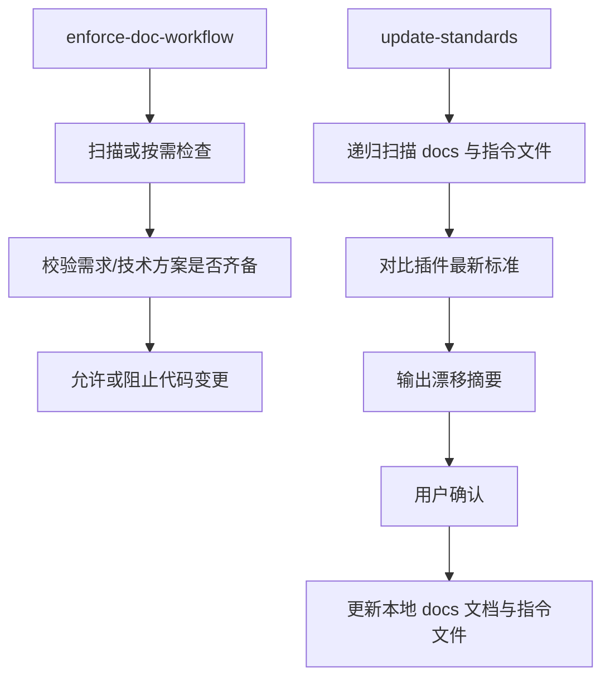
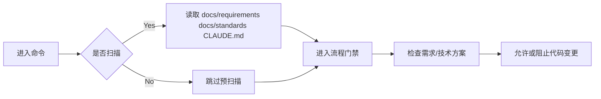
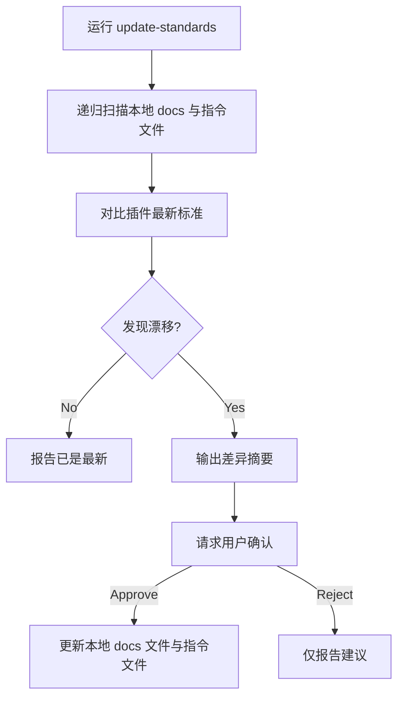
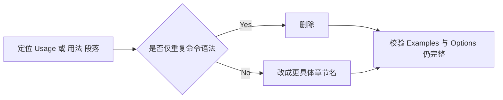
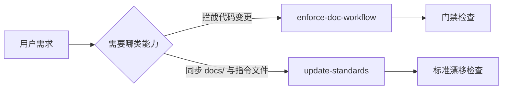

# 技术方案 20260312: update-standards 命令职责拆分 - 技术设计

## 文档信息

- **编号**: TECH-20260312
- **标题**: update-standards 命令职责拆分
- **版本**: 1.0.0
- **创建日期**: 2026-03-12
- **状态**: 待实现
- **依赖**: REQ-20260312 (update-standards 命令职责拆分)
- **分支**: req-20260312-visual-first-technical-design

## 1. 技术架构概述

### 1.1 整体设计思路

本次改动只调整命令层文案与职责边界, 不引入新的脚本执行器或目录结构。核心目标是让 `enforce-doc-workflow` 聚焦于“代码变更前的文档门禁”, 同时新增 `update-standards` 作为“`docs/` 全量文档与指令文件漂移检查/同步”的专用入口。

### 1.2 架构设计与实体设计



```text
plugins/ai-doc-driven-dev/
├── commands/
│   ├── enforce-doc-workflow.md          [修改]
│   └── update-standards.md              [新增]
├── README.md                            [修改]
└── README-zh.md                         [修改]
```

## 2. 核心命令详细设计

### 2.1 `enforce-doc-workflow.md` (流程门禁)

**功能职责**：
- 保留扫描确认、文档缺失检查、流程强制执行
- 移除模板/规范同步职责
- 通过 Related Commands 引导用户使用 `update-standards`

**职责变更表**：
| 项目 | 修改前 | 修改后 | 变更状态 |
| --- | --- | --- | --- |
| 命令主体目标 | 文档门禁 + `docs/` 同步 | 文档门禁 | <span style="color:green">职责收敛</span> |
| `~~Template Synchronization & Update~~` 段落 | `~~存在~~` | 删除 | <span style="color:red">(-移除)</span> |
| Related Commands | 无 `update-standards` | 增加 `update-standards` | <span style="color:green">(+新增)</span> |

**逻辑执行机制**：


**规则/约束**：
- 不再负责比较本地文件与插件最新模板的差异
- 不在正文中主动描述“检测最新标准并自动更新”

### 2.2 `update-standards.md` (全量 docs 同步)

**功能职责**：
- 检查本地 `docs/**/*.md` 与指令文件是否落后于插件最新标准
- 汇总缺失原则、模板漂移和待更新文件
- 在用户确认后更新本地 `docs/` 文档与指令文件

**检查目标定义**：
| 目标 | 范围 | 必查 | 说明 |
| --- | --- | --- | --- |
| `docs/**/*.md` | 全量项目文档 | 是 | 递归覆盖 `requirements/`、`design/`、`analysis/`、`standards/` 及自定义子目录 |
| `CLAUDE.md` | 指令文件 | 是 | 文档驱动工作流规则 |
| `AGENTS.md` / `GEMINI.md` | 指令文件 | 否 | 存在时纳入同步 |

**逻辑执行机制**：


**规则/约束**：
- 任何写入操作都需要先展示差异并获得确认
- `docs/` 目录下的历史文档不再排除在同步范围之外
- 重点覆盖“Visual-First Design Principles”等新增原则
- 命令定位为维护/升级入口, 不承担代码变更门禁

### 2.3 README 文档更新

**功能职责**：
- 在中英文 README 中增加 `update-standards` 命令说明
- 调整 `enforce-doc-workflow` 描述, 强调其为门禁命令
- 将项目内命令示例改为供应商中立写法, 移除 `claude` 前缀

**文档改动表**：
| 文档 | 修改内容 | 变更状态 |
| --- | --- | --- |
| `README.md` | 新增 `update-standards` 章节 | <span style="color:green">(+新增)</span> |
| `README-zh.md` | 新增 `update-standards` 章节 | <span style="color:green">(+新增)</span> |
| `enforce-doc-workflow` 说明 | 保持扫描说明, 去掉同步职责 | <span style="color:green">职责对齐</span> |
| 项目内命令示例 | `claude <command>` → `<command>` | <span style="color:green">兼容 Codex</span> |

### 2.4 命令示例中立化

**功能职责**：
- 清理根 README、插件 README、命令文档、相关需求/设计文档中的 `claude <command>` 示例
- 保留命令名与参数, 去掉特定 CLI 前缀

**转换规则**：
| 旧写法 | 新写法 | 适用场景 |
| --- | --- | --- |
| `<runner> enforce-doc-workflow` | `enforce-doc-workflow` | 命令使用示例 |
| `<runner> analyze-docs --detailed` | `analyze-docs --detailed` | 参数示例 |
| `<runner> plugin install js-framework-analyzer` | `plugin install js-framework-analyzer` | 插件安装示例 |

**逻辑执行机制**：


### 2.5 `Usage` 段落清理

**功能职责**：
- 删除命令文档中仅重复单行命令语法的 `## Usage`
- 删除 README 命令章节中冗余的 `**Usage:**` / `**用法:**`
- 将总览型 README 的 `## Usage/## 使用` 调整为更具体的 `## Commands/## 命令`

**清理规则**：
| 旧结构 | 新结构 | 处理方式 |
| --- | --- | --- |
| `## Usage` + 单行命令块 | 直接进入 `## Options` 或 `## Behavior` | 删除整段 |
| `**Usage:**` + 单行命令块 | 保留 `Features` / `What it does` / `Example workflow` | 删除整段 |
| `## Usage` + `### Commands` | `## Commands` | 重命名章节 |

**逻辑执行机制**：


## 强制性开发工作流程

1. 先创建 REQ/TECH 文档
2. 再修改命令文档
3. 再统一更新项目内命令示例
4. 最后校验引用

## 约束条件与改动说明

| 项目 | 旧方案 | 新方案 | 变更状态 |
| --- | --- | --- | --- |
| 命令入口 | `enforce-doc-workflow` 同时处理两类任务 | 两个命令分别处理 | <span style="color:green">职责拆分</span> |
| 用户触发同步 | 进入门禁命令后隐含触发 | 手动运行 `update-standards` | <span style="color:green">更显式</span> |
| `docs/` 更新范围 | 局部模板视角 | 全量 `docs/**/*.md` | <span style="color:green">范围扩大</span> |
| 标准更新路径 | 与流程门禁耦合 | 独立维护入口 | <span style="color:green">更清晰</span> |
| 文档示例入口 | `claude <command>` | 中立 `<command>` | <span style="color:green">跨 Agent 兼容</span> |
| 文档结构 | 含冗余 `Usage / 用法` | 删除冗余段落 | <span style="color:green">更精简</span> |

## 3. 工作流程设计

### 3.1 插件执行流程



### 3.2 技能调用策略

- `enforce-doc-workflow` 优先围绕文档齐备性和计划一致性工作
- `update-standards` 优先围绕全量 `docs/` 文档与指令文件同步工作
- 两者可以串联使用, 但不应再互相隐式吞并职责

### 3.3 分支策略与缺陷处理

- 当前改动在现有工作分支中完成
- 若后续 `update-standards` 需要新增参数, 应以独立需求继续扩展

## 4. 数据流设计

### 4.1 技能间数据传递


### 4.2 文件系统交互

| 文件 | 读取 | 写入 | 说明 |
| --- | --- | --- | --- |
| `README.md` | 是 | 是 | 根文档命令示例中立化 |
| `plugins/ai-doc-driven-dev/commands/enforce-doc-workflow.md` | 是 | 是 | 删除同步职责 |
| `plugins/ai-doc-driven-dev/commands/update-standards.md` | 否 | 是 | 新建命令 |
| `plugins/ai-doc-driven-dev/README.md` | 是 | 是 | 英文说明更新 |
| `plugins/ai-doc-driven-dev/README-zh.md` | 是 | 是 | 中文说明更新 |
| `plugins/*/commands/*.md` | 是 | 是 | 命令示例中立化 |
| `plugins/*/README*.md` | 是 | 是 | 插件文档示例中立化 |
| `docs/requirements/*.md` / `docs/design/*.md` | 是 | 是 | 历史设计文档中的命令示例清理 |
| `plugins/*/commands/*.md` | 是 | 是 | 删除 `Usage` 段落 |
| `plugins/*/README*.md` | 是 | 是 | 删除 `Usage` / `用法` 段落 |

## 5. 性能优化策略

### 5.1 缓存机制

- 不引入缓存
- 保持命令定义层面的轻量修改

### 5.2 并行处理

- 不涉及并行执行逻辑
- 仅在文档校验阶段使用并行读取

## 6. 扩展性设计

### 6.1 模板系统

- `update-standards` 为后续扩展 `--check-only`、`--scope` 等参数预留独立入口

### 6.2 插件接口

- 保持现有命令文件结构不变
- 新命令遵循现有 frontmatter 约定

## 7. 质量保证

### 7.1 测试策略

| 阶段 | 验证方式 | 通过标准 |
| --- | --- | --- |
| Red | 检查 `update-standards.md` 不存在且项目仍有 `claude <command>` | 命令未满足新需求 |
| Green | 检查新命令已创建、旧职责已移除、`claude <command>` 与 `Usage` 残留清零 | 职责拆分完成 |
| Refactor | 检查 README 与 Related Commands 一致 | 用户文档无残留歧义 |

### 7.2 质量指标

| 指标 | 目标 |
| --- | --- |
| 旧职责残留 | 0 处 |
| 新命令可发现性 | README 与 Related Commands 均可找到 |
| `docs/` 覆盖范围 | 覆盖所有 `docs/**/*.md` |
| `claude <command>` 残留 | 0 处 |
| `Usage / 用法` 残留 | 0 处 |
| 中英文文档同步 | 100% |
