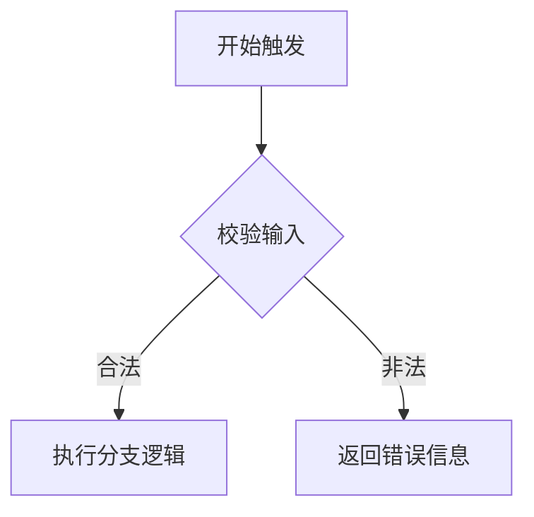
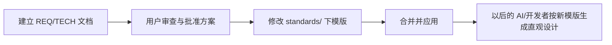

# 技术方案 20260312: 图表优先的技术方案设计原则 - 技术设计

## 文档信息

- **编号**: TECH-20260312
- **标题**: 图表优先的技术方案设计原则
- **版本**: 1.0.0
- **创建日期**: 2026-03-12
- **状态**: 待实现
- **依赖**: REQ-20260312 (图表优先的技术方案设计原则)
- **分支**: req-20260312-visual-first-technical-design

## 1. 技术架构概述

### 1.1 整体设计思路

为了推行 REQ-20260312 定义的“图表优先（Visual-First）”原则，并显著减少用户在阅读长篇技术文档时的认知负担，核心技术设计是**修改脚手架中的文档模板定义**。AI 智能体基于这些模板及其注释指引来生成体系架构文件，因此在模板层面上强制施加约束，即可有效地规范后续所有项目的格式质量。

### 1.2 架构设计与修改范围

```text
claude-community-plugins/
└── docs/
    └── standards/
        ├── technical-design-template.md   (核心修改：加入图表强制使用占位符与规范说明)
        └── requirements-template.md       (辅助修改：增加表格形式展现参数与状态的要求)
```

## 2. 核心详细设计

### 2.1 修改 `technical-design-template.md` 细节

在原模板中容易产生大量散文式叙述的章节，植入明确的规范和示例块。

**A. 表格优先 (基于 Markdown Table)**
规范“数据结构”、“参数配置”、“状态定义”类的枚举，必须使用表格呈现：
```markdown
<!-- 强制约束：属性及配置请使用如下 Table 呈现，禁止使用无序文本列表 -->
| 字段名 | 类型 | 必填 | 说明 |
| --- | --- | --- | --- |
| id | string | 是 | 唯一标识符 |
```

**B. 流程与结构优先 (基于 Mermaid)**
在“整体设计思路”、“功能职责”、“执行流程”、“数据流设计”等所有涉及逻辑走向的节点中注入代码块，并附加强制提示 `<!-- 强制：必须使用 Mermaid 流程图或时序图展示执行逻辑，并尽量减少额外文字解释 -->`。
针对数据库设计与实体关系，强制提示 `<!-- 强制：数据库与实体模型必须使用 Mermaid erDiagram 绘制 -->`：


**C. 改动差异优先 (Inline Diff Highlighting)**
在任何涉及技术方案变更、代码结构变动、或工作流调整的章节，禁止将“改前”与“改后”拆分为两张图或两张表。强制要求在“同一视图”内直观展示变更：

- **针对流程与结构图 (Mermaid)**：必须利用 `style` 或 `classDef` 语法，或在文字节点内直接标注。比如，新增节点标为绿色，删除节点标为红色并带虚线，修改节点标为黄色。
  ```mermaid
  flowchart LR
    classDef added fill:#d4edda,stroke:#28a745
    classDef removed fill:#f8d7da,stroke:#dc3545,stroke-dasharray: 5 5
    
    A[原有逻辑] --> B[已废弃节点 - Removed]:::removed
    A --> C[全新逻辑 - Added]:::added
  ```

- **针对数据结构与参数配置 (Markdown Table)**：必须在同一个表格的同一行内说明字段变更，可以使用 `~~删除线~~` 或直接注明 `(+新增) / (-废弃)`。
  | 字段名 | 类型 | 说明 | 变更状态 |
  | --- | --- | --- | --- |
  | `~~old_id~~` | string | 老的唯一标识符 | <span style="color:red">(-废弃)</span> |
  | `new_id` | string | 新的唯一标识符 | <span style="color:green">(+新增)</span> |

### 2.2 工作流程约束说明

修改模板文件中的公共要求：
- 在技术设计的导言或规范段落，增加一条显式原则：“**在阐述系统架构、组件交互、复杂数据流向时，原则上优先展示 Mermaid 图表，并在必要时辅以 Markdown 表格，严格精简补充性文字。**”

## 3. 工作流程设计

本次技术方案变更的落地流程如下：



## 4. 影响范围与兼容性

- **向后兼容**：不强制翻新现有（旧）文档。此规范仅约束在 2026-03-12 及以后新建的内容。
- **渲染安全**：要求优先使用基础且广泛支持的 `flowchart` 与 `sequenceDiagram` 类型，避免使用在某些编辑器中解析异常的偏门语法，确保多端和 AI 解析的安全展示。
