# TECH-20260314: OpenClaw 诊断技能技术设计

> **文档 ID**: TECH-20260314
> **需求文档**: REQ-20260314
> **状态**: 草稿
> **创建日期**: 2026-03-14
> **最后更新**: 2026-03-14

## 1. 技术架构

### 1.1 整体架构

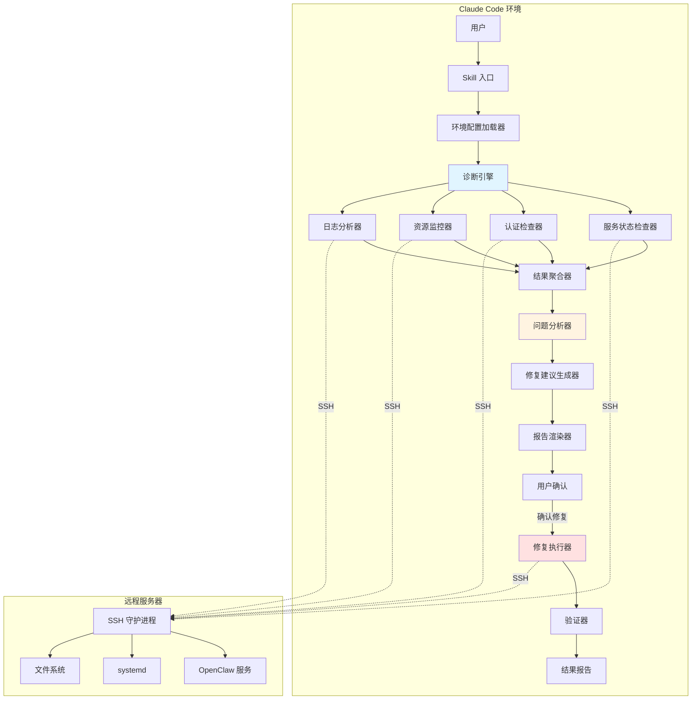

### 1.2 技术栈

| 组件 | 技术选型 | 理由 |
|------|----------|------|
| **Skill 定义** | Markdown + Frontmatter | 符合 Claude Code Plugin 规范 |
| **脚本语言** | Bash + Python | 远程服务器已有环境，无需额外安装 |
| **数据格式** | JSON | 标准化、易解析 |
| **通信协议** | SSH | 安全、标准 |
| **配置管理** | 环境变量 | 灵活、安全 |

### 1.3 核心组件

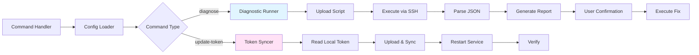

**组件说明**:
- **Config Loader**: 加载环境变量配置
- **Diagnostic Runner**: 执行诊断流程
- **Token Syncer**: Token 同步流程
- **Report Generator**: 生成诊断报告
- **Fix Executor**: 执行修复操作

## 2. 数据模型

### 2.1 配置模型

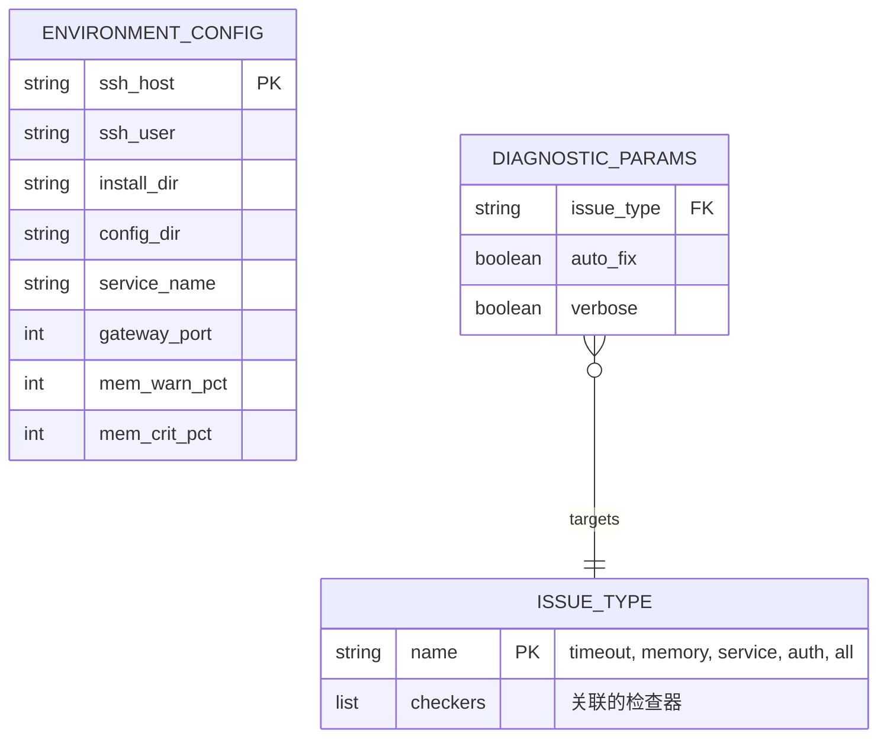

**环境配置结构** (JSON Schema):
```json
{
  "$schema": "http://json-schema.org/draft-07/schema#",
  "type": "object",
  "properties": {
    "ssh_host": {"type": "string", "description": "远程服务器地址"},
    "ssh_user": {"type": "string", "default": "root"},
    "install_dir": {"type": "string", "default": "/root/openclaw"},
    "config_dir": {"type": "string", "default": "/root/.openclaw"},
    "service_name": {"type": "string", "default": "openclaw"},
    "gateway_port": {"type": "integer", "default": 18789},
    "mem_warn_pct": {"type": "integer", "default": 70},
    "mem_crit_pct": {"type": "integer", "default": 80}
  },
  "required": ["ssh_host"]
}
```

**说明**: `ssh_host` 必须由用户通过环境变量提供，不设默认值

### 2.2 诊断结果模型

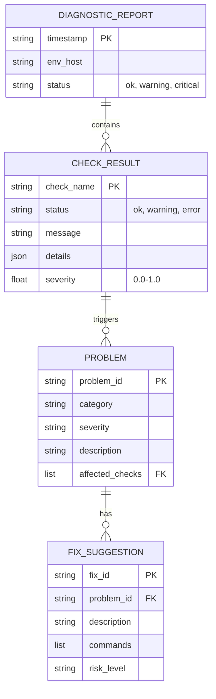

**诊断结果结构** (TypeScript 风格):
```typescript
interface DiagnosticReport {
  timestamp: string;          // ISO 8601
  env: EnvironmentConfig;
  overall_status: 'ok' | 'warning' | 'critical';
  checks: CheckResult[];
  problems: Problem[];
  suggestions: FixSuggestion[];
  metadata: {
    duration_ms: number;
    checks_run: number;
    checks_passed: number;
  };
}

interface CheckResult {
  name: string;               // 'service_status', 'token_expiry', etc.
  status: 'ok' | 'warning' | 'error';
  message: string;
  details: Record<string, any>;
  severity: number;           // 0.0 (info) - 1.0 (critical)
  timestamp: string;
}

interface Problem {
  id: string;
  category: 'service' | 'auth' | 'resource' | 'config';
  severity: 'low' | 'medium' | 'high' | 'critical';
  description: string;
  affected_checks: string[];
  root_cause?: string;
}

interface FixSuggestion {
  id: string;
  problem_id: string;
  description: string;
  commands: Command[];
  risk_level: 'safe' | 'moderate' | 'dangerous';
  auto_executable: boolean;
}

interface Command {
  description: string;
  exec: string;               // Bash command
  requires_confirmation: boolean;
}
```

## 3. 核心流程设计

### 3.1 诊断执行流程

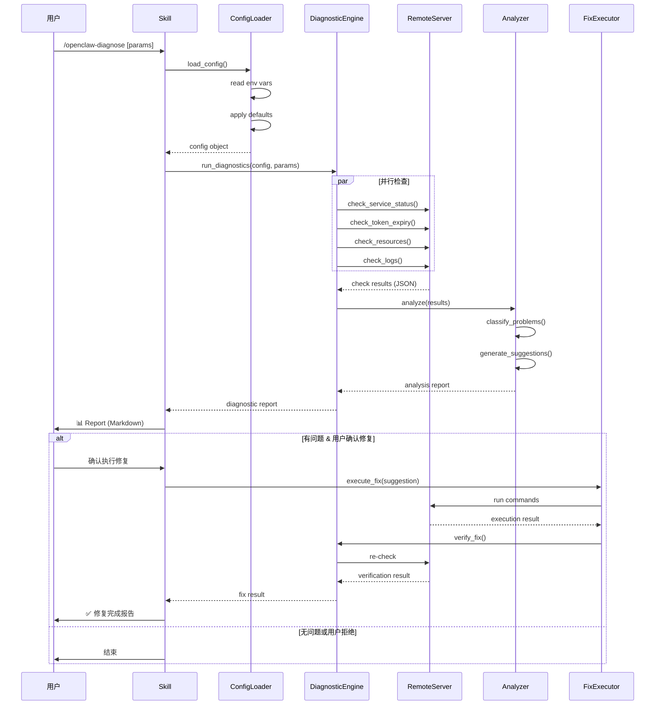

### 3.2 检查器执行流程

**服务状态检查器**:
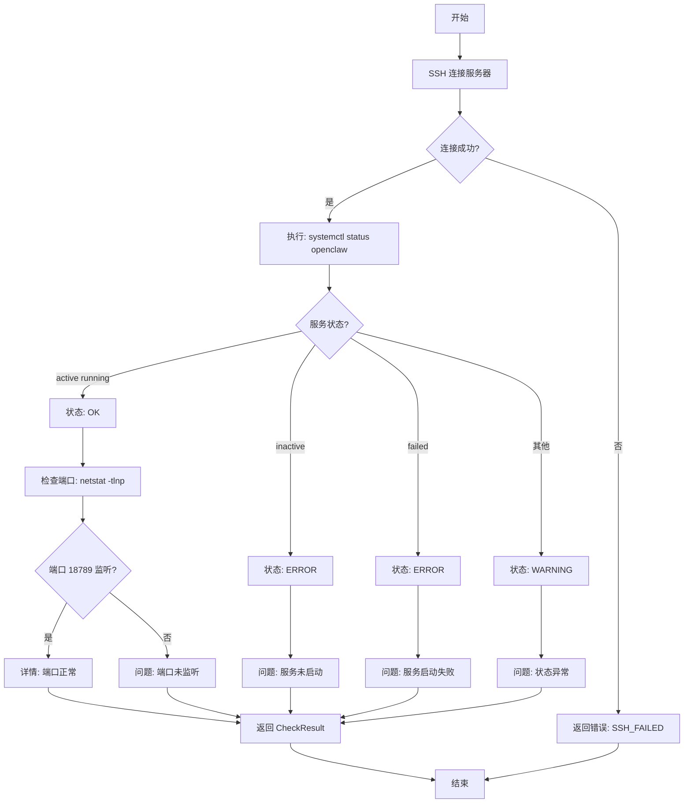

**Token 有效期检查器**:
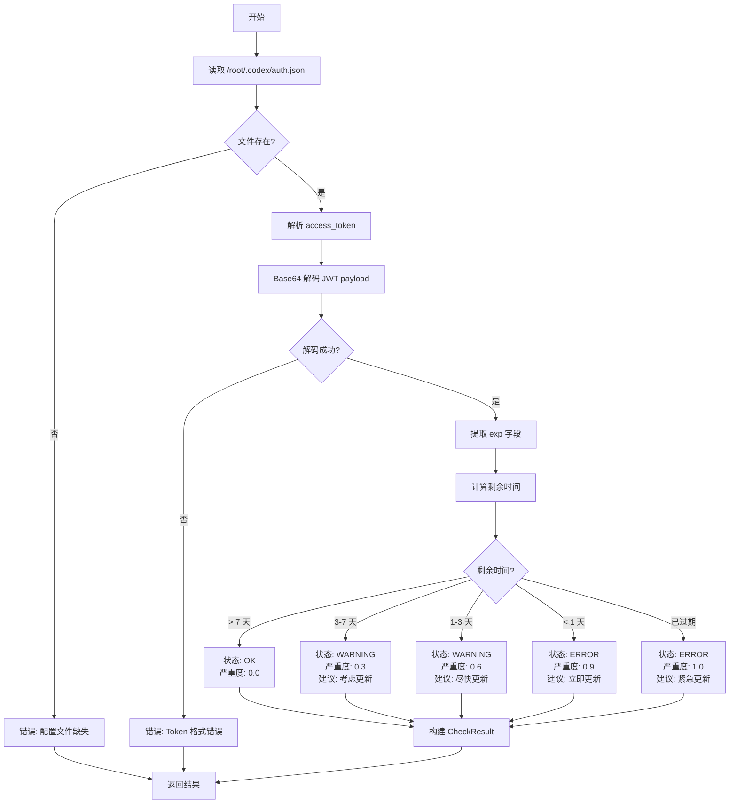

**资源监控检查器**:
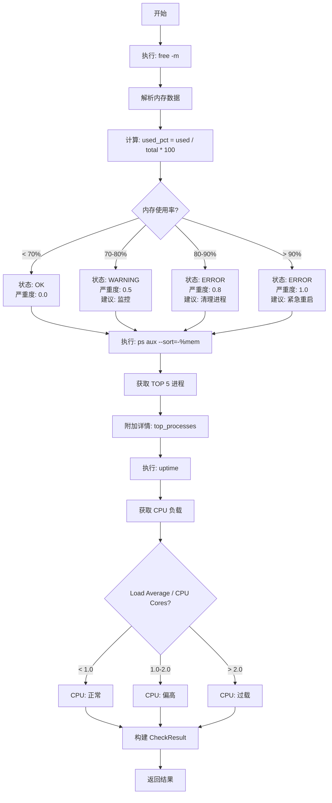

### 3.3 问题分析流程

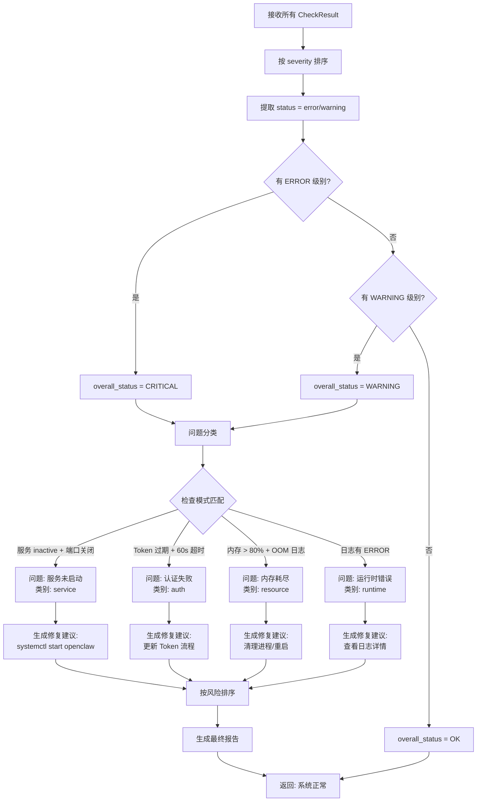

## 4. 文件结构设计

### 4.1 插件目录结构

```
plugins/openclaw-ops/
├── .claude-plugin/
│   └── plugin.json                    # 插件元数据
├── README.md                          # 插件文档 (英文)
├── README-zh.md                       # 插件文档 (中文)
├── commands/
│   ├── diagnose.md                    # /openclaw-diagnose 命令
│   └── update-token.md                # /openclaw-update-token 命令
├── scripts/
│   ├── diagnose.sh                    # 诊断脚本 (在服务器上执行)
│   └── update-token.py                # Token 同步脚本 (在服务器上执行)
└── knowledge/
    ├── troubleshooting.md             # 故障排查指南
    └── environment-config.md          # 环境变量配置说明
```

**说明**:
- 使用 **Commands** 而非 Skills,因为这是用户主动调用的操作
- 脚本文件会在 Command 执行时上传到服务器 `/tmp/` 目录
- 不需要复杂的模块化设计,保持简单直接

### 4.2 Command 定义文件

**`commands/diagnose.md`**:
````markdown
---
name: openclaw-diagnose
description: |
  Diagnose OpenClaw Telegram bot gateway issues and provide fix suggestions.

  <example>/openclaw-diagnose</example>
  <example>/openclaw-diagnose Bot not responding, 60s timeout</example>
  <example>/openclaw-diagnose Memory usage high</example>
allowed-tools: ["Bash", "Read", "Write", "AskUserQuestion"]
license: MIT
---

# /openclaw-diagnose

**Purpose**: Diagnose OpenClaw service issues and provide actionable fix suggestions.

## What It Checks
- ✅ Service status (systemd active/inactive)
- ✅ OAuth token expiration (JWT parsing)
- ✅ Memory usage (threshold warnings)
- ✅ Recent log errors (journalctl)

## Environment Variables
| Variable | Default | Required | Description |
|----------|---------|----------|-------------|
| `OPENCLAW_SSH_HOST` | 无 | ✅ | Server address (必须提供) |
| `OPENCLAW_SSH_USER` | `root` | ❌ | SSH user |
| `OPENCLAW_SERVICE_NAME` | `openclaw` | ❌ | systemd service name |
| `OPENCLAW_MEM_WARN_PCT` | `70` | ❌ | Memory warning threshold (%) |

## Implementation Steps

### 1. Load Configuration
```bash
# SSH_HOST is required - must be provided via env var
if [ -z "${OPENCLAW_SSH_HOST}" ]; then
    echo "ERROR: OPENCLAW_SSH_HOST environment variable is required"
    exit 1
fi

SSH_HOST="${OPENCLAW_SSH_HOST}"
SSH_USER="${OPENCLAW_SSH_USER:-root}"
SERVICE="${OPENCLAW_SERVICE_NAME:-openclaw}"
MEM_WARN="${OPENCLAW_MEM_WARN_PCT:-70}"
```

### 2. Read & Upload Diagnostic Script
Read `scripts/diagnose.sh` and upload to server:
```bash
scp diagnose.sh ${SSH_USER}@${SSH_HOST}:/tmp/openclaw-diagnose.sh
```

### 3. Execute Remote Diagnostics
```bash
ssh ${SSH_USER}@${SSH_HOST} 'bash /tmp/openclaw-diagnose.sh'
```

### 4. Parse JSON Results
The script outputs JSON like:
```json
{
  "checks": [
    {"name": "service", "status": "ok", "severity": 0.0},
    {"name": "token", "status": "warning", "severity": 0.6, "days_left": 2}
  ]
}
```

### 5. Generate Report
Display formatted report with:
- System status table
- Problem analysis
- Fix suggestions (e.g., "/openclaw-update-token")

### 6. User Confirmation
Use `AskUserQuestion` to ask:
```
发现问题: Token 将在 2 天后过期
是否执行修复? [/openclaw-update-token]
```

### 7. Execute Fix (if confirmed)
Run the suggested fix command.

## Output Format
```markdown
🔍 OpenClaw 诊断报告
环境: 104.168.43.20
时间: 2026-03-14 10:30:00

✅ 服务: active (running)
⚠️  Token: 2 天 (建议更新)
✅ 内存: 44% (1.06GB / 2.4GB)
✅ 日志: 无错误

修复建议:
1. /openclaw-update-token
```
````

**`commands/update-token.md`**:
````markdown
---
name: openclaw-update-token
description: |
  Sync local auth token file to OpenClaw server.
  Updates both codex and OpenClaw configuration files.

  <example>/openclaw-update-token</example>
  <example>/openclaw-update-token ~/.codex/auth.json</example>
  <example>/openclaw-update-token ~/my-token.json</example>
allowed-tools: ["Bash", "Read", "Write", "AskUserQuestion"]
license: MIT
---

# /openclaw-update-token

**Purpose**: Synchronize local auth.json token file to remote OpenClaw server.

## Parameters
| Parameter | Required | Description |
|-----------|----------|-------------|
| `token_file_path` | No | Local auth.json file path. If not provided, ask user. |

## Prerequisites
- Local token file exists and is valid JSON
- SSH access to OpenClaw server
- Server has Python 3 installed

## What It Does
1. Get token file path from user (if not provided)
2. Read local auth.json file
3. Validate token expiry (JWT parsing)
4. Upload to server `/tmp/sync_auth.json`
5. Run sync script on server:
   - Update `/root/.codex/auth.json`
   - Update `/root/.openclaw/agents/main/agent/auth-profiles.json`
6. Restart OpenClaw service
7. Verify service status

## Implementation Steps

### 1. Get Token File Path
If not provided as argument, use `AskUserQuestion`:
```
Question: "请提供 auth.json 文件路径"
Options:
  - "~/.codex/auth.json" (推荐 - Claude Code token)
  - "~/custom-auth.json" (自定义文件)
  - [用户输入路径]
```

### 2. Read Local Token
```bash
# Expand ~ to home directory
TOKEN_FILE="${token_file_path/#\~/$HOME}"

# Read using Read tool
Read ${TOKEN_FILE}
```

### 3. Validate Token
Extract JWT payload and check expiry:
```python
import json, base64, datetime

with open(token_file_path) as f:
    auth = json.load(f)

# Parse access_token JWT
token = auth['tokens']['access_token']
payload = token.split('.')[1] + '==='
jwt = json.loads(base64.urlsafe_b64decode(payload))
exp = datetime.datetime.utcfromtimestamp(jwt['exp'])
now = datetime.datetime.utcnow()

if exp < now:
    print("ERROR: Token已过期")
    exit(1)

days_left = (exp - now).days
print(f"Token有效期: {days_left} 天")
```

### 4. Upload Token
```bash
# Use Bash tool with scp
scp ${TOKEN_FILE} ${SSH_USER}@${SSH_HOST}:/tmp/sync_auth.json
```

### 4. Run Sync Script
Read `scripts/update-token.py` and execute on server:
```bash
ssh ${SSH_USER}@${SSH_HOST} 'python3 /tmp/update-token.py'
```

**`update-token.py`** (执行在服务器上):
```python
#!/usr/bin/env python3
import json, base64

# Read uploaded token
with open("/tmp/sync_auth.json") as f:
    auth = json.load(f)

# Update codex config
with open("/root/.codex/auth.json", "w") as f:
    json.dump(auth, f, indent=2)

# Extract info
tokens = auth["tokens"]
payload = tokens["id_token"].split(".")[1] + "==="
jwt = json.loads(base64.urlsafe_b64decode(payload))
email = jwt.get("email")

access_payload = tokens["access_token"].split(".")[1] + "==="
access_jwt = json.loads(base64.urlsafe_b64decode(access_payload))
expires_ms = access_jwt.get("exp") * 1000

# Update openclaw config
path = "/root/.openclaw/agents/main/agent/auth-profiles.json"
with open(path) as f:
    profiles = json.load(f)

profiles["profiles"]["openai-codex"].update({
    "access": tokens["access_token"],
    "refresh": tokens["refresh_token"],
    "expires": expires_ms,
    "email": email,
    "accountId": tokens["account_id"]
})

with open(path, "w") as f:
    json.dump(profiles, f, indent=2)

print(f"✓ Token synced for {email}")
```

### 5. Restart Service
```bash
ssh ${SSH_USER}@${SSH_HOST} 'systemctl restart openclaw'
```

### 6. Verify
Check service status:
```bash
ssh ${SSH_USER}@${SSH_HOST} 'systemctl is-active openclaw'
```

## Output Format
```markdown
🔄 Token 同步中...

✅ 本地 Token 有效
   Email: nixmxbl3155@hotmail.com
   有效期: 2026-03-20 (7 天)

✅ 上传成功

✅ 配置文件已更新:
   • /root/.codex/auth.json
   • /root/.openclaw/agents/main/agent/auth-profiles.json

✅ 服务已重启

验证:
✅ 服务状态: active
```
````

### 4.3 脚本接口规范

**`scripts/diagnose.sh` 输出格式**:
```bash
#!/bin/bash
# 输出 JSON 格式的诊断结果

cat << EOF
{
  "timestamp": "$(date -u +%Y-%m-%dT%H:%M:%SZ)",
  "checks": [
    {
      "name": "service_status",
      "status": "ok",
      "message": "Service is active and running",
      "details": {
        "state": "active",
        "substate": "running",
        "uptime_seconds": 86400
      },
      "severity": 0.0
    },
    {
      "name": "token_expiry",
      "status": "warning",
      "message": "Token expires in 2 days",
      "details": {
        "expires_at": "2026-03-16T10:30:00Z",
        "days_remaining": 2,
        "email": "nixmxbl3155@hotmail.com"
      },
      "severity": 0.6
    }
  ]
}
EOF
```

## 5. 关键技术实现

### 5.1 环境配置加载

**实现位置**: `SKILL.md` 内嵌 Bash 代码

```bash
# Function: load_openclaw_config
# Purpose: Load configuration from environment variables with defaults
# Output: Export configuration variables

load_openclaw_config() {
    export OPENCLAW_SSH_HOST="${OPENCLAW_SSH_HOST:-104.168.43.20}"
    export OPENCLAW_SSH_USER="${OPENCLAW_SSH_USER:-root}"
    export OPENCLAW_INSTALL_DIR="${OPENCLAW_INSTALL_DIR:-/root/openclaw}"
    export OPENCLAW_CONFIG_DIR="${OPENCLAW_CONFIG_DIR:-/root/.openclaw}"
    export OPENCLAW_SERVICE_NAME="${OPENCLAW_SERVICE_NAME:-openclaw}"
    export OPENCLAW_GATEWAY_PORT="${OPENCLAW_GATEWAY_PORT:-18789}"
    export OPENCLAW_MEM_WARN_PCT="${OPENCLAW_MEM_WARN_PCT:-70}"
    export OPENCLAW_MEM_CRIT_PCT="${OPENCLAW_MEM_CRIT_PCT:-80}"

    # Validation
    if ! command -v ssh &> /dev/null; then
        echo "ERROR: ssh command not found" >&2
        return 1
    fi

    # Test connection
    if ! ssh -o ConnectTimeout=5 ${OPENCLAW_SSH_USER}@${OPENCLAW_SSH_HOST} 'echo OK' &> /dev/null; then
        echo "WARNING: Cannot connect to ${OPENCLAW_SSH_HOST}" >&2
    fi
}
```

### 5.2 并行检查执行

```bash
# Function: run_parallel_checks
# Purpose: Execute multiple checkers in parallel for speed
# Output: Combined JSON results

run_parallel_checks() {
    local tmpdir=$(mktemp -d)

    # Start all checkers in background
    check_service_status > ${tmpdir}/service.json &
    check_token_expiry > ${tmpdir}/token.json &
    check_resources > ${tmpdir}/resource.json &
    check_logs > ${tmpdir}/logs.json &

    # Wait for all to complete
    wait

    # Combine results using jq
    jq -s '{checks: map(.checks[]) | ., timestamp: now | todate}' \
        ${tmpdir}/*.json

    # Cleanup
    rm -rf ${tmpdir}
}
```

### 5.3 Token 有效期检查

**实现位置**: `scripts/checkers/auth.py`

```python
#!/usr/bin/env python3
import json
import base64
import sys
from datetime import datetime, timezone

def check_token_expiry(auth_file='/root/.codex/auth.json'):
    """Check OAuth token expiration."""
    try:
        with open(auth_file) as f:
            auth = json.load(f)

        # Decode JWT
        token = auth['tokens']['access_token']
        payload_b64 = token.split('.')[1] + '==='
        payload = json.loads(base64.urlsafe_b64decode(payload_b64))

        # Calculate expiry
        exp_timestamp = payload['exp']
        exp_dt = datetime.fromtimestamp(exp_timestamp, tz=timezone.utc)
        now = datetime.now(timezone.utc)
        remaining = (exp_dt - now).total_seconds()
        days_remaining = remaining / 86400

        # Determine status
        if remaining < 0:
            status = 'error'
            severity = 1.0
            message = 'Token has expired'
        elif days_remaining < 1:
            status = 'error'
            severity = 0.9
            message = f'Token expires in {remaining/3600:.1f} hours'
        elif days_remaining < 3:
            status = 'warning'
            severity = 0.6
            message = f'Token expires in {days_remaining:.1f} days'
        elif days_remaining < 7:
            status = 'warning'
            severity = 0.3
            message = f'Token expires in {days_remaining:.1f} days (consider renewal)'
        else:
            status = 'ok'
            severity = 0.0
            message = f'Token valid for {days_remaining:.1f} days'

        result = {
            'checks': [{
                'name': 'token_expiry',
                'status': status,
                'message': message,
                'details': {
                    'expires_at': exp_dt.isoformat(),
                    'days_remaining': round(days_remaining, 1),
                    'email': payload.get('email', 'unknown')
                },
                'severity': severity
            }]
        }

        print(json.dumps(result, indent=2))
        return 0

    except FileNotFoundError:
        result = {
            'checks': [{
                'name': 'token_expiry',
                'status': 'error',
                'message': 'Auth configuration file not found',
                'details': {'file': auth_file},
                'severity': 1.0
            }]
        }
        print(json.dumps(result, indent=2))
        return 1

    except Exception as e:
        result = {
            'checks': [{
                'name': 'token_expiry',
                'status': 'error',
                'message': f'Token check failed: {str(e)}',
                'details': {'error': str(e)},
                'severity': 0.8
            }]
        }
        print(json.dumps(result, indent=2))
        return 1

if __name__ == '__main__':
    sys.exit(check_token_expiry())
```

### 5.4 问题分析与建议生成

**实现位置**: `scripts/analyzers/problem_analyzer.py`

```python
#!/usr/bin/env python3
import json
import sys

# 问题模式定义
PROBLEM_PATTERNS = [
    {
        'id': 'service_down',
        'category': 'service',
        'patterns': [
            {'check': 'service_status', 'status': 'error'},
            {'check': 'port_listening', 'status': 'error'}
        ],
        'description': 'OpenClaw service is not running',
        'severity': 'critical',
        'fix': {
            'description': 'Start the OpenClaw service',
            'commands': [
                {'desc': 'Start service', 'exec': 'systemctl start openclaw'},
                {'desc': 'Verify status', 'exec': 'systemctl status openclaw'}
            ],
            'risk': 'safe'
        }
    },
    {
        'id': 'token_expired',
        'category': 'auth',
        'patterns': [
            {'check': 'token_expiry', 'severity_gte': 0.8}
        ],
        'description': 'OAuth token is expired or about to expire',
        'severity': 'high',
        'fix': {
            'description': 'Update authentication token',
            'commands': [
                {'desc': 'Sync token from local', 'exec': '/openclaw-update-token'}
            ],
            'risk': 'safe'
        }
    },
    {
        'id': 'memory_critical',
        'category': 'resource',
        'patterns': [
            {'check': 'memory_usage', 'severity_gte': 0.8}
        ],
        'description': 'Memory usage is critically high (OOM risk)',
        'severity': 'high',
        'fix': {
            'description': 'Free memory by restarting service',
            'commands': [
                {'desc': 'Stop unnecessary services', 'exec': 'systemctl stop docker minio'},
                {'desc': 'Kill Chrome processes', 'exec': 'pkill -9 chrome'},
                {'desc': 'Restart OpenClaw', 'exec': 'systemctl restart openclaw'}
            ],
            'risk': 'moderate'
        }
    }
]

def analyze_results(diagnostic_data):
    """Analyze diagnostic results and generate problem report."""
    checks = {c['name']: c for c in diagnostic_data['checks']}
    problems = []

    # Pattern matching
    for pattern in PROBLEM_PATTERNS:
        matched = True
        for cond in pattern['patterns']:
            check_name = cond['check']
            if check_name not in checks:
                matched = False
                break

            check = checks[check_name]

            # Check status condition
            if 'status' in cond and check['status'] != cond['status']:
                matched = False
                break

            # Check severity condition
            if 'severity_gte' in cond and check['severity'] < cond['severity_gte']:
                matched = False
                break

        if matched:
            problems.append({
                'id': pattern['id'],
                'category': pattern['category'],
                'severity': pattern['severity'],
                'description': pattern['description'],
                'affected_checks': [p['check'] for p in pattern['patterns']],
                'fix_suggestion': pattern['fix']
            })

    # Determine overall status
    max_severity = max([c['severity'] for c in checks.values()], default=0.0)
    if max_severity >= 0.8:
        overall = 'critical'
    elif max_severity >= 0.5:
        overall = 'warning'
    else:
        overall = 'ok'

    return {
        'overall_status': overall,
        'problems': problems,
        'checks_summary': {
            'total': len(checks),
            'passed': sum(1 for c in checks.values() if c['status'] == 'ok'),
            'warnings': sum(1 for c in checks.values() if c['status'] == 'warning'),
            'errors': sum(1 for c in checks.values() if c['status'] == 'error')
        }
    }

if __name__ == '__main__':
    data = json.load(sys.stdin)
    result = analyze_results(data)
    print(json.dumps(result, indent=2))
```

## 6. 安全设计

### 6.1 敏感信息处理

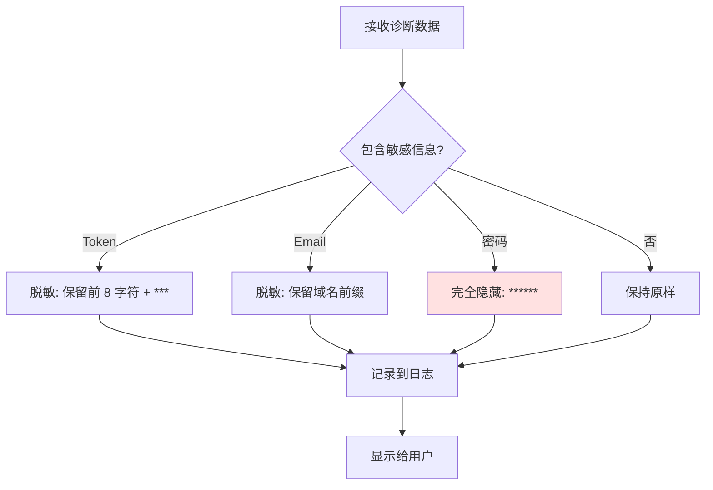

**实现示例**:
```python
def sanitize_sensitive_data(data):
    """Remove or mask sensitive information."""
    if 'details' in data:
        details = data['details']

        # Mask token
        if 'access_token' in details:
            token = details['access_token']
            details['access_token'] = token[:8] + '***' + token[-4:]

        # Mask email (keep domain)
        if 'email' in details:
            email = details['email']
            parts = email.split('@')
            if len(parts) == 2:
                details['email'] = parts[0][:3] + '***@' + parts[1]

        # Remove password completely
        if 'password' in details:
            del details['password']

    return data
```

### 6.2 命令执行安全

| 安全措施 | 实现方式 |
|----------|----------|
| **命令白名单** | 只允许预定义的修复命令 |
| **参数校验** | 禁止命令注入 (`;`, `\|`, `&&`) |
| **用户确认** | 危险操作需要二次确认 |
| **操作日志** | 所有修复操作记录审计日志 |
| **回滚机制** | 关键操作前备份配置 |

**命令白名单实现**:
```python
ALLOWED_COMMANDS = {
    'start_service': 'systemctl start openclaw',
    'restart_service': 'systemctl restart openclaw',
    'check_status': 'systemctl status openclaw --no-pager',
    'view_logs': 'journalctl -u openclaw --since "10 minutes ago" --no-pager',
    'check_memory': 'free -h',
    'kill_chrome': 'pkill -9 chrome'
}

def execute_safe_command(command_id, ssh_client):
    """Execute only whitelisted commands."""
    if command_id not in ALLOWED_COMMANDS:
        raise ValueError(f"Command '{command_id}' not in whitelist")

    cmd = ALLOWED_COMMANDS[command_id]

    # Log execution
    log_audit(f"Executing: {cmd}")

    # Execute
    result = ssh_client.exec_command(cmd)

    return result
```

## 7. 性能优化

### 7.1 并行执行策略

```mermaid
gantt
    title 诊断时间对比
    dateFormat X
    axisFormat %s

    section 串行执行
    服务检查 (2s)   :0, 2
    Token 检查 (1s) :2, 3
    资源检查 (1s)   :3, 4
    日志检查 (3s)   :4, 7
    总计 7秒        :milestone, 7, 0

    section 并行执行
    服务检查 (2s)   :0, 2
    Token 检查 (1s) :0, 1
    资源检查 (1s)   :0, 1
    日志检查 (3s)   :0, 3
    总计 3秒        :milestone, 3, 0
```

**实现**: 使用 Bash 后台任务 (`&`) + `wait`

### 7.2 SSH 连接复用

```bash
# 使用 ControlMaster 复用 SSH 连接
SSH_OPTS="-o ControlMaster=auto -o ControlPath=/tmp/ssh-%r@%h:%p -o ControlPersist=60"

ssh ${SSH_OPTS} user@host "command1"
ssh ${SSH_OPTS} user@host "command2"  # 复用连接，无需重新建立
```

### 7.3 缓存机制

| 缓存项 | 有效期 | 用途 |
|--------|--------|------|
| **配置文件** | 5 分钟 | 避免重复读取 `/root/.openclaw/openclaw.json` |
| **服务状态** | 1 分钟 | 快速响应重复查询 |
| **诊断结果** | 不缓存 | 保证数据实时性 |

## 8. 测试策略

### 8.1 单元测试覆盖

| 模块 | 测试用例 |
|------|----------|
| **ConfigLoader** | 环境变量读取 / 默认值应用 / 验证失败处理 |
| **ServiceChecker** | 正常状态 / 服务停止 / 端口未监听 |
| **AuthChecker** | Token 有效 / 即将过期 / 已过期 / 文件缺失 |
| **ResourceChecker** | 正常使用 / 警告阈值 / 危险阈值 |
| **ProblemAnalyzer** | 模式匹配 / 严重度分类 / 建议生成 |

### 8.2 集成测试场景

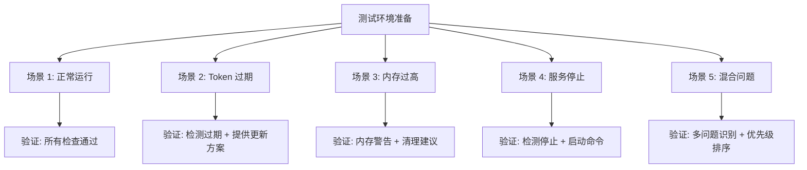

### 8.3 模拟测试数据

**正常状态**:
```json
{
  "checks": [
    {"name": "service_status", "status": "ok", "severity": 0.0},
    {"name": "token_expiry", "status": "ok", "severity": 0.0},
    {"name": "memory_usage", "status": "ok", "severity": 0.0},
    {"name": "log_errors", "status": "ok", "severity": 0.0}
  ]
}
```

**Token 过期**:
```json
{
  "checks": [
    {"name": "service_status", "status": "ok", "severity": 0.0},
    {"name": "token_expiry", "status": "error", "severity": 1.0,
     "details": {"expires_at": "2026-03-12T00:00:00Z", "days_remaining": -2}},
    {"name": "memory_usage", "status": "ok", "severity": 0.0}
  ]
}
```

## 9. 部署清单

### 9.1 部署前检查

| 检查项 | 命令 | 期望结果 |
|--------|------|----------|
| **SSH 连通性** | `ssh user@host echo OK` | 输出 "OK" |
| **systemd 可用** | `ssh user@host systemctl --version` | 版本号 |
| **Python 3.6+** | `ssh user@host python3 --version` | 版本 >= 3.6 |
| **jq 可用** | `ssh user@host jq --version` | 版本号 |
| **OpenClaw 已安装** | `ssh user@host ls /root/openclaw` | 目录存在 |

### 9.2 安装步骤

```bash
# 1. 克隆插件仓库
git clone https://github.com/your-org/claude-community-plugins.git
cd claude-community-plugins

# 2. 设置环境变量 (可选)
cat >> ~/.bashrc << 'EOF'
export OPENCLAW_SSH_HOST="104.168.43.20"
export OPENCLAW_SSH_USER="root"
EOF
source ~/.bashrc

# 3. 测试连接
ssh ${OPENCLAW_SSH_USER}@${OPENCLAW_SSH_HOST} 'echo "Connection OK"'

# 4. 上传脚本到服务器
scp -r plugins/openclaw-ops/scripts/* \
    ${OPENCLAW_SSH_USER}@${OPENCLAW_SSH_HOST}:/usr/local/bin/openclaw-scripts/

# 5. 设置脚本执行权限
ssh ${OPENCLAW_SSH_USER}@${OPENCLAW_SSH_HOST} \
    'chmod +x /usr/local/bin/openclaw-scripts/**/*.sh'

# 6. 测试诊断功能
/openclaw-diagnose
```

### 9.3 验证步骤

```bash
# 验证 1: 基础诊断
/openclaw-diagnose

# 验证 2: 定向检查
/openclaw-diagnose --issue-type=auth

# 验证 3: 详细模式
/openclaw-diagnose --verbose

# 验证 4: 模拟 Token 过期
# (修改服务器上的 auth.json 使 exp 为过去时间)
ssh ${OPENCLAW_SSH_USER}@${OPENCLAW_SSH_HOST} \
    'python3 /usr/local/bin/openclaw-scripts/test/simulate_expired_token.py'
/openclaw-diagnose
# 预期: 检测到 Token 过期问题
```

## 10. 运维指南

### 10.1 日常运维流程

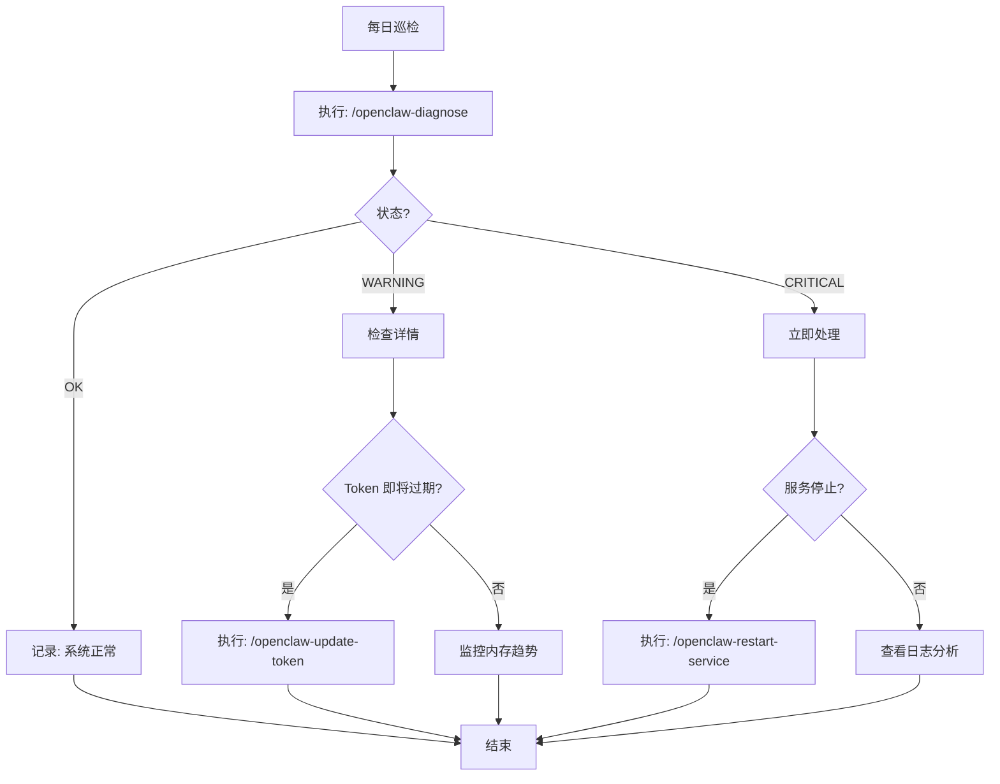

### 10.2 告警阈值配置

| 指标 | 正常 | 警告 | 危险 | 处理动作 |
|------|------|------|------|----------|
| **内存使用** | < 70% | 70-80% | > 80% | 清理进程/重启 |
| **Token 剩余天数** | > 7 天 | 3-7 天 | < 3 天 | 更新 Token |
| **服务状态** | active | - | inactive | 启动服务 |
| **日志错误数** | 0 | 1-5/10min | > 5/10min | 分析错误 |

### 10.3 常见问题处理流程

**问题 1: 诊断脚本超时**
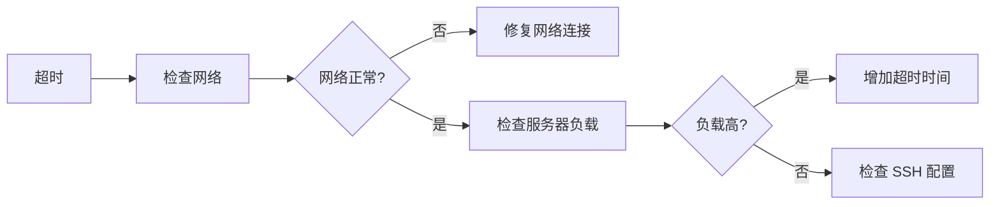

**问题 2: 修复操作失败**
```bash
# 1. 查看详细错误
/openclaw-diagnose --verbose

# 2. 手动执行修复命令
ssh user@host "systemctl restart openclaw"

# 3. 查看服务日志
ssh user@host "journalctl -u openclaw -n 50"

# 4. 如果还是失败，尝试重新安装
ssh user@host "cd /root/openclaw && git pull && npm install"
```

## 11. 后续优化方向

### 11.1 功能增强

| 优先级 | 功能 | 描述 |
|--------|------|------|
| P1 | **历史趋势** | 记录诊断历史，绘制资源使用趋势图 |
| P1 | **智能告警** | 基于历史数据预测潜在问题 |
| P2 | **多服务器支持** | 同时管理多个 OpenClaw 实例 |
| P2 | **Webhook 通知** | 问题发生时自动通知 Telegram/邮件 |
| P3 | **自愈能力** | 自动修复常见问题（用户授权后）|

### 11.2 性能优化

- **增量诊断**: 只检查上次失败的项
- **结果缓存**: 短时间内复用诊断结果
- **异步执行**: 长时间操作改为后台任务

### 11.3 用户体验

- **交互式向导**: 引导用户逐步排查问题
- **可视化报告**: 生成 HTML 格式的诊断报告
- **一键修复**: 对于安全操作，提供一键修复按钮

---

## 附录

### A. 数据流图

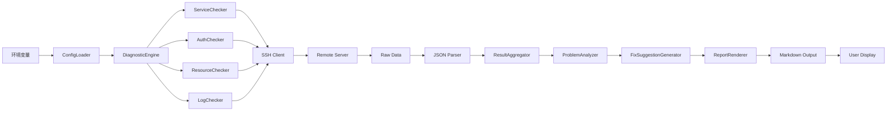

### B. 错误码定义

| 错误码 | 描述 | 处理建议 |
|--------|------|----------|
| `E001` | SSH 连接失败 | 检查网络和 SSH 配置 |
| `E002` | 命令执行超时 | 增加超时时间或检查服务器负载 |
| `E003` | 权限不足 | 使用 root 用户或添加 sudo |
| `E004` | 配置文件损坏 | 从备份恢复 |
| `E005` | Token 解析失败 | 检查 auth.json 格式 |
| `W001` | 环境变量缺失 | 将使用默认值 |
| `W002` | 检查项跳过 | 某些诊断项不可用 |

### C. API 文档

**函数**: `run_diagnostics(config, params) -> DiagnosticReport`

**参数**:
- `config: EnvironmentConfig` - 环境配置对象
- `params: DiagnosticParams` - 诊断参数

**返回**: `DiagnosticReport` - 诊断报告对象

**异常**:
- `SSHConnectionError` - SSH 连接失败
- `CommandTimeoutError` - 命令执行超时
- `ConfigValidationError` - 配置验证失败

**示例**:
```python
config = load_env_config()
params = DiagnosticParams(issue_type='all', verbose=False)
report = run_diagnostics(config, params)
print(report.to_markdown())
```

---

**变更历史**:
- 2026-03-14: 初始版本
