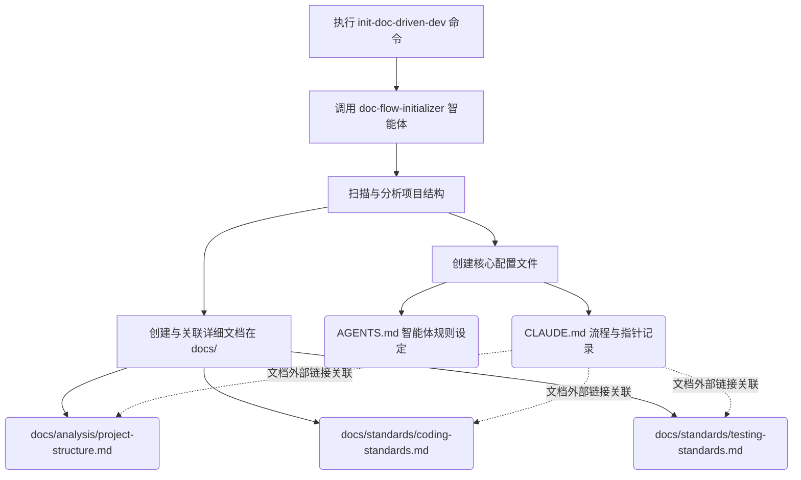
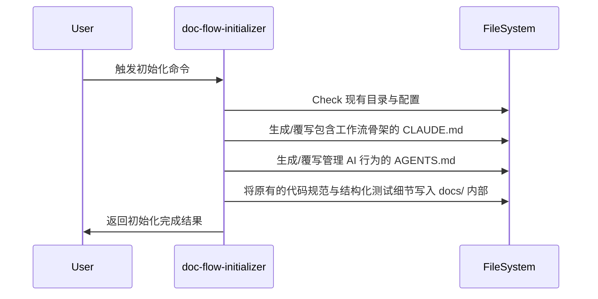

# 技术方案 20260316: init-doc-driven-dev-optimization - 技术设计

## 文档信息

- **编号**: TECH-20260316
- **标题**: init-doc-driven-dev-optimization
- **版本**: 1.0.0
- **创建日期**: 2026-03-16
- **状态**: 待实现
- **依赖**: REQ-20260316 (init-doc-driven-dev 初始化命令优化 需求)

## 1. 技术架构概述

### 1.1 整体设计思路

通过修改提供给初始化流程的 Agent Prompt (`agents/doc-flow-initializer.md`) 以及命令描述文件 (`commands/init-doc-driven-dev.md`)，约束 AI 助手在执行初始化项目文档（即基于用户项目生成 doc-driven 必须的开发文档库）时的格式和层级：
- 从“单体巨石型 `CLAUDE.md`”转向“基于指针架构的中心分发 `CLAUDE.md`”。核心工作流保留，而具体标准与分析下放于专职的 docs 子文件夹；
- 从单一配置引导升级为双核心配置 `CLAUDE.md` 和 `AGENTS.md`。

### 1.2 架构设计与实体设计

## 2. 核心技能详细设计

### 2.1 doc-flow-initializer 改动与结构定义

**改动内容**：
更新 `agents/doc-flow-initializer.md` 里的步骤描述与 `Enhanced CLAUDE.md Sections` 模块结构：

| 变更项 | 变更状态 |
| --- | --- |
| `CLAUDE.md` 中的 `Project Structure` 细节提取 | (-调整) 只保留指向 `docs/analysis/project-analysis.md` 的链接 |
| `CLAUDE.md` 中的 `Coding Standards` 和 `Testing` | (-调整) 只保留指向 `docs/standards/` 对应文档的链接 |
| `CLAUDE.md` 内容重点 | (+增强) 关注工作流 Workflow 和系统重要规则约束 |
| 文件生成指令集 | (+新增) 增加 `AGENTS.md` 的双向并列同步生成定义 |

**核心工作流流转（Workflow 修正）在智能体文档上：**

## 约束条件与改动说明

本变更单纯作用于提示逻辑和生成模板指引的文本修改。遵循所生成的文件仅进行 markdown 文档更新和替换的机制，不侵入其他运行代码。

## 3. 工作流程设计

- 用户侧无需增加任何命令参数。命令按已有逻辑传入给智能体，智能体根据本次调整更新出来的 prompt 采取全新结构的行动结果。
