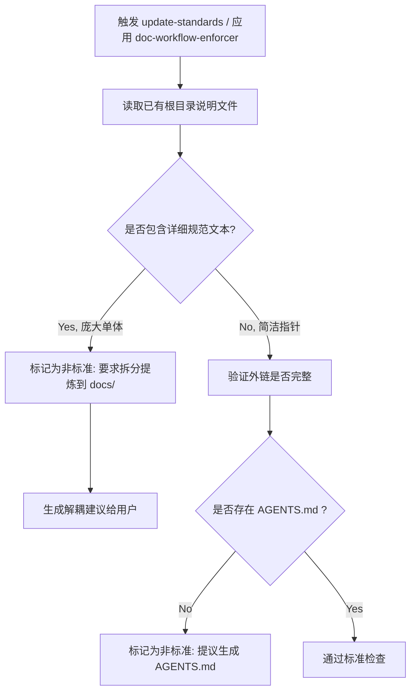
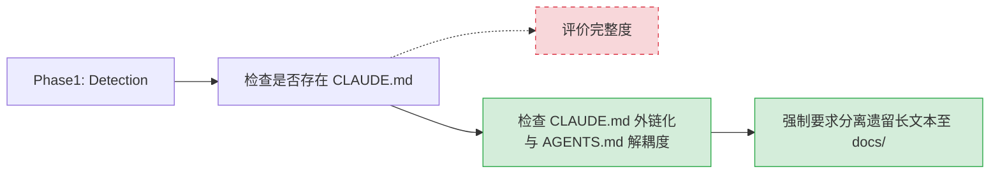

# 技术方案 20260316: update-standards-optimization - 技术设计

## 文档信息

- **编号**: TECH-20260316-2
- **标题**: update-standards-optimization
- **版本**: 1.0.0
- **创建日期**: 2026-03-16
- **状态**: 待实现
- **依赖**: REQ-20260316-2 (update-standards-optimization 需求)

## 1. 技术架构概述

### 1.1 整体设计思路

为了使 `update-standards` 命令与上一迭代针对 `init-doc-driven-dev` 做出的更新（即 `CLAUDE.md` 职责弱化外链化以及并列确立 `AGENTS.md`）保持一致。我们需要在 AI 的校验标准与命令上下文中，打补丁纠正其依然把臃肿的 `CLAUDE.md` 当作最佳实践的认知偏差。

### 1.2 架构设计与实体设计

在系统判定标准迁移过程中，针对检查逻辑的规则流转：

## 2. 核心技能详细设计

### 2.1 doc-workflow-enforcer 改动与结构定义

**改动内容**：
更新 `skills/doc-workflow-enforcer/SKILL.md` 中的 `Phase 1: Detection` 及 `Workflow Rules Added`：

| 变更项 | 变更状态 |
| --- | --- |
| 现有 `CLAUDE.md` 完整度判断 | (-废弃) 将大篇幅包含 Code Style/Testing 视为“好文档”的判断逻辑 |
| 解耦检测标准 | (+新增) 将单体 `CLAUDE.md` 标记为需迁移遗留物，要求分离出 `docs/standards/` 并引入外链 |
| 引入 `AGENTS.md` | (+增强) 把必须存在独立的 `AGENTS.md` 作为验证文档合规性的一环 |

**【改动展现示例 - 图表】**
原模式（大文本容忍）向新模式（强制解耦检查）的跃迁：

## 3. 工作流程设计

- AI 会根据 `update-standards.md` 中新加入的描述 "Check for Monolithic Anti-pattern"（如果 `CLAUDE.md` 设计了过多编码细节则提示拆分）进行自我认知调整。
- 使用 `update-standards` 时，系统将精准定位到现有的旧版臃肿型介绍文件，并提出更合理的整改意见。
