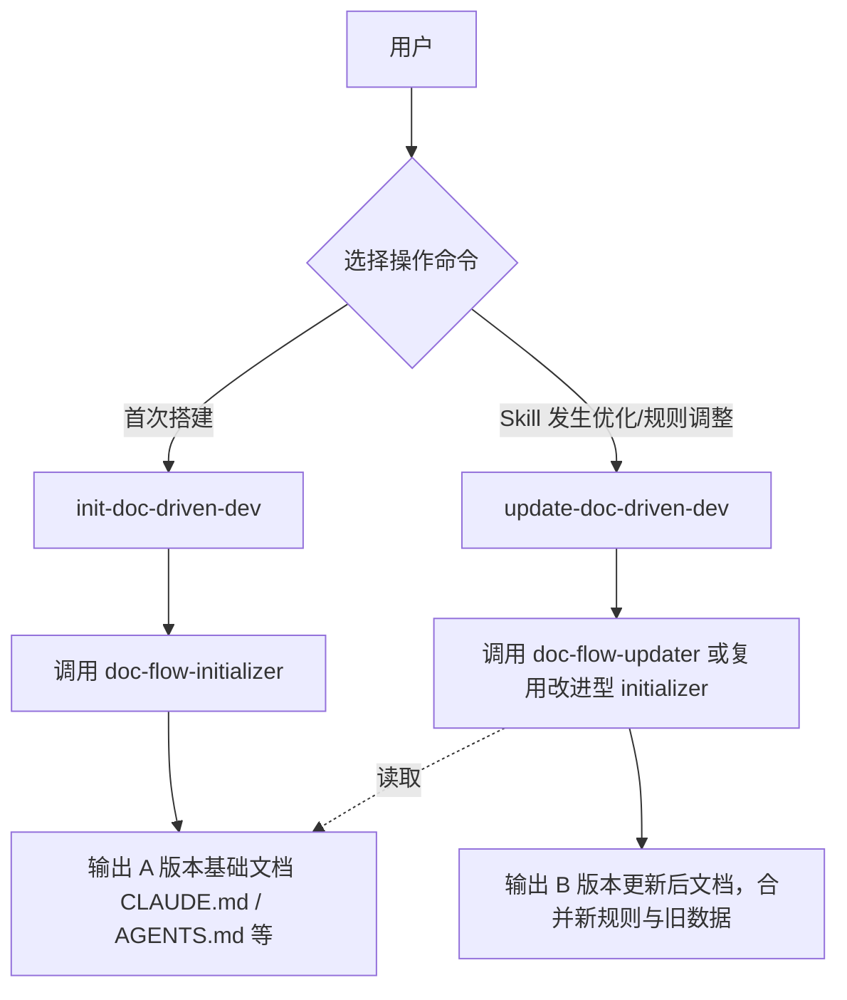
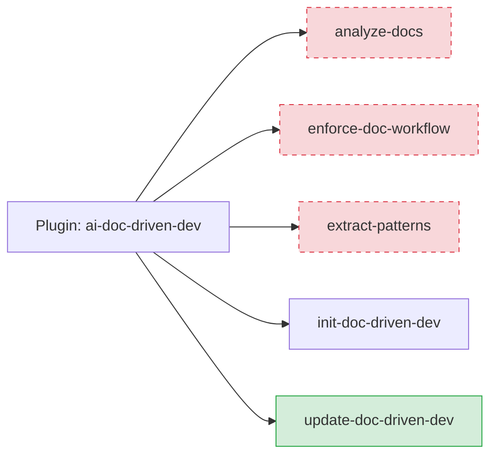
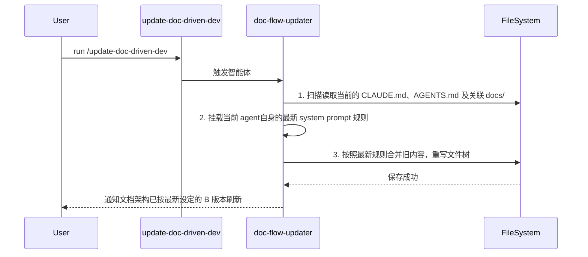

# 技术方案 20260317: simplify-commands-and-add-update - 技术设计

## 文档信息

- **编号**: TECH-20260317
- **标题**: simplify-commands-and-add-update
- **版本**: 1.0.0
- **创建日期**: 2026-03-17
- **状态**: 待实现
- **依赖**: REQ-20260317

## 1. 技术架构概述

### 1.1 整体设计思路

极简化插件命令入口点，剥离非核心分析类命令，将所有文档流操作归约为“初始化 (init)”与“热更新 (update)”生命周期。
通过建立 `update-doc-driven-dev` 命令，在智能体层应用新的变更策略，合并旧文档的有益上下文与新 Skill 版本赋予的新结构与规则。

### 1.2 架构设计与实体设计

## 2. 核心技能详细设计

### 2.1 删除冗余项

**目标清理列表**：
| 资源路径 | 资源类型 | 变更状态 |
| --- | --- | --- |
| `commands/analyze-docs.md` | Command | (-废弃强制删除) |
| `commands/enforce-doc-workflow.md` | Command | (-废弃强制删除) |
| `commands/extract-patterns.md` | Command | (-废弃强制删除) |

*(注：如果有专属且当前不再被 `init`/`update` 复用的 Agent，亦可一并梳理隐性删除，但按当前要求只需确保 Command 层面下移。)*

### 2.2 新增 Update 命令

**功能职责**：
提供一个重构已有文档库的入口操作，允许在 Skill 更新后，将存量老旧体系的文档结构刷为最新体系。

**具体改动落地**：

| 文件路径 | 职责说明 | 变更状态 |
| --- | --- | --- |
| `commands/update-doc-driven-dev.md` | 声明 `update` 命令的前端触发描述 | (+新增) |
| `agents/doc-flow-updater.md` | 声明如何执行“读取现有 -> 提取关键点 -> 应用新规则 -> 重新输出合并后文档”的 AI 提示词 | (+新增, 或整合至 initializer) |

我们将创建一个专门从事更新的 `agents/doc-flow-updater.md`，因为它与 `init` 从零到一的心智模型存在差异，`update` 需要更多的“融合旧内容，匹配新骨架”的能力。

## 约束条件与改动说明

## 3. 工作流程设计

**Update 执行流程图**：

