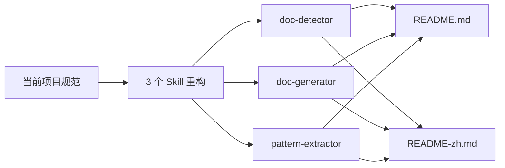
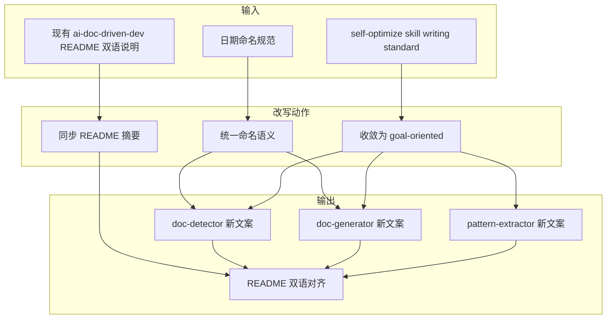
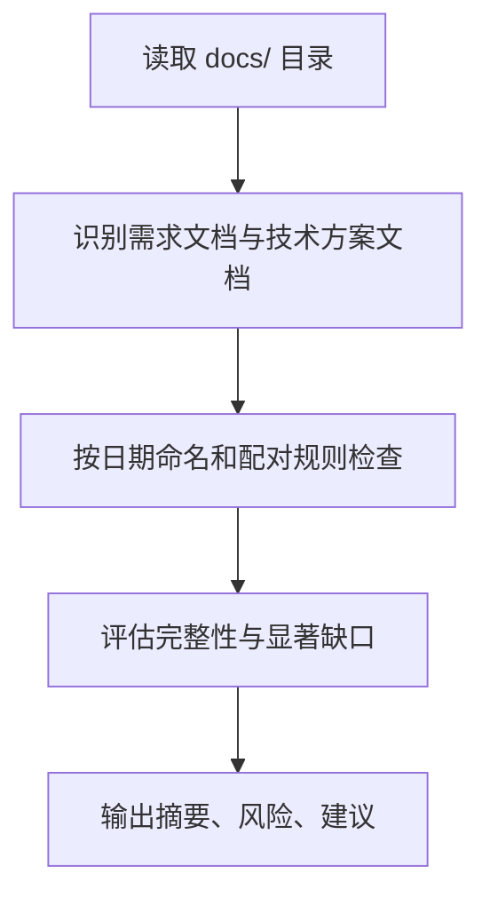
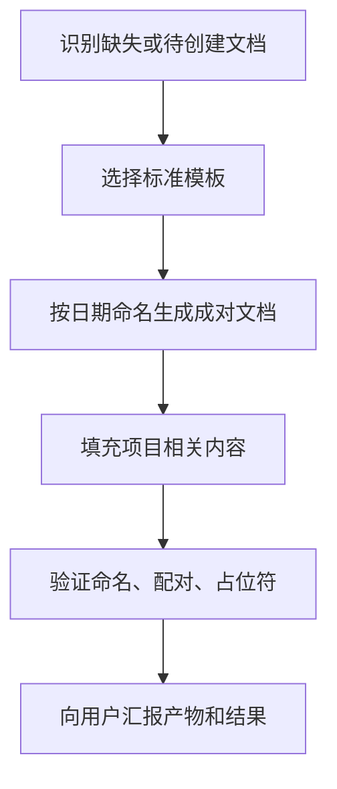
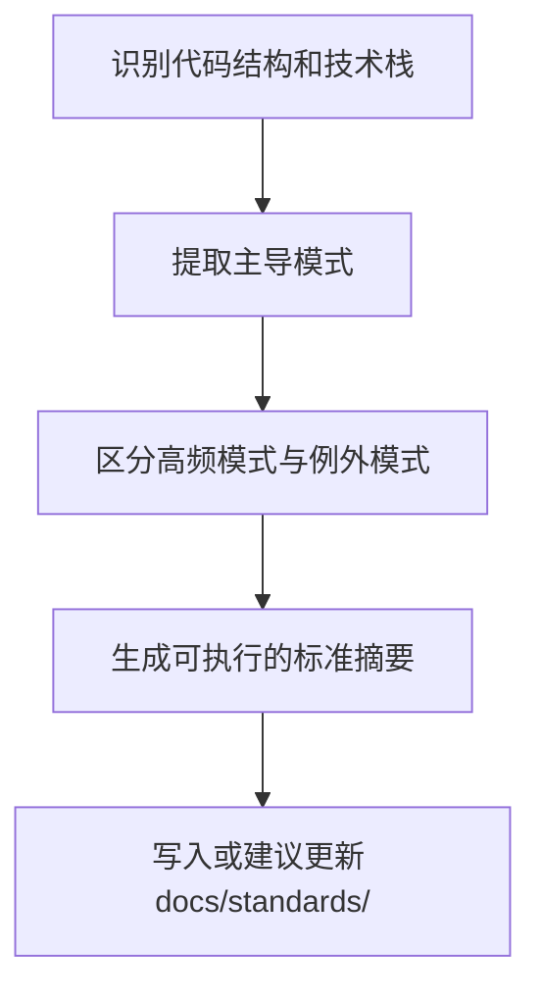
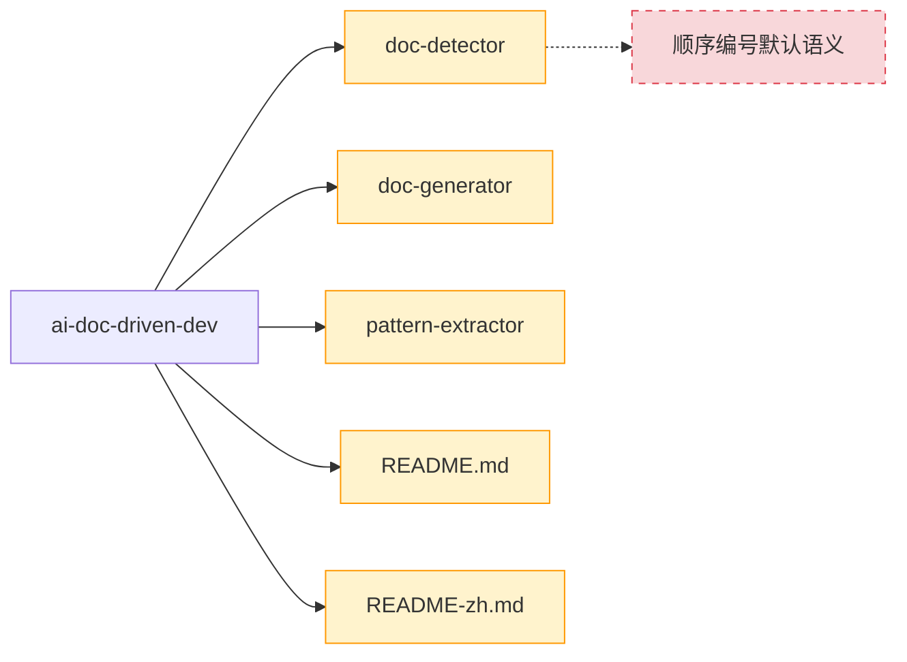
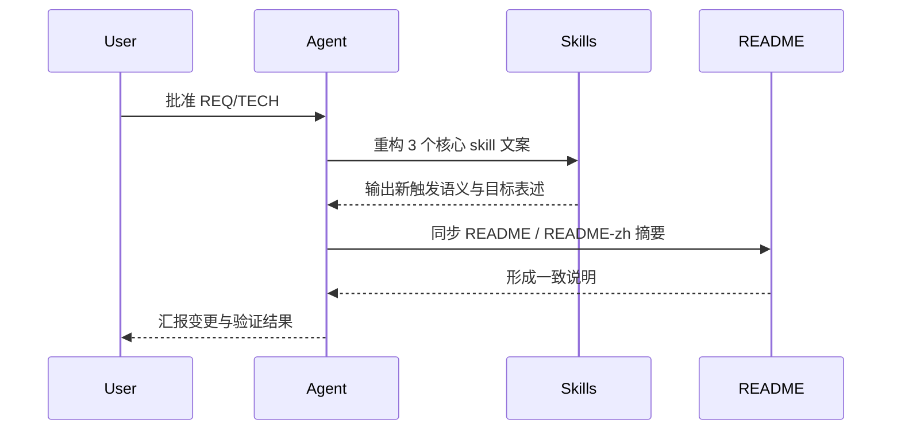

# 技术方案 20260331: ai-doc-driven-dev-skill-optimization - 核心 Skill 文案与 README 同步优化技术设计

## 文档信息

- **编号**: TECH-20260331
- **标题**: ai-doc-driven-dev-skill-optimization
- **版本**: 1.0.0
- **创建日期**: 2026-03-31
- **状态**: 待实现
- **依赖**: REQ-20260331 (ai-doc-driven-dev-skill-optimization 需求)
- **分支**: 当前工作区

## 1. 技术架构概述

### 1.1 整体设计思路

本次采用“skill 内核先统一、README 摘要后同步”的最小闭环策略。先把 3 个 skill 的命名规则、表达方式、输出目标改到当前标准，再同步 plugin README 双语描述，确保入口摘要与 skill 实际行为一致。

| 原则 | 说明 |
| --- | --- |
| 规则优先 | 以当前日期命名标准和 docs-first 流程为准 |
| 目标优先 | skill 先写目标、成功标准、约束，不写死底层执行步骤 |
| 摘要从属 | README 只复述 skill 能力，不维护第二套行为定义 |
| 最小范围 | 不动 command、agent、template |



### 1.2 架构设计与实体设计



```text
plugins/ai-doc-driven-dev/
├── README.md
├── README-zh.md
└── skills/
    ├── doc-detector/SKILL.md
    ├── doc-generator/SKILL.md
    └── pattern-extractor/SKILL.md
```

## 2. 核心技能详细设计

### 2.1 doc-detector 重构

**功能职责**：
- 分析 `docs/` 文档覆盖度和一致性
- 默认按日期命名规范评估需求文档与技术方案文档
- 输出“问题摘要 + 建议动作”，而不是编号制体检报告

**数据与参数定义**：

| 字段名 | 类型 | 必填 | 说明 |
| --- | --- | --- | --- |
| `naming_rule` | string | 是 | `YYYYMMDD-feature-name.md` |
| `pairing_rule` | string | 是 | requirement ↔ technical-design |
| `report_focus` | string | 是 | completeness / consistency / risks |
| `style` | string | 是 | goal-oriented |

**逻辑执行机制**：



**规则/约束**：
- 不再默认顺序编号制
- 不要求对每份文档做硬性打分才能完成任务
- 必须把发现结果组织成便于用户决策的摘要

### 2.2 doc-generator 重构

**功能职责**：
- 生成符合当前项目模板和命名规则的成对文档
- 明确可用模板、目标路径和生成成功标准
- 避免写成逐条命令教学

**数据与参数定义**：

| 字段名 | 类型 | 必填 | 说明 |
| --- | --- | --- | --- |
| `template_paths` | string[] | 是 | 当前标准模板路径 |
| `output_rule` | string | 是 | requirement/design 配对创建 |
| `naming_rule` | string | 是 | 日期命名 + 同日冲突后缀 |
| `success_rule` | string | 是 | 命名、配对、占位符替换完成 |

**逻辑执行机制**：



**规则/约束**：
- 描述模板和路径，不写死命令调用方式
- 明确支持同日冲突的 `-v2` / `-v3`
- 输出示例必须与当前日期命名规则一致

### 2.3 pattern-extractor 重构

**功能职责**：
- 提取代码库中的主导模式并沉淀到 `docs/standards/`
- 强调“形成可复用标准”的目标，而不是工具层细节
- 保留 LSP 作为可用能力说明，但不主导全文

**数据与参数定义**：

| 字段名 | 类型 | 必填 | 说明 |
| --- | --- | --- | --- |
| `analysis_scope` | string | 是 | codebase patterns |
| `output_target` | string | 是 | docs/standards/ |
| `signal_priority` | string | 是 | dominant patterns first |
| `tool_assets` | string | 是 | Read / Grep / Glob / LSP |

**逻辑执行机制**：



**规则/约束**：
- 优先输出“推荐遵循的主导模式”
- 不把 LSP 使用说明写成主体流程
- 输出示例要接近标准文档，而非纯统计清单

### 2.4 文件级变更矩阵

| 文件路径 | 责任 | 关键变更点 | 变更状态 |
| --- | --- | --- | --- |
| `plugins/ai-doc-driven-dev/skills/doc-detector/SKILL.md` | 文档检测 | `~~001/002/REQ-005~~` 旧编号示例移除；改为日期命名检查与摘要输出 | <span style="color:orange">(~更新)</span> |
| `plugins/ai-doc-driven-dev/skills/doc-generator/SKILL.md` | 文档生成 | 保留日期命名规则；减少机械步骤；强调模板、产物和成功标准 | <span style="color:orange">(~更新)</span> |
| `plugins/ai-doc-driven-dev/skills/pattern-extractor/SKILL.md` | 模式提取 | 弱化工具教学；强化标准沉淀目标 | <span style="color:orange">(~更新)</span> |
| `plugins/ai-doc-driven-dev/README.md` | 英文摘要 | skill 介绍与新语义同步 | <span style="color:orange">(~更新)</span> |
| `plugins/ai-doc-driven-dev/README-zh.md` | 中文摘要 | 与英文版同步，避免旧语义残留 | <span style="color:orange">(~更新)</span> |

## 强制性开发工作流程

1. 审批当前需求文档与技术方案
2. 先修改 3 个 skill 文案
3. 再同步 plugin README 双语摘要
4. 最后校验 skill 与 README 语义是否一致

## 约束条件与改动说明



| 约束项 | 说明 | 处理策略 |
| --- | --- | --- |
| 范围约束 | 不动 command / agent / template | 发现相关问题仅记录，不在本次处理 |
| 风格约束 | 向 goal-oriented 收敛 | 仅保留必要约束和成功标准 |
| 一致性约束 | README 不能落后于 skill | skill 改完后立即同步 README 双语 |

## 3. 工作流程设计

### 3.1 插件执行流程



### 3.2 技能调用策略

| 场景 | 策略 |
| --- | --- |
| 文档分析 | `doc-detector` 聚焦缺口和风险摘要 |
| 文档生成 | `doc-generator` 聚焦成对产物和成功标准 |
| 模式沉淀 | `pattern-extractor` 聚焦主导规范抽取 |

### 3.3 分支策略与缺陷处理

- 分支命名：`req-20260331-ai-doc-driven-dev-skill-optimization`
- 若实施时发现仅 README 与 skill 摘要不一致，可继续在同一需求下修复
- 若需要同时改 command / agent 逻辑，则新开需求

## 4. 数据流设计

### 4.1 技能间数据传递


### 4.2 文件系统交互

| 路径 | 操作 | 目的 |
| --- | --- | --- |
| `plugins/ai-doc-driven-dev/skills/doc-detector/SKILL.md` | read/write | 修正文档检测规范 |
| `plugins/ai-doc-driven-dev/skills/doc-generator/SKILL.md` | read/write | 修正文档生成规范 |
| `plugins/ai-doc-driven-dev/skills/pattern-extractor/SKILL.md` | read/write | 修正模式提取规范 |
| `plugins/ai-doc-driven-dev/README.md` | read/write | 同步英文摘要 |
| `plugins/ai-doc-driven-dev/README-zh.md` | read/write | 同步中文摘要 |

## 5. 性能优化策略

### 5.1 缓存机制

- 不引入缓存
- 文件数量少，直接读取即可

### 5.2 并行处理

- 3 个 skill 可并行阅读和比对
- 最终写入建议串行，确保风格一致

## 6. 扩展性设计

### 6.1 模板系统

- 本次不新增模板
- 后续若扩到 `doc-workflow-enforcer`，可复用当前写法标准

### 6.2 插件接口

- 本次不新增任何接口或命令

## 7. 质量保证

### 7.1 测试策略

| 检查项 | 方法 | 通过标准 |
| --- | --- | --- |
| 命名规则一致性 | 搜索 skill 中是否还保留顺序编号默认示例 | 3 个 skill 不再默认旧编号制 |
| 风格一致性 | 人工对照 `self-optimize` 标准 | skill 主体以目标/约束/产物为中心 |
| README 同步性 | 对照 README 与 skill 摘要 | skill 名称、用途、边界不冲突 |
| 范围控制 | `git diff` | 只落在 5 个目标文件和新文档 |

### 7.2 质量指标

| 指标 | 目标值 |
| --- | --- |
| 旧编号默认引用数 | 0 |
| README 与 skill 摘要冲突数 | 0 |
| 本轮越界修改文件数 | 0 |
