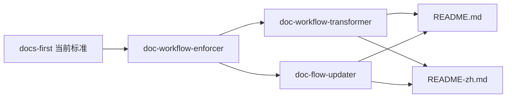
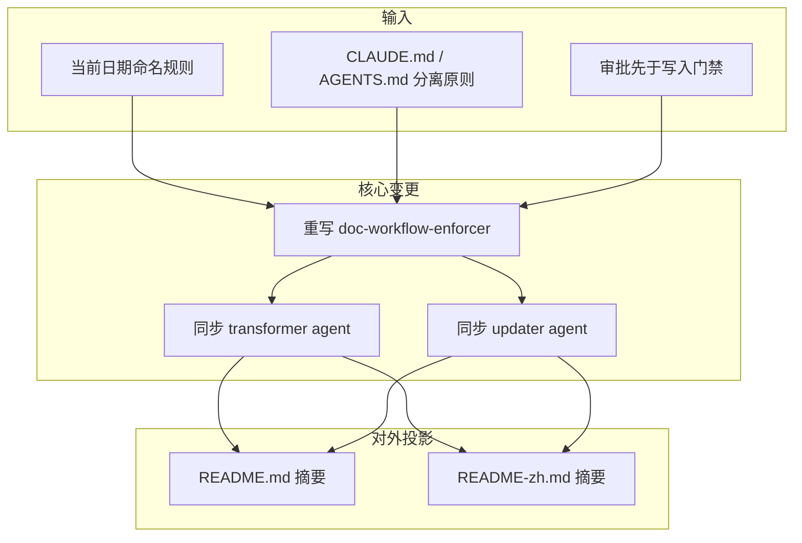
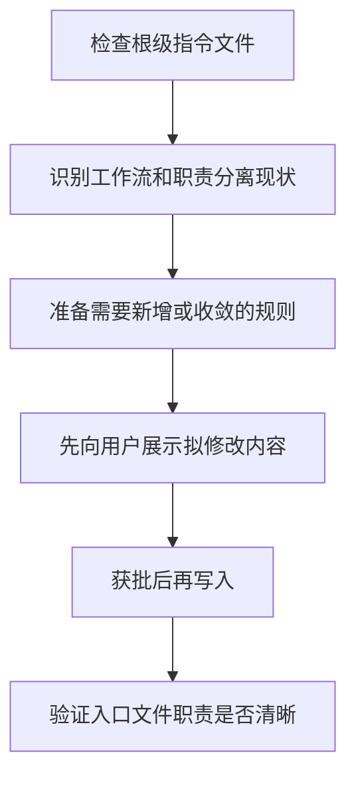
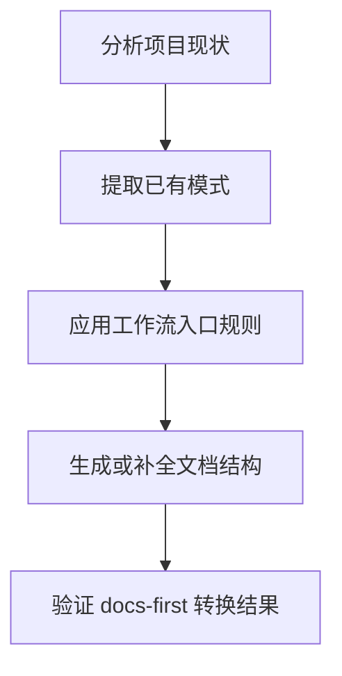
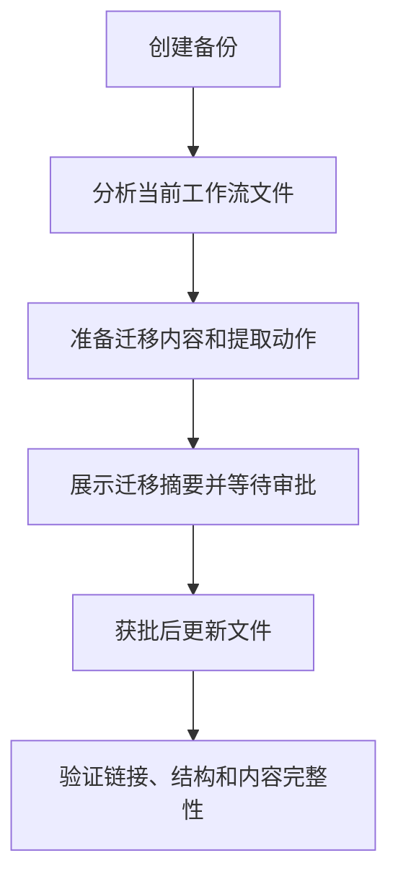
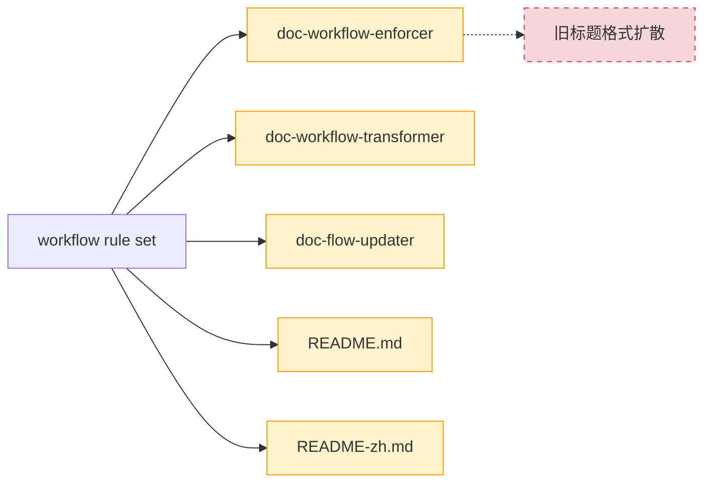
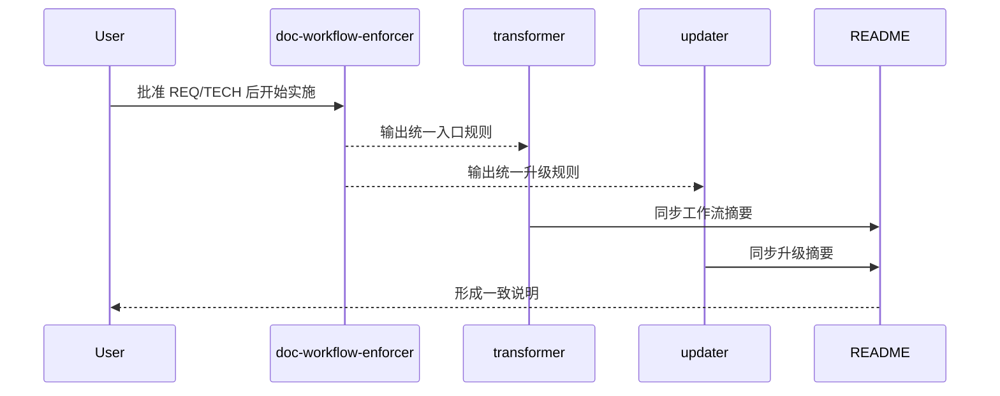
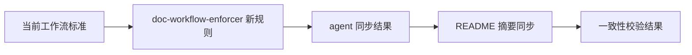

# 技术方案 20260331: doc-workflow-enforcer-alignment - 工作流规范与关联 Agent/README 对齐技术设计

## 文档信息

- **编号**: TECH-20260331
- **标题**: doc-workflow-enforcer-alignment
- **版本**: 1.0.0
- **创建日期**: 2026-03-31
- **状态**: 待实现
- **依赖**: REQ-20260331 (doc-workflow-enforcer-alignment 需求)
- **分支**: 当前工作区

## 1. 技术架构概述

### 1.1 整体设计思路

本次采用“入口规则先统一，再同步编排和升级代理，最后同步对外摘要”的顺序。`doc-workflow-enforcer` 是规范入口，两个 agent 负责复用和执行这套规则，README 双语只做摘要投影。

| 原则 | 说明 |
| --- | --- |
| 入口统一 | 先以 `doc-workflow-enforcer` 为规范源 |
| 代理从属 | agent 只编排和迁移，不扩展第二套规则 |
| 摘要同步 | README 只复述核心能力和最佳实践 |
| 最小范围 | 不改 command、template、其他 skill |



### 1.2 架构设计与实体设计



```text
plugins/ai-doc-driven-dev/
├── README.md
├── README-zh.md
├── skills/
│   └── doc-workflow-enforcer/SKILL.md
└── agents/
    ├── doc-workflow-transformer.md
    └── doc-flow-updater.md
```

## 2. 核心技能详细设计

### 2.1 doc-workflow-enforcer 重构

**功能职责**：
- 定义 docs-first 工作流入口规则
- 强调 `CLAUDE.md` 轻量入口与 `AGENTS.md` AI 规则分离
- 强调审批门禁和日期命名，而不是旧标题格式扩散

**数据与参数定义**：

| 字段名 | 类型 | 必填 | 说明 |
| --- | --- | --- | --- |
| `entry_files` | string[] | 是 | `CLAUDE.md`, `AGENTS.md` |
| `workflow_focus` | string | 是 | docs-first + approval gate |
| `naming_rule` | string | 是 | `YYYYMMDD-feature-name.md` |
| `separation_rule` | string | 是 | CLAUDE lightweight / AGENTS AI rules |

**逻辑执行机制**：



**规则/约束**：
- 审批先于写入必须保留
- 日期命名强调文件命名和文档配对，不继续放大旧标题格式
- `CLAUDE.md` / `AGENTS.md` 分工必须是核心内容

### 2.2 doc-workflow-transformer 同步

**功能职责**：
- 编排 `doc-detector`、`pattern-extractor`、`doc-workflow-enforcer`、`doc-generator`
- 让工作流转换场景遵循新的入口规则和输出边界

**数据与参数定义**：

| 字段名 | 类型 | 必填 | 说明 |
| --- | --- | --- | --- |
| `agent_role` | string | 是 | workflow orchestration |
| `entry_skill` | string | 是 | doc-workflow-enforcer |
| `sync_status` | string | 是 | aligned with current workflow rules |

**逻辑执行机制**：



**规则/约束**：
- agent 不能写出与 `doc-workflow-enforcer` 冲突的规则
- 工作流阶段描述要匹配新的 skill 语义

### 2.3 doc-flow-updater 同步

**功能职责**：
- 升级已有 docs-first 基础设施到当前规范
- 保留“备份、分析、审批、写入、验证”的迁移闭环
- 移除或收敛继续扩散旧标题格式的内容

**数据与参数定义**：

| 字段名 | 类型 | 必填 | 说明 |
| --- | --- | --- | --- |
| `migration_focus` | string | 是 | upgrade existing workflow safely |
| `backup_rule` | string | 是 | backup before write |
| `approval_gate` | string | 是 | explicit user approval required |
| `naming_rule` | string | 是 | date-based file naming |

**逻辑执行机制**：



**规则/约束**：
- 不删除用户内容
- 不把旧标题格式当作默认“After”状态
- 成功标准以“职责清晰、命名一致、审批保留”为主

### 2.4 文件级变更矩阵

| 文件路径 | 责任 | 关键变更点 | 变更状态 |
| --- | --- | --- | --- |
| `plugins/ai-doc-driven-dev/skills/doc-workflow-enforcer/SKILL.md` | 入口规则 | 收敛为当前工作流、职责分离、审批门禁 | <span style="color:orange">(~更新)</span> |
| `plugins/ai-doc-driven-dev/agents/doc-workflow-transformer.md` | 编排代理 | 阶段描述与 skill 新语义对齐 | <span style="color:orange">(~更新)</span> |
| `plugins/ai-doc-driven-dev/agents/doc-flow-updater.md` | 升级代理 | 迁移规则、示例和成功标准对齐当前规范 | <span style="color:orange">(~更新)</span> |
| `plugins/ai-doc-driven-dev/README.md` | 英文摘要 | 更新 `doc-workflow-enforcer` 说明与最佳实践 | <span style="color:orange">(~更新)</span> |
| `plugins/ai-doc-driven-dev/README-zh.md` | 中文摘要 | 同步英文版工作流说明 | <span style="color:orange">(~更新)</span> |

## 强制性开发工作流程

1. 审批当前需求文档与技术方案
2. 先更新 `doc-workflow-enforcer`
3. 再更新两个直接相关 agent
4. 最后同步 README 双语摘要
5. 校验 5 个文件是否仍有旧语义漂移

## 约束条件与改动说明



| 约束项 | 说明 | 处理策略 |
| --- | --- | --- |
| 范围约束 | 不动 command / template / 其他 skill | 发现问题仅记录，不在本次处理 |
| 门禁约束 | 审批先于写入必须保留 | 所有 skill/agent/README 说明同步强调 |
| 一致性约束 | agent 与 README 不能落后于 skill | 先改 skill，再同步 agent 和 README |

## 3. 工作流程设计

### 3.1 插件执行流程



### 3.2 技能调用策略

| 场景 | 策略 |
| --- | --- |
| 新项目工作流初始化 | 以 `doc-workflow-enforcer` 为入口规则源 |
| 工作流转换 | `doc-workflow-transformer` 复用入口规则 |
| 存量项目升级 | `doc-flow-updater` 复用入口规则和审批门禁 |

### 3.3 分支策略与缺陷处理

- 分支命名：`req-20260331-doc-workflow-enforcer-alignment`
- 若实施时发现只是 5 个目标文件间的摘要漂移，可继续在同一需求内修复
- 若需要改 command / template，则新开需求

## 4. 数据流设计

### 4.1 技能间数据传递



### 4.2 文件系统交互

| 路径 | 操作 | 目的 |
| --- | --- | --- |
| `plugins/ai-doc-driven-dev/skills/doc-workflow-enforcer/SKILL.md` | read/write | 修正工作流入口规则 |
| `plugins/ai-doc-driven-dev/agents/doc-workflow-transformer.md` | read/write | 同步编排阶段描述 |
| `plugins/ai-doc-driven-dev/agents/doc-flow-updater.md` | read/write | 同步升级规则与示例 |
| `plugins/ai-doc-driven-dev/README.md` | read/write | 同步英文摘要 |
| `plugins/ai-doc-driven-dev/README-zh.md` | read/write | 同步中文摘要 |

## 5. 性能优化策略

### 5.1 缓存机制

- 不引入缓存
- 目标文件少，直接读取即可

### 5.2 并行处理

- 可并行阅读 skill / agent / README
- 最终写入建议串行，保证语义一致

## 6. 扩展性设计

### 6.1 模板系统

- 本次不新增模板
- 后续若要统一 commands，可复用本轮的“入口规则先统一”方法

### 6.2 插件接口

- 本次不新增任何接口或命令

## 7. 质量保证

### 7.1 测试策略

| 检查项 | 方法 | 通过标准 |
| --- | --- | --- |
| 规则一致性 | 搜索 5 个文件中的旧标题/旧语义 | 不再把旧标题格式作为默认输出 |
| 门禁一致性 | 人工核对审批相关表述 | skill、agent、README 都保留审批先于写入 |
| 职责一致性 | 核对 `CLAUDE.md` / `AGENTS.md` 分工表述 | 5 个文件语义一致 |
| 范围控制 | `git diff` | 只落在批准的 5 个目标文件和新文档 |

### 7.2 质量指标

| 指标 | 目标值 |
| --- | --- |
| 旧标题格式默认引用数 | 0 |
| skill / agent / README 语义冲突数 | 0 |
| 本轮越界修改文件数 | 0 |
