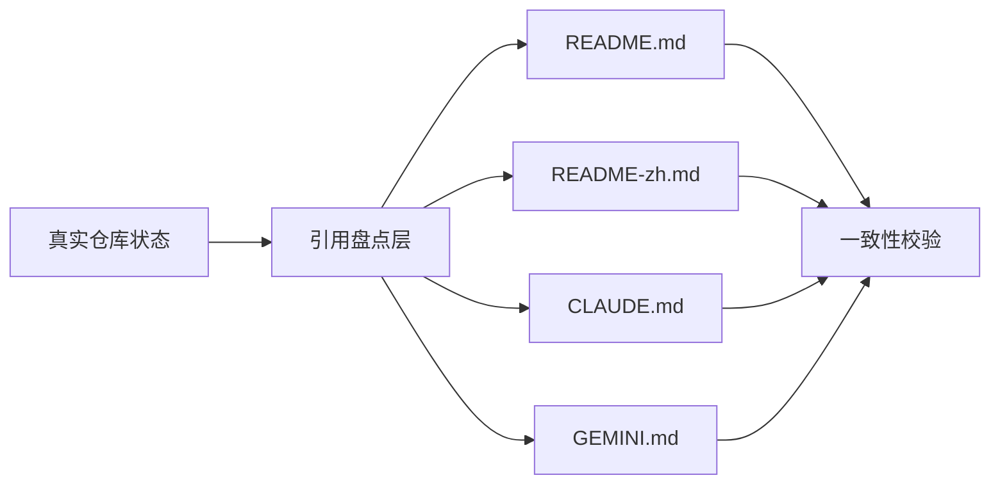
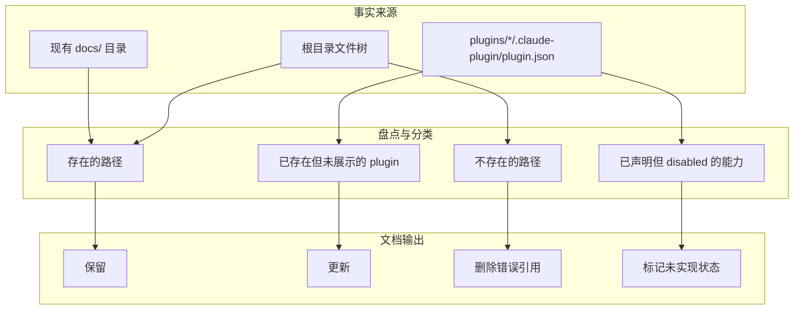
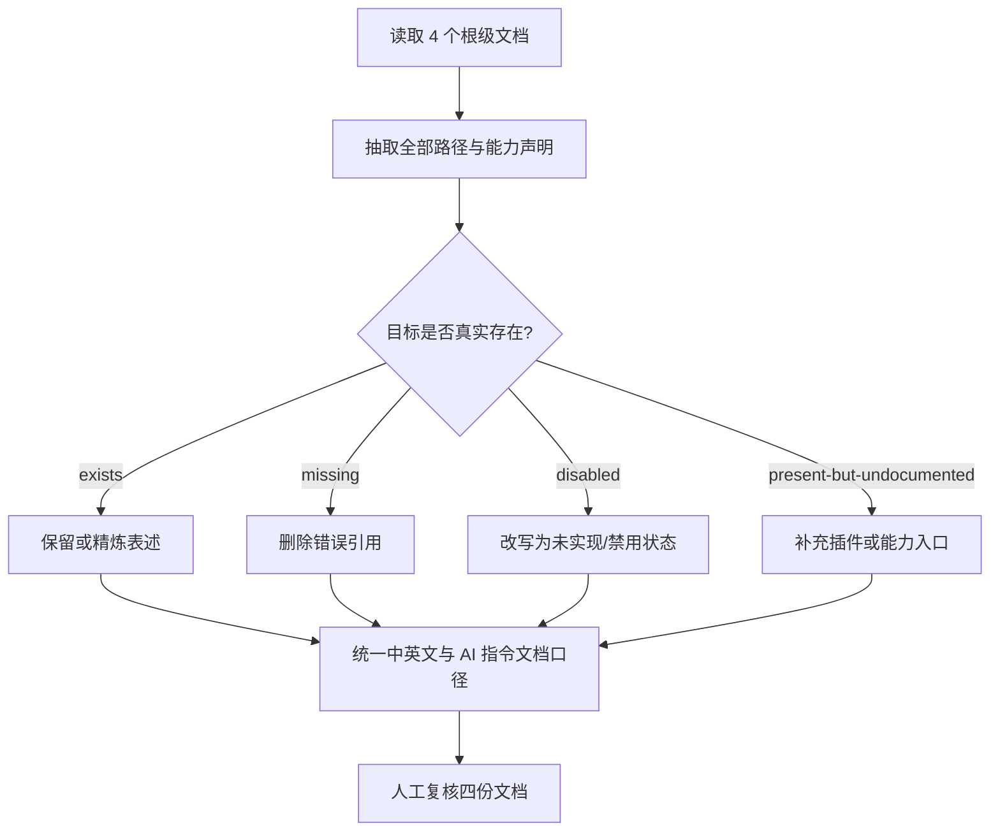
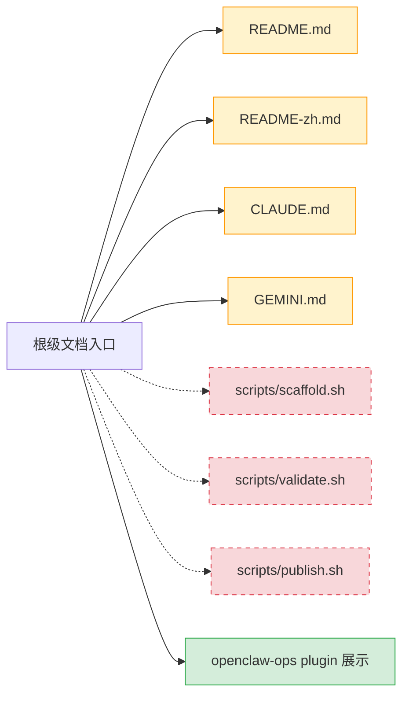
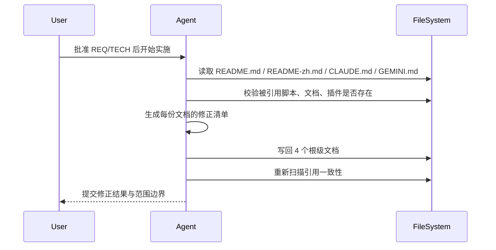

# 技术方案 20260331: marketplace-consistency-optimization - 根级市场文档真相对齐技术设计

## 文档信息

- **编号**: TECH-20260331
- **标题**: marketplace-consistency-optimization
- **版本**: 1.0.0
- **创建日期**: 2026-03-31
- **状态**: 待实现
- **依赖**: REQ-20260331 (marketplace-consistency-optimization 需求)
- **分支**: 当前工作区

## 1. 技术架构概述

### 1.1 整体设计思路

本次技术方案采用“只修入口、不动实现”的最小改动策略，把根级文档恢复为可信入口。核心原则是：

| 原则 | 说明 |
| --- | --- |
| 单一事实源 | 以仓库当前文件树、`plugins/*/.claude-plugin/plugin.json`、现有 plugin 目录为准 |
| 最小范围 | 仅修改 4 个根级文档，不下沉到 plugin README 或 skill/command 本体 |
| 同步修正 | 英文 README、中文 README、`CLAUDE.md`、`GEMINI.md` 同轮修正，避免再次漂移 |
| 明确状态 | 对未实现能力使用“未实现 / 规划中 / disabled”明确标识，不保留伪可用说明 |



### 1.2 架构设计与实体设计



```text
<project-root>/
├── README.md
├── README-zh.md
├── CLAUDE.md
├── GEMINI.md
├── docs/
└── plugins/
```

## 2. 核心技能详细设计

### 2.1 根级文档修正单元 (root-doc-alignment)

**功能职责**：
- 盘点根级文档中的文件引用、脚本引用、插件清单与状态说明
- 将失真项改写为与仓库真实状态一致的表述
- 统一四份根级文档对“安装、使用、当前实现边界”的表达

**数据与参数定义**：

| 字段名 | 类型 | 必填 | 说明 |
| --- | --- | --- | --- |
| `doc_path` | string | 是 | 被修正的根级文档路径 |
| `reference_kind` | string | 是 | `script` / `doc` / `plugin` / `workflow` |
| `reference_target` | string | 是 | 被引用路径或能力标识 |
| `actual_state` | string | 是 | `exists` / `missing` / `disabled` / `present-but-undocumented` |
| `action` | string | 是 | `keep` / `rewrite` / `remove-reference` / `add-entry` |

**逻辑执行机制**：



**规则/约束**：
- 只允许改动 4 个根级文档
- 不新增脚本来“补齐”文档承诺
- 不把 plugin 内部 README 问题纳入本次实现

### 2.2 文件级变更矩阵 (inline diff)

| 文件路径 | 责任 | 关键修正点 | 变更状态 |
| --- | --- | --- | --- |
| `README.md` | 英文市场总入口 | `~~scripts/scaffold.sh~~`、`~~scripts/validate.sh~~`、`~~scripts/publish.sh~~` 引用移除；补充 `openclaw-ops`；统一安装路径说明 | <span style="color:orange">(~更新)</span> |
| `README-zh.md` | 中文市场总入口 | 与英文版对齐事实源；移除 `~~cp -r~~` 作为唯一主路径的冲突表达；补充真实插件清单 | <span style="color:orange">(~更新)</span> |
| `CLAUDE.md` | Claude 项目事实入口 | 把 `~~scripts/~~`、`~~workflow.md~~`、`~~architecture.md~~` 等不存在资源从“能力实现”改为事实性描述 | <span style="color:orange">(~更新)</span> |
| `GEMINI.md` | Gemini 项目事实入口 | 与 `CLAUDE.md` 同步，清理相同失真项 | <span style="color:orange">(~更新)</span> |

## 强制性开发工作流程

1. 审批当前需求文档与技术方案
2. 仅按文件级变更矩阵编辑 4 个根级文档
3. 编辑后重新扫描根级文档中的路径引用
4. 发现超出范围的问题时停止并回到文档更新，而不是顺手扩改 plugin 文档

## 约束条件与改动说明



| 约束项 | 说明 | 处理策略 |
| --- | --- | --- |
| 范围约束 | 不能修改 plugin 本体 | 发现 plugin README 失真时仅记录为后续需求 |
| 事实约束 | 文档必须对应真实仓库状态 | 逐项验证被引用路径是否存在 |
| 双语约束 | 中英文入口必须共享同一事实集 | 以英文版为结构基线，中文版同步表达 |

## 3. 工作流程设计

### 3.1 插件执行流程



### 3.2 技能调用策略

| 场景 | 策略 |
| --- | --- |
| 根级文档修订 | 直接基于仓库现状编辑 Markdown |
| plugin 内部问题发现 | 仅记录，不在本次变更内处理 |
| 发现更多入口文档漂移 | 先判断是否属于根级 4 文件，否则升级为新需求 |

### 3.3 分支策略与缺陷处理

- 分支命名：`req-20260331-marketplace-consistency-optimization`
- 若实施时发现的仅是根级 4 文档中的漏改项，可继续在同一需求下修复
- 若需要新增脚本、补 plugin README、改 command/skill 内容，则必须新开需求

## 4. 数据流设计

### 4.1 技能间数据传递

本次不涉及多 skill 数据传递，数据流仅存在于“仓库事实 -> 文档修订 -> 复核结果”之间。


### 4.2 文件系统交互

| 路径 | 操作 | 目的 |
| --- | --- | --- |
| `README.md` | read/write | 修正英文市场入口 |
| `README-zh.md` | read/write | 修正中文市场入口 |
| `CLAUDE.md` | read/write | 修正 Claude 指令事实 |
| `GEMINI.md` | read/write | 修正 Gemini 指令事实 |
| `plugins/*/.claude-plugin/plugin.json` | read | 校验当前插件库存和元数据 |

## 5. 性能优化策略

### 5.1 缓存机制

- 不引入缓存
- 仓库规模较小，直接读取当前文件即可

### 5.2 并行处理

- 文档读取与引用校验可并行
- 最终写入需串行，确保四份文档口径一致

## 6. 扩展性设计

### 6.1 模板系统

- 本次不新增模板
- 后续若扩展到 plugin 级文档校正，可复用当前“引用盘点 + 状态分类 + 统一口径”方法

### 6.2 插件接口

- 本次不新增任何 plugin 接口或脚本入口

## 7. 质量保证

### 7.1 测试策略

| 检查项 | 方法 | 通过标准 |
| --- | --- | --- |
| 路径真实性 | `rg`/人工扫描根级文档中的路径引用 | 不再引用不存在的 `scripts/` 或虚构文档 |
| 插件清单完整性 | 对比 `plugins/` 目录与根级 README | 根级 README 不遗漏现有 plugin |
| 双语一致性 | 对照英文与中文入口结构 | 同一类安装/使用说明不冲突 |
| 指令文档一致性 | 对照 `CLAUDE.md` 与 `GEMINI.md` | 两者不再重复声明不存在能力 |

### 7.2 质量指标

| 指标 | 目标值 |
| --- | --- |
| 根级文档错误引用数 | 0 |
| 根级 README 漏展示现有 plugin 数 | 0 |
| 根级安装说明主路径冲突数 | 0 |
