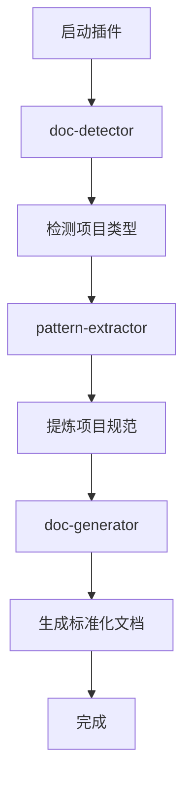

# 技术方案 001: AI Documentation-Driven Development Plugin - 基础架构技术设计

## 文档信息

- **编号**: TECH-001
- **标题**: AI文档驱动开发插件基础架构
- **版本**: 1.0.0
- **创建日期**: 2026-01-10
- **状态**: 已实现
- **依赖**: REQ-001 (基础功能需求)

## 1. 技术架构概述

### 1.1 整体设计思路

**核心理念**：通过自动化的文档体系建设，为AI辅助开发提供充分的上下文信息，确保代码生成质量和项目一致性。

**技术路线**：
```
项目代码分析 → 规范提炼 → 文档生成 → AI上下文优化 → CLAUDE.md强制集成
```

### 1.2 插件架构设计

```
ai-doc-driven-dev/
├── .claude-plugin/
│   └── plugin.json              # 插件元数据和配置
├── skills/                      # 核心技能模块
│   ├── claude-md-enforcer/      # CLAUDE.md强制集成技能（优先执行）
│   │   └── SKILL.md
│   ├── doc-detector/            # 文档检测技能
│   │   └── SKILL.md
│   ├── pattern-extractor/       # 项目规范提炼技能
│   │   └── SKILL.md
│   └── doc-generator/           # 文档生成技能
│       └── SKILL.md
├── knowledge/                   # 知识库和模板
│   ├── templates/               # 文档模板库
│   │   ├── frontend-templates/
│   │   └── backend-templates/
│   ├── patterns/               # 代码模式识别规则
│   │   ├── frontend-patterns.json
│   │   └── backend-patterns.json
│   └── standards/              # 通用编码规范
│       ├── typescript-standards.md
│       ├── python-standards.md
│       └── java-standards.md
└── README.md
```

## 2. 核心技能详细设计

### 2.1 doc-detector (文档检测技能)

**功能职责**：
- 扫描项目目录结构，检测现有文档
- 识别缺失的标准化文档类型
- 生成文档完整性报告和建议

**实现思路**：
```typescript
interface DocumentDetectionResult {
  existing: {
    requirements: string[];      // 需求方案
    design: string[];           // 技术方案
    analysis: string[];         // 项目分析（可选）
    standards: string[];        // 编码规范（可选）
  };
  coreDocuments: {
    hasRequirements: boolean;    // 是否有需求方案
    hasDesign: boolean;         // 是否有技术方案
    isDocDriven: boolean;       // 是否满足文档驱动基本要求
  };
  claudeMdStatus: 'exists' | 'missing' | 'needs_update';
  userPrompts: string[];        // 需要询问用户的缺失文档
}
```

**检测规则**：
1. 扫描 `docs/` 目录结构
2. 检查核心文档是否存在（技术方案、需求方案）
3. 验证CLAUDE.md文件状态
4. 分析项目类型（前端/后端/全栈）
5. 询问用户是否需要生成缺失的文档（而非自动生成）

### 2.2 pattern-extractor (项目规范提炼技能)

**功能职责**：
- 分析现有代码库，提取项目特有的编码模式
- 识别命名约定、架构模式、API设计规范
- 生成项目规范文档

**实现思路**：

**前端规范提炼**：
```typescript
interface FrontendPatterns {
  typescript: {
    interfaceNaming: string;        // Props, State命名模式
    componentStructure: string;     // 组件文件组织方式
    importExportStyle: string;      // 导入导出模式
  };
  api: {
    requestMethod: string;          // axios, fetch使用模式
    errorHandling: string;          // 错误处理方式
    dataTransform: string;          // 数据转换模式
  };
  styling: {
    approach: string;               // CSS-in-JS, Modules, etc.
    themeManagement: string;        // 主题变量管理
    componentStyling: string;       // 组件样式组织
  };
  stateManagement: {
    library: string;                // Redux, Zustand, Context
    storeStructure: string;         // Store组织方式
    actionPatterns: string;         // Action定义模式
  };
}
```

**后端规范提炼**：
```typescript
interface BackendPatterns {
  api: {
    routeDefinition: string;        // 路由定义方式
    responseFormat: string;         // 响应格式统一模式
    parameterValidation: string;    // 参数验证方式
  };
  dataModel: {
    entityDefinition: string;       // 实体定义模式
    fieldNaming: string;           // 字段命名约定
    relationshipMapping: string;    // 关系映射方式
  };
  errorHandling: {
    exceptionStructure: string;     // 异常处理结构
    errorCodes: string;            // 错误码定义方式
    loggingPattern: string;        // 日志记录模式
  };
  security: {
    authenticationMethod: string;   // 认证方式
    authorizationPattern: string;   // 权限控制模式
    tokenManagement: string;       // Token管理方式
  };
}
```

**分析算法**：
1. **代码扫描**：使用LSP分析代码结构
2. **模式识别**：基于预定义规则匹配常见模式
3. **频率统计**：统计命名和结构的使用频率
4. **规范提取**：基于主流模式生成规范文档

### 2.3 doc-generator (文档生成技能)

**功能职责**：
- 基于代码分析结果生成标准化文档
- 使用模板系统确保文档一致性
- 支持增量更新和版本管理

**模板系统设计**：
```
templates/
├── requirements/
│   ├── functional-requirements.template.md
│   ├── non-functional-requirements.template.md
│   └── user-stories.template.md
├── design/
│   ├── architecture.template.md
│   ├── api-design.template.md
│   └── database-design.template.md
├── analysis/
│   ├── codebase-structure.template.md
│   ├── dependency-analysis.template.md
│   └── tech-stack.template.md
├── standards/
│   ├── coding-standards.template.md
│   ├── naming-conventions.template.md
│   └── review-guidelines.template.md
└── ai-context/
    ├── project-overview.template.md
    ├── coding-patterns.template.md
    └── development-guidelines.template.md
```

**生成流程**：
1. 选择合适的模板
2. 填充项目特定数据
3. 应用项目规范
4. 生成最终文档
5. 添加frontmatter元数据

### 2.4 claude-md-enforcer (CLAUDE.md强制集成技能)

**功能职责**：
- 检测现有CLAUDE.md文件
- 强制插入文档驱动开发规范
- 确保开发流程的一致性

**实现策略**：
```typescript
interface ClaudeMdOperation {
  action: 'create' | 'update' | 'insert';
  existingContent?: string;
  insertionPoint?: string;
  template: string;
}
```

**处理逻辑**：
1. **文件不存在**：创建包含完整规范的CLAUDE.md
2. **文件存在但无规范**：在适当位置插入文档驱动开发规范
3. **文件存在有旧规范**：更新为最新的规范内容
4. **文件存在有新规范**：跳过处理

**强制规范模板**：
```markdown
# 文档驱动开发规范

**IMPORTANT**: 此项目采用文档驱动开发模式。

## 强制性开发工作流程
1. 需求分析 → docs/requirements/
2. 技术设计 → docs/design/
3. 规范检查 → docs/standards/
4. AI上下文 → docs/ai-context/
5. 代码实现

## 约束条件
- ❌ 禁止直接修改代码
- ✅ 必须先更新相关文档
- ✅ AI生成基于docs上下文

**违反此流程的代码变更将被拒绝！**
```


## 3. 工作流程设计

### 3.1 插件执行流程



### 3.2 技能调用策略

**顺序执行**：
1. `claude-md-enforcer` → 强制集成CLAUDE.md（优先执行）
2. `doc-detector` → 分析现状
3. `pattern-extractor` → 提炼规范
4. `doc-generator` → 按需生成文档

**错误处理**：
- 每个技能独立执行，失败不影响其他技能
- 提供详细的错误信息和恢复建议
- 支持部分成功的场景

## 4. 数据流设计

### 4.1 技能间数据传递

```typescript
interface PluginContext {
  projectInfo: {
    type: 'frontend' | 'backend' | 'fullstack';
    framework: string;
    language: string;
    rootPath: string;
  };
  detectionResult: DocumentDetectionResult;
  extractedPatterns: FrontendPatterns | BackendPatterns;
  generatedDocs: string[];
  claudeMdStatus: 'created' | 'updated' | 'skipped';
}
```

### 4.2 文件系统交互

**读取操作**：
- 扫描项目目录结构
- 读取现有文档和代码文件
- 分析package.json、配置文件等

**写入操作**：
- 创建docs目录结构
- 生成标准化文档文件
- 更新或创建CLAUDE.md

## 5. 性能优化策略

### 5.1 缓存机制
- 缓存项目分析结果
- 避免重复的文件扫描
- 增量更新机制

### 5.2 并行处理
- 独立的分析任务并行执行
- 文档生成可并行进行
- 优化大型项目的处理时间

## 6. 扩展性设计

### 6.1 模板系统
- 支持自定义文档模板
- 可配置的规范提取规则
- 多语言和框架支持

### 6.2 插件接口
- 标准化的技能接口
- 可插拔的分析模块
- 支持第三方扩展

## 7. 质量保证

### 7.1 测试策略
- 单元测试：每个技能独立测试
- 集成测试：整体工作流程测试
- 真实项目验证：多种项目类型验证

### 7.2 质量指标
- 文档生成准确率 > 90%
- 规范提取有效性 > 85%
- 插件执行时间 < 30秒（中等项目）

---

*此技术方案将指导插件的具体实现，确保功能的完整性和技术的可行性。*