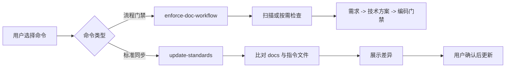

# 需求文档 20260312: update-standards 命令职责拆分

## 文档信息
- **编号**: REQ-20260312
- **标题**: update-standards 命令职责拆分
- **版本**: 1.0.0
- **创建日期**: 2026-03-12
- **状态**: 草案

## 1. 需求背景

### 1.1 问题现状

当前 `enforce-doc-workflow` 同时承担两类职责:
- 文档优先开发流程的准入与拦截
- 本地 `docs/` 全量文档/指令文件与插件最新标准的同步

这会带来两个直接问题:
- 用户只想开启“文档先行门禁”时, 命令语义过重
- 标准同步属于维护动作, 不应与代码变更拦截强绑定

### 1.2 目标用户

- 频繁使用 `enforce-doc-workflow` 的项目维护者
- 需要独立执行文档标准升级的团队
- 需要更清晰命令边界的插件使用者

## 2. 功能需求

### 2.1 核心功能

**F1: `enforce-doc-workflow` 只保留流程强制职责**
- 保留扫描确认、缺失文档检查、需求/技术方案/编码的门禁流程
- 移除“检查本地模板是否落后于插件最新标准并更新”的职责

**F2: 新增独立命令 `update-standards`**
- 独立负责检查并同步本地 `docs/**/*.md` 与指令文件 (`CLAUDE.md`, `AGENTS.md`, `GEMINI.md`) 是否落后于插件最新标准
- 在发现缺失原则或模板漂移时, 先给出差异说明, 再征求用户确认后更新所有需要调整的 `docs/` 文件与指令文件

**F3: 用户文档同步反映职责拆分**
- 命令文档与插件 README 必须明确两个命令的边界
- `enforce-doc-workflow` 需要将标准同步引导到 `update-standards`

**F4: 项目内命令示例改为供应商中立写法**
- 项目内所有 `claude <command>` 形式的示例都应移除 `claude` 前缀
- 命令展示统一改为中立的 `<command>` 或 `plugin install ...` 形式, 以兼容 Codex 等其他入口

**F5: 删除冗余 Usage 段落**
- 项目内命令文档和 README 中, 仅用于重复单行命令语法的 `Usage` / `用法` 段落应删除
- 保留 `Options`、`Examples`、`Commands` 等更有信息量的章节

**职责拆分表**

| 能力 | `enforce-doc-workflow` | `update-standards` | 变更状态 |
| --- | --- | --- | --- |
| 代码变更前文档门禁 | 保留 | 不负责 | 无变化 |
| 仓库扫描与文档完整性检查 | 保留 | 可按需复用检查结果 | 无变化 |
| `~~docs/ 文档与规范同步~~` | `~~内置执行~~` | 独立命令执行 | <span style="color:green">职责迁移</span> |
| 用户确认后更新 `docs/` 与指令文件 | `~~内置执行~~` | 负责 | <span style="color:green">(+新增入口)</span> |
| `~~claude <command>~~` 示例 | `~~保留~~` | 中立命令展示 | <span style="color:green">兼容 Codex</span> |
| `~~Usage / 用法~~` 段落 | `~~保留~~` | 删除 | <span style="color:green">文档瘦身</span> |

### 2.2 辅助功能

- `enforce-doc-workflow` 的 Related Commands 增加 `update-standards`
- README 增加 `update-standards` 的用途和使用示例
- 根 README、插件 README、命令定义与相关设计文档中的命令示例去掉 `claude` 前缀
- 删除命令文档与 README 中冗余的 `Usage` / `用法` 段落

## 3. 技术需求

### 3.1 架构设计



### 3.2 技术实现大纲

| 文件 | 动作 | 说明 |
| --- | --- | --- |
| `docs/requirements/20260312-update-standards-command-separation.md` | 新增 | 定义职责拆分需求 |
| `docs/design/20260312-update-standards-command-separation-technical-design.md` | 新增 | 定义命令边界与修改方案 |
| `plugins/ai-doc-driven-dev/commands/enforce-doc-workflow.md` | 修改 | 移除模板/规范同步职责 |
| `plugins/ai-doc-driven-dev/commands/update-standards.md` | 新增 | 承接标准同步职责 |
| `README.md` 与插件 README | 修改 | 去除 `claude <command>` 示例并更新说明 |
| `plugins/*/commands/*.md` | 修改 | 使用中立命令示例 |
| `docs/requirements/*.md` 与 `docs/design/*.md` | 修改 | 清理遗留 `claude <command>` 示例 |

### 3.3 简化数据模型

| 检查目标 | 类型 | 更新方式 | 说明 |
| --- | --- | --- | --- |
| `docs/**/*.md` | 项目文档文件 | 用户确认后统一更新 | 覆盖 `requirements/`、`design/`、`analysis/`、`standards/` 及其他子目录 |
| `CLAUDE.md` | 指令文件 | 用户确认后更新 | 工作流与原则同步 |
| `AGENTS.md` | 指令文件 | 用户确认后更新 | 多 Agent 项目使用 |
| `GEMINI.md` | 指令文件 | 用户确认后更新 | 兼容其他指令文件 |

## 技术栈

- Markdown with YAML frontmatter
- Mermaid
- Claude Code Plugin command definitions

## 开发约定（从代码中自动提炼）

- 命令文件位于 `plugins/ai-doc-driven-dev/commands/`
- 命令名采用 kebab-case
- README 需保持中英文双语同步
- 命令描述以职责清晰、边界明确为优先

## 项目特有规范

- 修改 `plugins/` 内容前必须先补齐 `docs/requirements/` 与 `docs/design/`
- 命令文档要尽量与实际职责一一对应, 避免“一个命令承载多个阶段目标”

## 架构模式

- 单一职责命令
- 命令文档驱动行为约束
- 用户确认后执行写入

## 开发工作流程

### 1. 强制性文档优先原则

- 先定义职责拆分的需求与技术设计
- 再修改命令文档与 README

### 2. 开发步骤（严格按顺序执行）

1. 创建本需求文档与对应技术方案
2. 修改 `enforce-doc-workflow` 与新增 `update-standards`
3. 更新 README、命令文档与相关设计文档中的命令示例
4. 校验命令职责与供应商中立写法一致性

### 3. AI使用规范

- AI 修改命令前必须确保职责边界在文档中已有明确说明
- 若后续发现 `update-standards` 还需再拆分, 应再次先补文档

### 4. 文档结构

```text
docs/
├── requirements/
│   └── 20260312-update-standards-command-separation.md
└── design/
    └── 20260312-update-standards-command-separation-technical-design.md
```

## 4. 风险评估

### 4.1 技术风险

- **命令发现性下降**: 用户可能不知道标准同步被迁移到新命令。缓解方式是更新 README 与 Related Commands。
- **职责重复描述**: 如果旧命令残留同步表述, 用户会误解。缓解方式是对关键文案做全文校验。

### 4.2 其他风险

- **命令命名歧义**: `update-standards` 可能被理解为仅更新 `docs/standards/`。缓解方式是在描述中明确覆盖整个 `docs/` 目录与指令文件。
- **中立命令示例歧义**: 去掉 `claude` 前缀后, 个别读者可能不确定入口。缓解方式是在正文中统一说明“在你的 agent/CLI 环境中运行该命令”。
