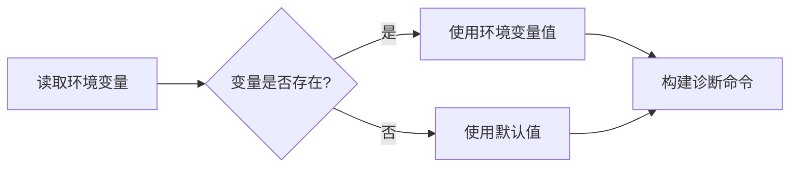
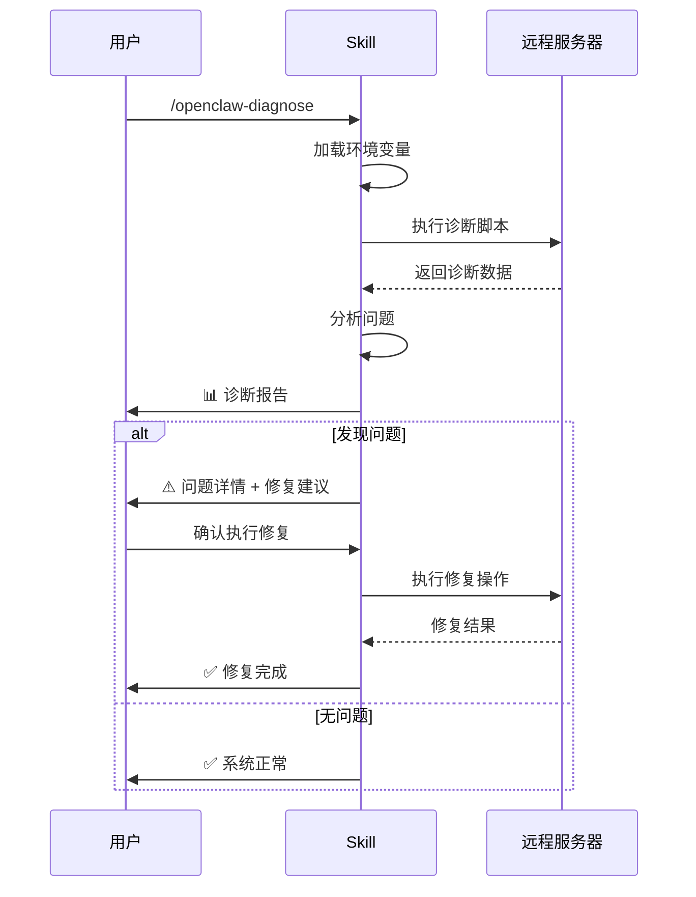
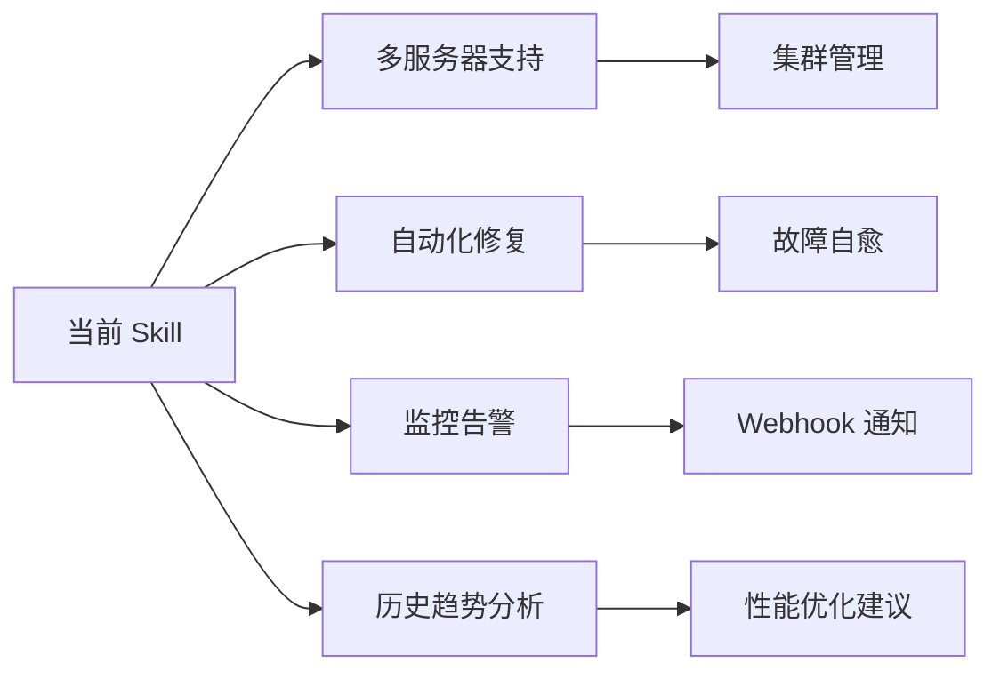

# REQ-20260314: OpenClaw 诊断与故障排查技能

> **文档 ID**: REQ-20260314
> **状态**: 草稿
> **创建日期**: 2026-03-14
> **最后更新**: 2026-03-14

## 1. 概述

### 1.1 背景

OpenClaw 是一个运行在远程服务器上的 Telegram AI Bot Gateway，需要定期维护和故障排查。当前运维知识分散在文档中，缺乏自动化诊断能力，导致问题排查效率低下。

### 1.2 目标

创建一个智能诊断 Skill，能够：
- **自动诊断** OpenClaw 服务常见问题
- **提供修复建议** 和操作指令
- **支持环境参数化配置**，适配不同部署环境
- **无需手动输入敏感信息**（通过环境变量注入）

### 1.3 适用场景

| 场景 | 描述 |
|------|------|
| **服务不响应** | Bot 60s 超时、消息无响应 |
| **内存异常** | OOM 风险、内存使用过高 |
| **认证失败** | Token 过期、OAuth 失效 |
| **服务启动失败** | systemd 服务无法启动 |
| **性能下降** | 响应变慢、CPU 占用高 |

## 2. 功能需求

### 2.1 核心命令

本需求提供 **2 个核心 Commands**：

| Command | 功能描述 | 使用场景 |
|---------|----------|----------|
| **`/openclaw-diagnose`** | 诊断 OpenClaw 问题并给出修复建议 | Bot 不响应、内存异常、服务异常 |
| **`/openclaw-update-token`** | 从本地同步 Token 到远程服务器 | Token 过期、认证失败 |

### 2.2 核心能力

```mermaid
flowchart TD
    A[用户描述问题] --> B[/openclaw-diagnose]
    B --> C[执行远程诊断脚本]
    C --> D[分析结果]
    D --> E{发现问题?}
    E -->|是| F[显示修复建议]
    E -->|否| G[显示正常状态]

    F --> H{用户确认修复?}
    H -->|是| I[执行修复命令]
    I --> J[验证修复结果]
    H -->|否| K[结束]

    G --> K
    J --> K

    L[Token 过期] --> M[/openclaw-update-token]
    M --> N[从 ~/.codex/auth.json 读取]
    N --> O[上传到服务器]
    O --> P[同步两个配置文件]
    P --> Q[重启服务]
    Q --> R[验证成功]
```

### 2.3 Command 1: `/openclaw-diagnose`

**功能**: 智能诊断 OpenClaw 问题

**输入参数**:
```bash
/openclaw-diagnose [可选:问题描述]

# 示例
/openclaw-diagnose                          # 全面诊断
/openclaw-diagnose Bot 不响应,超时 60 秒      # 描述具体问题
/openclaw-diagnose 内存占用过高               # 定向排查
```

**执行流程**:
1. 读取环境变量配置 (服务器地址、用户、目录等)
2. SSH 连接到服务器
3. 执行诊断脚本(检查服务状态、Token、内存、日志)
4. 解析诊断结果,识别问题
5. 生成诊断报告 + 修复建议
6. 如果需要修复,征求用户确认后执行

**输出格式**:
```markdown
🔍 OpenClaw 诊断报告
环境: 104.168.43.20
时间: 2026-03-14 10:30:00

系统状态:
✅ 服务状态: active (running)
⚠️  Token 有效期: 2 天 (建议更新)
✅ 内存使用: 44% (1.06GB / 2.4GB)
✅ 日志: 无错误

问题分析:
[中] Token 将在 2 天后过期

修复建议:
1. 更新 Token: /openclaw-update-token

是否执行修复操作 1?
```

### 2.4 Command 2: `/openclaw-update-token`

**功能**: 从本地 auth.json 同步 Token 到远程服务器

**输入参数**:
```bash
/openclaw-update-token [token_file_path]

# 示例
/openclaw-update-token                           # 提示用户提供文件路径
/openclaw-update-token ~/.codex/auth.json       # 指定 codex token
/openclaw-update-token ~/my-auth.json           # 指定自定义文件
```

**执行流程**:
1. **用户提供 token 文件路径** (如果未提供，询问用户)
2. 读取本地 auth.json 文件
3. 验证 Token 有效性 (解析 JWT exp 字段)
4. 上传到服务器 `/tmp/sync_auth.json`
5. 在服务器上执行同步脚本:
   - 更新 `/root/.codex/auth.json`
   - 更新 `/root/.openclaw/agents/main/agent/auth-profiles.json`
6. 重启 OpenClaw 服务
7. 验证服务状态

**输出格式**:
```markdown
🔄 Token 同步中...

📁 读取: /Users/xxx/.codex/auth.json

✅ Token 验证通过
   Email: nixmxbl3155@hotmail.com
   有效期: 2026-03-20 (7 天)

✅ 上传到服务器: 104.168.43.20

✅ 同步配置文件:
   • /root/.codex/auth.json
   • /root/.openclaw/agents/main/agent/auth-profiles.json

✅ 重启服务: systemctl restart openclaw

验证结果:
✅ 服务状态: active (running)
✅ Token 有效期: 7 天
```

### 2.5 诊断项矩阵

| 诊断项 | 检查内容 | 正常阈值 | 异常处理 |
|--------|----------|----------|----------|
| **服务状态** | `systemctl status openclaw` | active (running) | 重启服务 |
| **Token 有效期** | JWT exp 字段 | > 24 小时 | 提示更新 Token |
| **内存使用** | `free -h` | < 70% | 清理进程 / 重启 |
| **进程存活** | `ps aux \| grep openclaw` | 1+ 进程 | 启动服务 |
| **日志错误** | `journalctl -u openclaw` | 无 ERROR | 分析错误类型 |
| **端口监听** | `netstat -tlnp \| grep 18789` | LISTEN 状态 | 检查端口冲突 |
| **配置文件** | 检查 JSON 语法 | 有效 JSON | 修复语法错误 |
| **依赖完整性** | `npm list --depth=0` | 无 missing | 重新安装 |

### 2.3 环境参数化

**设计原则**：所有环境相关配置通过环境变量注入，避免硬编码

| 环境变量 | 必填 | 默认值 | 说明 |
|----------|------|--------|------|
| `OPENCLAW_SSH_HOST` | ✅ | 无 | 服务器地址 (必须提供) |
| `OPENCLAW_SSH_USER` | ❌ | `root` | SSH 用户 |
| `OPENCLAW_INSTALL_DIR` | ❌ | `/root/openclaw` | 安装目录 |
| `OPENCLAW_CONFIG_DIR` | ❌ | `/root/.openclaw` | 配置目录 |
| `OPENCLAW_SERVICE_NAME` | ❌ | `openclaw` | systemd 服务名 |
| `OPENCLAW_GATEWAY_PORT` | ❌ | `18789` | 网关端口 |
| `OPENCLAW_MEM_WARN_PCT` | ❌ | `70` | 内存警告阈值 (%) |
| `OPENCLAW_MEM_CRIT_PCT` | ❌ | `80` | 内存危险阈值 (%) |

**配置加载逻辑**：


## 3. 用户交互流程

### 3.1 基本诊断流程



### 3.2 交互示例

**示例 1: 全面诊断**
```
用户: /openclaw-diagnose

AI: 🔍 开始 OpenClaw 服务诊断...

环境信息:
• 服务器: 104.168.43.20
• 服务名: openclaw
• 安装目录: /root/openclaw

[执行检查...]

诊断报告:
✅ 服务状态: active (running)
⚠️ Token 有效期: 2 天 (建议更新)
✅ 内存使用: 44% (1.06GB / 2.4GB)
✅ 日志无错误
✅ 端口监听: 18789 正常

建议操作:
1. Token 将在 2 天后过期，建议提前更新
   命令: /openclaw-update-token

是否需要执行其他操作?
```

**示例 2: 定向排查**
```
用户: Bot 不响应，超时 60 秒

AI: 🔍 检测到超时问题，正在排查认证状态...

[检查 Token...]

⚠️ 问题发现:
• Token 已过期 (过期时间: 2026-03-12)
• 需要更新认证信息

修复方案:
1. 在本地运行 `codex` 刷新 token
2. 同步到服务器: /openclaw-update-token

是否立即执行方案 2?
```

## 4. 技术需求

### 4.1 Command 接口设计

**Command 1: `/openclaw-diagnose`**

| 参数 | 类型 | 必填 | 说明 |
|------|------|------|------|
| `issue_description` | string | 否 | 问题描述,如 "Bot 不响应" "内存过高" |

**调用示例**:
```bash
/openclaw-diagnose
/openclaw-diagnose Bot 不响应,超时 60 秒
/openclaw-diagnose 内存占用过高
```

**Command 2: `/openclaw-update-token`**

| 参数 | 类型 | 必填 | 说明 |
|------|------|------|------|
| `token_file_path` | string | 否 | 本地 auth.json 文件路径 (如 `~/.codex/auth.json`) |

**调用示例**:
```bash
/openclaw-update-token                         # 会提示用户提供文件路径
/openclaw-update-token ~/.codex/auth.json     # 直接指定文件
```

### 4.2 输出格式

**诊断报告结构**:
```markdown
## 🔍 OpenClaw 诊断报告
**时间**: 2026-03-14 10:30:00 UTC
**环境**: 104.168.43.20

### 系统状态
| 检查项 | 状态 | 详情 |
|--------|------|------|
| 服务状态 | ✅ | active (running) |
| Token 有效期 | ⚠️ | 2 天 (2026-03-16) |
| 内存使用 | ✅ | 44% (1.06GB / 2.4GB) |
| CPU 使用 | ✅ | 15% |
| 日志错误 | ✅ | 无 |

### 问题汇总
⚠️ **中优先级** (1 项)
- Token 即将过期，建议提前更新

### 建议操作
1. 更新 Token: `/openclaw-update-token`
2. 下次检查时间: 2026-03-15 (24 小时后)
```

### 4.3 错误处理

| 错误类型 | 处理策略 |
|----------|----------|
| **SSH 连接失败** | 提示检查网络、验证 SSH 配置 |
| **命令执行超时** | 设置 30s 超时，失败后重试 1 次 |
| **环境变量缺失** | 使用默认值 + 警告提示 |
| **权限不足** | 提示需要 root 权限 |
| **配置文件损坏** | 尝试从备份恢复 |

## 5. 非功能需求

### 5.1 性能要求

| 指标 | 目标 |
|------|------|
| **诊断耗时** | < 10 秒 |
| **命令执行超时** | 30 秒 |
| **并发诊断** | 不支持（避免冲突）|

### 5.2 安全要求

| 要求 | 实现方式 |
|------|----------|
| **敏感信息保护** | Token/密码不显示在日志中 |
| **SSH 密钥管理** | 使用 SSH Agent，不存储密钥 |
| **操作审计** | 所有修复操作记录到日志 |
| **权限最小化** | 只读诊断不需要 root 权限 |

### 5.3 可维护性

- **模块化设计**: 每个诊断项独立实现
- **配置外部化**: 所有阈值可通过环境变量调整
- **日志规范**: 统一的日志格式和等级

## 6. 扩展性设计

### 6.1 未来扩展方向



### 6.2 插件化扩展

| 扩展点 | 描述 |
|--------|------|
| **自定义诊断项** | 用户可添加自己的检查逻辑 |
| **通知渠道** | 支持 Telegram/邮件/Webhook |
| **修复策略** | 可配置的修复流程 |
| **监控集成** | 对接 Prometheus/Grafana |

## 7. 验收标准

### 7.1 功能验收

| 验收项 | 标准 |
|--------|------|
| **基础诊断** | 能检测所有 8 个诊断项 |
| **问题识别** | 准确识别常见 5 种问题类型 |
| **修复建议** | 每种问题都有可执行的修复方案 |
| **环境参数化** | 支持 8 个环境变量配置 |
| **错误处理** | 优雅处理网络/权限/配置错误 |

### 7.2 场景测试

| 测试场景 | 预期结果 |
|----------|----------|
| **Token 过期** | 检测到过期 + 提供更新流程 |
| **内存 > 80%** | 触发危险警告 + OOM 缓解方案 |
| **服务停止** | 检测到 inactive + 提供启动命令 |
| **日志有 ERROR** | 提取错误信息 + 分类分析 |
| **配置语法错误** | 定位错误行 + 修复建议 |

## 8. 实施优先级

### 8.1 MVP 范围

**第一版本(MVP)只实现两个 Commands**:

| Command | 功能 | 优先级 | 复杂度 |
|---------|------|--------|--------|
| `/openclaw-diagnose` | 诊断问题 + 修复建议 | P0 | 中 |
| `/openclaw-update-token` | 同步 Token | P0 | 低 |

**核心检查项** (MVP):
- ✅ 服务状态 (systemctl status)
- ✅ Token 有效期 (JWT 解析)
- ✅ 内存使用 (free -h)
- ✅ 日志错误 (journalctl)

**修复能力** (MVP):
- ✅ 重启服务
- ✅ 更新 Token
- ✅ 清理内存(建议手动确认)

### 8.2 后续扩展方向

| 功能 | 优先级 | 说明 |
|------|--------|------|
| 配置文件校验 | P1 | 检查 JSON 语法错误 |
| 依赖完整性检查 | P1 | npm list --depth=0 |
| 历史趋势分析 | P2 | 记录诊断历史 |
| 智能告警 | P2 | Webhook 通知 |
| 多服务器支持 | P3 | 管理多个实例 |

## 9. 风险与约束

### 9.1 已知风险

| 风险 | 影响 | 缓解措施 |
|------|------|----------|
| **SSH 连接不稳定** | 诊断失败 | 增加重试机制 + 超时控制 |
| **权限不足** | 无法执行修复 | 明确提示所需权限 |
| **环境差异** | 命令不兼容 | 参数化配置 + 兼容性检查 |
| **自动修复风险** | 误操作影响服务 | 默认需要确认 + 操作日志 |

### 9.2 技术约束

| 约束 | 说明 |
|------|------|
| **SSH 依赖** | 需要 SSH 访问远程服务器 |
| **系统兼容性** | 仅支持 Linux (systemd) |
| **工具依赖** | 需要 systemctl, journalctl, free 等命令 |
| **网络要求** | 稳定的网络连接 |

## 10. 参考文档

- OpenClaw 官方文档: https://github.com/openclaw/openclaw
- Systemd 服务管理: https://www.freedesktop.org/software/systemd/man/systemctl.html
- JWT Token 规范: https://datatracker.ietf.org/doc/html/rfc7519

---

## 附录

### A. 完整诊断脚本示例

```bash
#!/bin/bash
# openclaw-diagnose.sh - 完整诊断脚本

# 环境变量加载
OPENCLAW_SSH_HOST="${OPENCLAW_SSH_HOST:-104.168.43.20}"
OPENCLAW_SSH_USER="${OPENCLAW_SSH_USER:-root}"
OPENCLAW_SERVICE="${OPENCLAW_SERVICE_NAME:-openclaw}"

# 执行诊断
ssh ${OPENCLAW_SSH_USER}@${OPENCLAW_SSH_HOST} << 'EOSSH'
#!/bin/bash
set -e

echo "=== 服务状态 ==="
systemctl status openclaw --no-pager | head -5

echo -e "\n=== Token 有效期 ==="
python3 << 'PYEOF'
import json, base64, datetime
try:
    with open("/root/.codex/auth.json") as f:
        d = json.load(f)
    payload = d["tokens"]["access_token"].split(".")[1] + "==="
    jwt = json.loads(base64.urlsafe_b64decode(payload))
    exp = datetime.datetime.utcfromtimestamp(jwt["exp"])
    now = datetime.datetime.utcnow()
    days = (exp - now).days
    print(f"过期时间: {exp}")
    print(f"剩余天数: {days}")
except Exception as e:
    print(f"检查失败: {e}")
PYEOF

echo -e "\n=== 资源使用 ==="
free -h
ps aux --sort=-%mem | head -3

echo -e "\n=== 最近错误 ==="
journalctl -u openclaw --since '10 minutes ago' --no-pager | grep -i error | tail -5 || echo "无错误"
EOSSH
```

### B. 术语表

| 术语 | 定义 |
|------|------|
| **OpenClaw** | Telegram AI Bot Gateway 服务 |
| **Token** | OAuth 认证令牌，用于访问 ChatGPT API |
| **OOM** | Out of Memory，内存不足错误 |
| **systemd** | Linux 系统服务管理器 |
| **CDP** | Chrome DevTools Protocol，浏览器控制协议 |

---

**变更历史**:
- 2026-03-14: 初始版本
