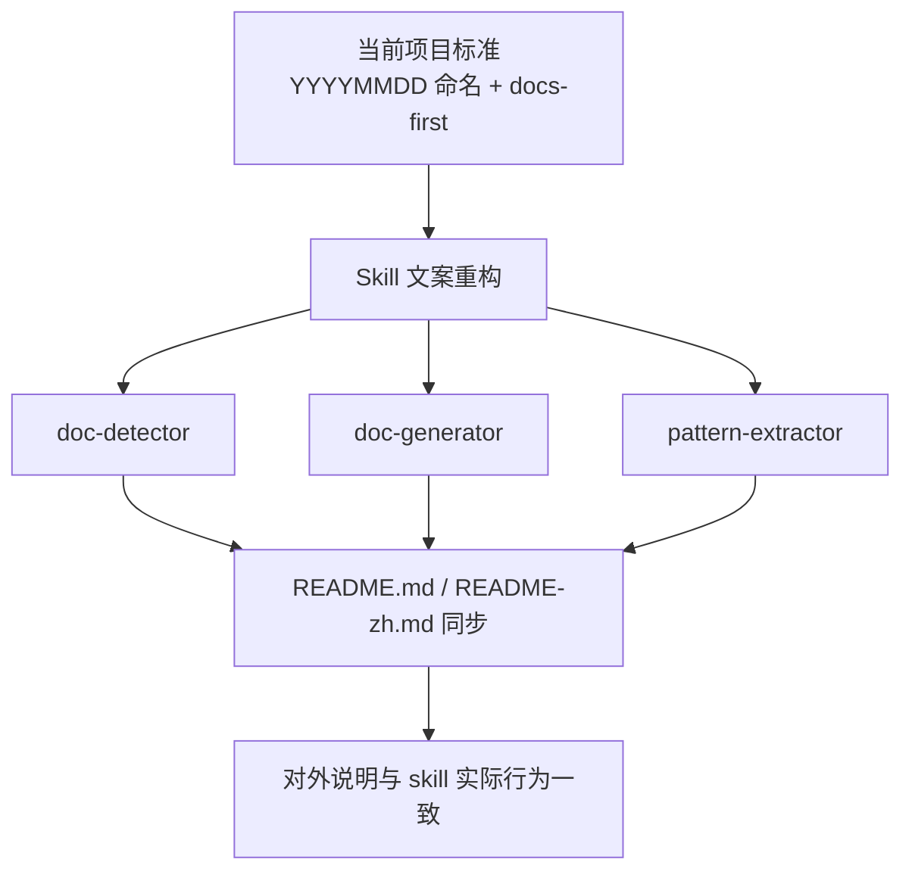
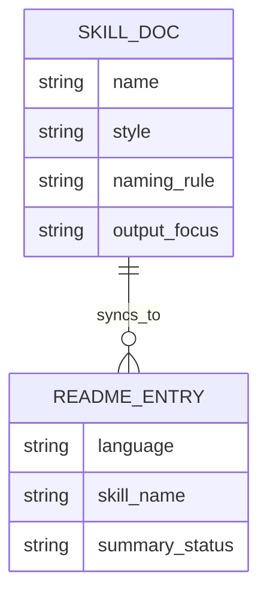

# 需求文档 20260331: ai-doc-driven-dev-skill-optimization - 核心 Skill 文案与 README 同步优化

## 文档信息
- **编号**: REQ-20260331
- **标题**: ai-doc-driven-dev-skill-optimization
- **版本**: 1.0.0
- **创建日期**: 2026-03-31
- **状态**: 草案

## 1. 需求背景

### 1.1 问题现状

当前 `plugins/ai-doc-driven-dev` 中的部分 skill 文案与项目现行标准存在明显漂移，主要体现在命名规范、表达方式和对外说明三个层面。

| 对象 | 当前问题 | 影响 |
| --- | --- | --- |
| `skills/doc-detector/SKILL.md` | 仍按 `001/002` 和 `REQ-005` 这类旧编号制描述文档检查逻辑 | 会误导 AI 按旧规范判断文档健康度 |
| `skills/doc-generator/SKILL.md` | 虽已切到日期命名，但仍偏“逐步指挥 AI 怎么做” | 与 `self-optimize` 的 goal-oriented 标准不一致 |
| `skills/pattern-extractor/SKILL.md` | 输出和流程偏重操作细节，缺少与 docs-first 目标的直接对齐 | 触发后产出风格不稳定 |
| `README.md` / `README-zh.md` | 对 3 个 skill 的描述仍是旧语义，没有反映新的写法和目标边界 | 用户看到的 plugin 说明与 skill 实际行为脱节 |

### 1.2 目标用户

- 使用 `ai-doc-driven-dev` 进行文档分析、生成和规范提取的 Claude/Codex 用户
- 依赖 plugin README 理解 skill 能力边界的使用者
- 后续维护这些 skill 的作者

## 2. 功能需求

### 2.1 核心功能

**F1: 统一 3 个 skill 到当前日期命名规范**
- `doc-detector` 不再使用顺序编号示例作为默认规则
- `doc-detector`、`doc-generator` 的输出示例和检查项统一使用 `YYYYMMDD-feature-name.md`
- 配对关系统一表述为“需求文档 ↔ 技术方案文档”，并与当前模板一致

**F2: 将 3 个 skill 改写为 goal-oriented 风格**
- skill 必须优先描述目标、成功标准、约束和可用资产
- 避免写死命令、低层执行细节和教学式步骤
- 保留清晰触发条件，但减少对 AI 的机械性逐步指挥

**F3: 对齐 plugin README 双语说明**
- `plugins/ai-doc-driven-dev/README.md` 与 `README-zh.md` 对 3 个 skill 的介绍同步更新
- README 中对 skill 的能力描述要与优化后的 skill 文案一致
- README 不应继续暗示旧编号制或已被收敛的旧行为

*(注：涉及 skill/README 改动范围时，统一在同一表格中标识“保留 / 更新 / 不纳入”，不拆分成独立的改前/改后章节。)*

### 2.2 辅助功能

- 对 `pattern-extractor` 的输出格式做轻量收敛，使其更适合形成 `docs/standards/` 下的标准文档
- 保持 3 个 skill 的章节结构风格一致，降低维护成本

## 3. 技术需求

### 3.1 架构设计

本次只调整 `plugins/ai-doc-driven-dev` 的 3 个 skill 文档与 plugin README 双语说明，不修改 commands、agents、knowledge templates 或其他 plugin。

### 3.2 技术实现大纲

| 步骤 | 操作对象 | 目标 |
| --- | --- | --- |
| 1 | `skills/doc-detector/SKILL.md` | 改为日期命名规则 + goal-oriented 分析输出 |
| 2 | `skills/doc-generator/SKILL.md` | 收敛为目标、约束、模板/路径说明优先 |
| 3 | `skills/pattern-extractor/SKILL.md` | 收敛为标准提取目标优先、减少工具教学感 |
| 4 | `README.md` / `README-zh.md` | 同步 3 个 skill 的新语义和使用场景 |

### 3.3 分项目类型的详细规范（可选）

#### 3.3.1 前端项目规范

- 不适用，本次不涉及前端代码实现

#### 3.3.2 后端项目规范

- 不适用，本次不涉及后端服务实现

### 3.4 简化数据模型（可选）

| 字段名 | 类型 | 必填 | 说明 |
| --- | --- | --- | --- |
| `name` | string | 是 | skill 名称 |
| `style` | string | 是 | `workflow-heavy` 或 `goal-oriented` |
| `naming_rule` | string | 是 | 默认遵循的文档命名规则 |
| `output_focus` | string | 是 | skill 预期产物的主目标 |
| `language` | string | 是 | README 语言版本 |
| `summary_status` | string | 是 | `keep` / `update` |

## 技术栈

- Markdown
- Mermaid
- 现有 skill frontmatter 和 plugin README 结构

## 开发约定（从代码中自动提炼）

- 文档采用日期命名：`YYYYMMDD-feature-name.md`
- 文档与实现必须保持同步
- visual-first：流程和范围优先用 Mermaid / 表格表达
- skill 需要遵循统一模板和明确触发条件

## 项目特有规范

- 本次仅允许修改以下 5 个文件：
  - `plugins/ai-doc-driven-dev/skills/doc-detector/SKILL.md`
  - `plugins/ai-doc-driven-dev/skills/doc-generator/SKILL.md`
  - `plugins/ai-doc-driven-dev/skills/pattern-extractor/SKILL.md`
  - `plugins/ai-doc-driven-dev/README.md`
  - `plugins/ai-doc-driven-dev/README-zh.md`
- 不在本次需求内修改 command、agent、template、analysis 文档

## 架构模式

- 单一规范源模式：skill 文案必须追随当前项目文档标准
- README 投影模式：plugin README 作为 skill 能力的对外摘要，不定义第二套行为

## 开发工作流程

### 1. 强制性文档优先原则

- 先完成需求文档与技术方案审批，再修改 skill 和 README
- 若实施中发现必须改 command / agent 才能自洽，需要新增需求或更新当前文档后再扩范围

### 2. 开发步骤（严格按顺序执行）

1. 审批 `REQ-20260331` 与 `TECH-20260331`
2. 统一 3 个 skill 的命名规则、触发语义和输出风格
3. 同步 plugin README 双语描述
4. 校验 README 与 skill 是否仍存在语义漂移

### 3. AI使用规范

- AI 不得继续默认旧编号制为当前项目规范
- AI 不得把工具执行细节写成 skill 的主价值
- AI 不得在无审批情况下扩大到其他 plugin 或 commands

### 4. 文档结构

| 路径 | 角色 | 本次状态 |
| --- | --- | --- |
| `plugins/ai-doc-driven-dev/skills/doc-detector/SKILL.md` | 文档状态分析 skill | (~更新) |
| `plugins/ai-doc-driven-dev/skills/doc-generator/SKILL.md` | 文档生成 skill | (~更新) |
| `plugins/ai-doc-driven-dev/skills/pattern-extractor/SKILL.md` | 模式提取 skill | (~更新) |
| `plugins/ai-doc-driven-dev/README.md` | plugin 英文说明 | (~更新) |
| `plugins/ai-doc-driven-dev/README-zh.md` | plugin 中文说明 | (~更新) |

## 4. 风险评估

### 4.1 技术风险

- 若 skill 写法收敛过度，可能丢失对复杂场景的必要约束
- 若 README 只改摘要不改触发边界，仍会出现说明与实际 skill 行为不一致
- 若只切日期命名而不改表达方式，问题会从“规则漂移”变成“风格漂移”

### 4.2 其他风险（可选）

- 旧分析文档中仍会保留历史编号制讨论，但本次不在清理范围内，需要在交付中明确边界
