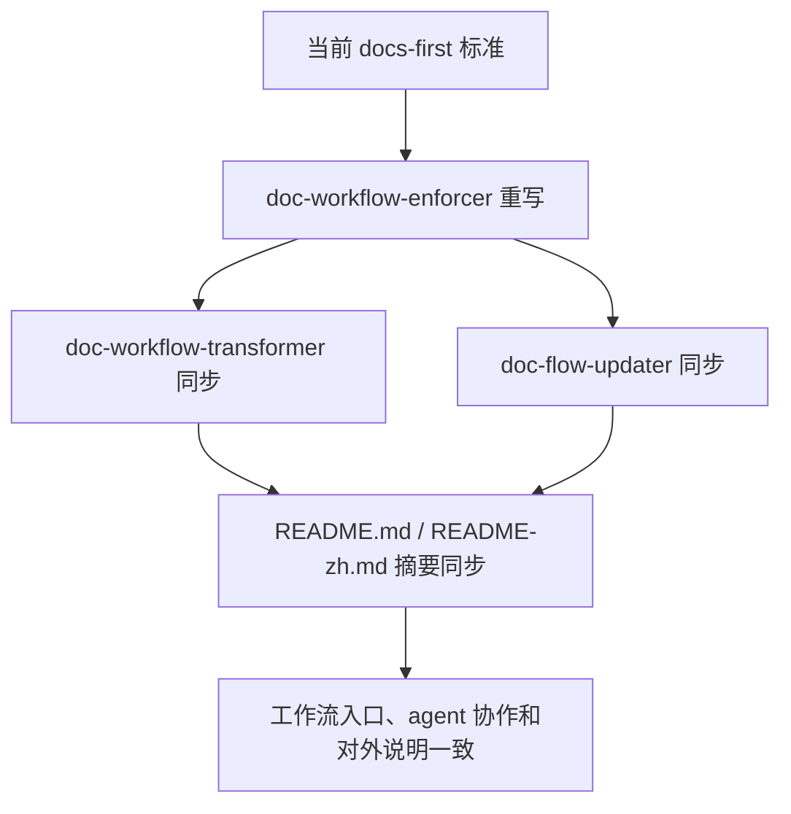
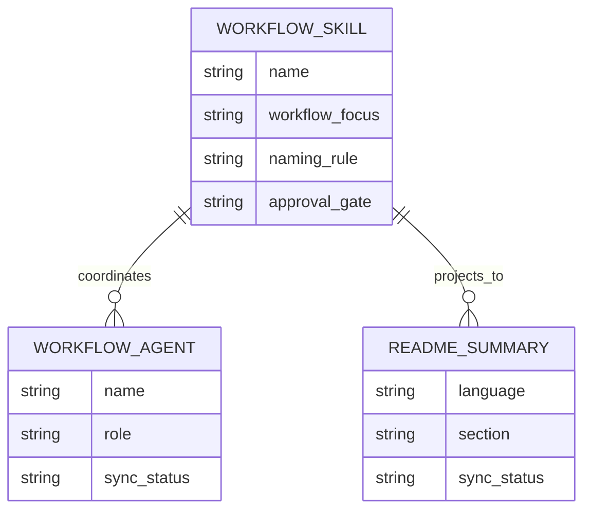

# 需求文档 20260331: doc-workflow-enforcer-alignment - 工作流规范与关联 Agent/README 对齐

## 文档信息
- **编号**: REQ-20260331
- **标题**: doc-workflow-enforcer-alignment
- **版本**: 1.0.0
- **创建日期**: 2026-03-31
- **状态**: 草案

## 1. 需求背景

### 1.1 问题现状

`ai-doc-driven-dev` 中与工作流强制执行相关的 skill、agent 和 README 已经出现规范漂移，主要集中在文档标题格式、工作流表达方式和范围说明上。

| 对象 | 当前问题 | 影响 |
| --- | --- | --- |
| `skills/doc-workflow-enforcer/SKILL.md` | 仍把 `REQ-YYYYMMDD` / `TECH-YYYYMMDD` 作为默认标题格式直接写入规则 | 与当前项目“文件日期命名优先、文档内容按模板落地”的标准存在冲突 |
| `agents/doc-workflow-transformer.md` | 仍按旧的编排方式描述 skill 协同，不足以反映最新的 skill 语义 | agent 触发后容易继续输出旧规范 |
| `agents/doc-flow-updater.md` | 包含旧标题格式、旧迁移示例和偏重过程教学的内容 | 更新场景下会继续扩散旧语义 |
| `README.md` / `README-zh.md` | 对 `doc-workflow-enforcer` 的摘要仍是旧表述，没有覆盖“轻量 CLAUDE.md + AGENTS.md 分离 + 日期命名”这组当前重点 | 用户看到的 plugin 说明与内部规范不完全一致 |

### 1.2 目标用户

- 使用 `ai-doc-driven-dev` 初始化或升级 docs-first 工作流的用户
- 依赖 plugin README 了解工作流边界的用户
- 后续维护 `doc-workflow-enforcer` 及其 agent 的作者

## 2. 功能需求

### 2.1 核心功能

**F1: 重写 `doc-workflow-enforcer` 为当前标准**
- 重点表达“轻量 CLAUDE.md + AGENTS.md 分离 + docs-first + 日期命名”
- 弱化对 AI 的逐步教学式描述，改为目标、约束、审批门禁优先
- 不再把旧标题格式当作默认成功标准直接扩散

**F2: 同步直接相关 agent 文案**
- `doc-workflow-transformer` 的阶段描述必须与当前 skill 语义一致
- `doc-flow-updater` 的迁移、命名、示例和成功标准必须与当前规范一致
- agent 文案不应继续放大旧规则或与 skill 摘要冲突

**F3: 同步 plugin README 双语摘要**
- `README.md` 与 `README-zh.md` 中关于 `doc-workflow-enforcer` 的介绍、最佳实践和相关说明要与新的 skill/agent 语义一致
- README 应突出这是“工作流和指令文件组织规则”的入口，而不是泛化的单文件注入器

*(注：涉及范围和责任边界时，统一在同一表格中标识“更新 / 保留 / 不纳入”，不拆成改前/改后两份表。)*

### 2.2 辅助功能

- 统一 `doc-workflow-enforcer`、`doc-workflow-transformer`、`doc-flow-updater` 对“审批先于写入”的表达
- 统一它们对 `CLAUDE.md`、`AGENTS.md`、`docs/standards/` 关系的表述

## 3. 技术需求

### 3.1 架构设计

本次只调整一个 skill、两个 agent，以及 plugin README 双语说明，不修改 commands、templates、其他 skill 或其他 plugin。

### 3.2 技术实现大纲

| 步骤 | 操作对象 | 目标 |
| --- | --- | --- |
| 1 | `skills/doc-workflow-enforcer/SKILL.md` | 按当前轻量 CLAUDE.md / AGENTS.md 分离标准重写 |
| 2 | `agents/doc-workflow-transformer.md` | 同步新的 skill 语义和阶段目标 |
| 3 | `agents/doc-flow-updater.md` | 同步更新规则、迁移示例和成功标准 |
| 4 | `README.md` / `README-zh.md` | 同步 `doc-workflow-enforcer` 的摘要与最佳实践 |

### 3.3 分项目类型的详细规范（可选）

#### 3.3.1 前端项目规范

- 不适用，本次不涉及前端实现

#### 3.3.2 后端项目规范

- 不适用，本次不涉及后端实现

### 3.4 简化数据模型（可选）

| 字段名 | 类型 | 必填 | 说明 |
| --- | --- | --- | --- |
| `workflow_focus` | string | 是 | 该 skill/agent 关注的工作流目标 |
| `naming_rule` | string | 是 | 当前默认文档命名规则 |
| `approval_gate` | string | 是 | 是否强调“先审批后写入” |
| `sync_status` | string | 是 | `keep` / `update` |

## 技术栈

- Markdown
- Mermaid
- 现有 skill / agent frontmatter 与 plugin README 结构

## 开发约定（从代码中自动提炼）

- 文档采用日期命名：`YYYYMMDD-feature-name.md`
- 先文档、后实现
- Visual-first：流程和结构优先使用 Mermaid / 表格
- README 只作为 skill/agent 的对外摘要，不维护第二套行为

## 项目特有规范

- 本次仅允许修改以下 5 个实现文件：
  - `plugins/ai-doc-driven-dev/skills/doc-workflow-enforcer/SKILL.md`
  - `plugins/ai-doc-driven-dev/agents/doc-workflow-transformer.md`
  - `plugins/ai-doc-driven-dev/agents/doc-flow-updater.md`
  - `plugins/ai-doc-driven-dev/README.md`
  - `plugins/ai-doc-driven-dev/README-zh.md`
- 不在本次需求内修改 command、template、其他 skill

## 架构模式

- 工作流入口模式：`doc-workflow-enforcer` 定义入口规则与约束
- 协作代理模式：agent 只复述和执行统一规则，不扩展第二套规范
- 摘要投影模式：README 仅同步核心能力和最佳实践

## 开发工作流程

### 1. 强制性文档优先原则

- 先完成本需求文档与技术方案审批，再修改 skill / agent / README
- 若实施中发现必须扩到 command 或 template，必须先补文档再改范围

### 2. 开发步骤（严格按顺序执行）

1. 审批 `REQ-20260331` 与 `TECH-20260331`
2. 重写 `doc-workflow-enforcer`
3. 同步两个直接相关 agent
4. 同步 plugin README 双语说明
5. 校验 5 个文件之间是否仍存在语义漂移

### 3. AI使用规范

- AI 不得继续默认旧标题格式为当前成功标准
- AI 不得把 agent 写成独立规范源
- AI 不得在无审批时扩大到 command / template 改动

### 4. 文档结构

| 路径 | 角色 | 本次状态 |
| --- | --- | --- |
| `plugins/ai-doc-driven-dev/skills/doc-workflow-enforcer/SKILL.md` | 工作流强制执行 skill | (~更新) |
| `plugins/ai-doc-driven-dev/agents/doc-workflow-transformer.md` | 工作流编排 agent | (~更新) |
| `plugins/ai-doc-driven-dev/agents/doc-flow-updater.md` | 工作流升级 agent | (~更新) |
| `plugins/ai-doc-driven-dev/README.md` | plugin 英文说明 | (~更新) |
| `plugins/ai-doc-driven-dev/README-zh.md` | plugin 中文说明 | (~更新) |

## 4. 风险评估

### 4.1 技术风险

- 如果只改 skill 不改 agent，agent 会继续扩散旧标题和旧迁移示例
- 如果 README 摘要不同步，用户仍会根据旧语义理解工作流入口
- 如果把规则写得过于抽象，可能弱化“审批先于写入”的关键门禁

### 4.2 其他风险（可选）

- 历史设计文档中仍会保留旧标题格式讨论，本次不纳入清理范围，需要在交付中明确边界
