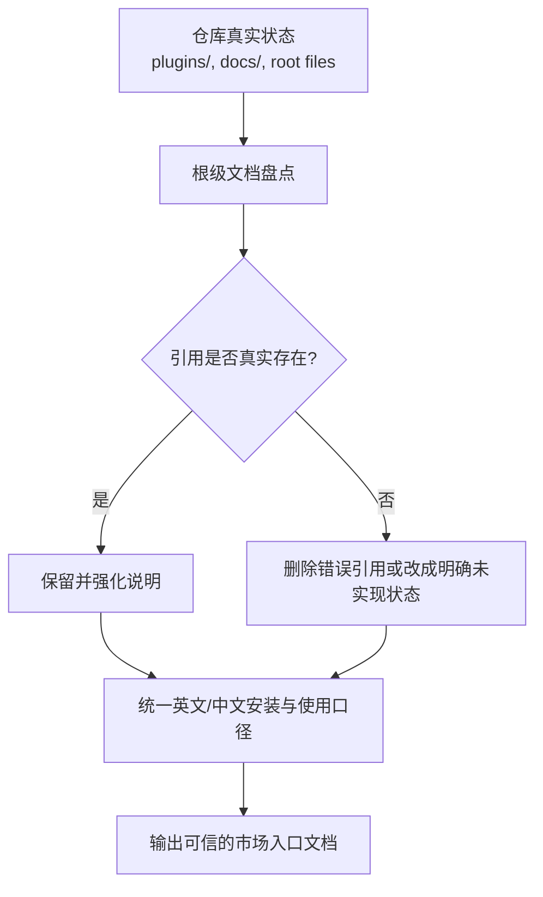
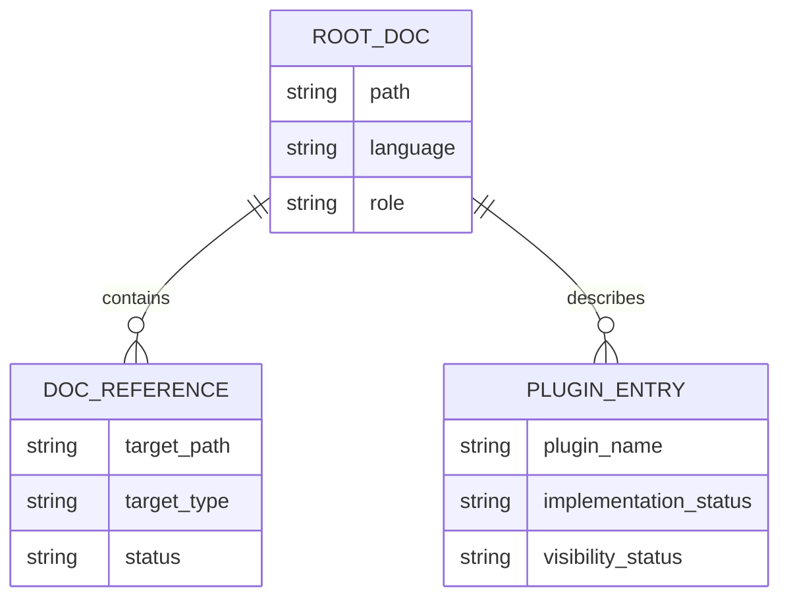

# 需求文档 20260331: marketplace-consistency-optimization - 根级市场文档真相对齐

## 文档信息
- **编号**: REQ-20260331
- **标题**: marketplace-consistency-optimization
- **版本**: 1.0.0
- **创建日期**: 2026-03-31
- **状态**: 草案

## 1. 需求背景

### 1.1 问题现状

当前仓库根级文档存在“说明已承诺、仓库未提供”的失真问题，主要集中在以下区域：

| 文档 | 现状问题 | 用户影响 |
| --- | --- | --- |
| `README.md` | 引用了不存在的 `scripts/scaffold.sh`、`scripts/validate.sh`、`scripts/publish.sh` | 新用户会按文档执行失败 |
| `README-zh.md` | 与英文版安装路径和说明不一致，且同样引用不存在资源 | 中文用户无法判断哪份说明可信 |
| `CLAUDE.md` | 将不存在的脚本和设计文档写成已落地能力 | AI 会基于错误仓库事实继续扩写错误内容 |
| `GEMINI.md` | 与 `CLAUDE.md` 复现同类失真 | 多入口规范同时漂移，后续维护成本上升 |

### 1.2 目标用户

- 首次进入仓库、依赖根级文档了解市场能力的开发者
- 准备安装或使用现有 plugin 的用户
- 依赖 `CLAUDE.md` / `GEMINI.md` 获取项目事实的 AI 代理

## 2. 功能需求

### 2.1 核心功能

**F1: 根级文档引用真相对齐**
- 清理根级文档中所有指向不存在脚本、文档、流程入口的说明
- 保留并强化当前仓库中真实存在的文件、插件、命令和目录结构
- 对“未实现”内容采用明确状态标识，而不是伪装成可执行路径

**F2: 市场插件清单对齐当前库存**
- 根级市场说明必须反映当前 `plugins/` 目录里的实际插件集合
- 已存在但未在市场首页呈现的 plugin 应被补充到根级文档中
- 禁止把 disabled / 未实现能力描述成可直接使用的稳定能力

**F3: 安装与使用说明统一**
- 根级英文文档、中文文档对同一类场景给出一致的主路径说明
- 对 Claude Code 与 Codex 的使用方式分别表述，但不互相冲突
- 不再保留互相矛盾的安装话术

*(注：涉及文档项与状态变更时，统一在同一表格中用“保留 / 更新 / 删除引用 / 新增说明”等内联标记呈现，不拆分为“改前 / 改后”两段。)*

### 2.2 辅助功能

- 在根级文档中补充“当前实现边界”说明，避免把规划项误写成落地能力
- 在需要时把“Coming Soon”内容降级为明确的非承诺描述

## 3. 技术需求

### 3.1 架构设计

本次变更只触达仓库根级文档，不修改 plugin 实现、不新增脚本、不调整 `plugins/` 目录下各插件文件。

### 3.2 技术实现大纲

| 步骤 | 操作对象 | 目标 |
| --- | --- | --- |
| 1 | `README.md` | 对齐插件清单、安装方式、开发者入口和实际仓库结构 |
| 2 | `README-zh.md` | 与英文版保持同一事实源，消除安装说明冲突 |
| 3 | `CLAUDE.md` | 删除不存在脚本/设计文档被写成已实现能力的内容 |
| 4 | `GEMINI.md` | 与 `CLAUDE.md` 同步修正，保持双入口一致 |

### 3.3 分项目类型的详细规范（可选）

#### 3.3.1 前端项目规范

- 不适用，本次不涉及前端代码或 UI 资源

#### 3.3.2 后端项目规范

- 不适用，本次不涉及服务端代码或接口行为

### 3.4 简化数据模型（可选）

| 字段名 | 类型 | 必填 | 说明 |
| --- | --- | --- | --- |
| `path` | string | 是 | 根级文档路径，如 `README.md` |
| `target_path` | string | 是 | 文档中引用的目标路径 |
| `target_type` | string | 是 | `script` / `doc` / `plugin` / `command` |
| `status` | string | 是 | `keep` / `update` / `remove-reference` / `mark-unimplemented` |
| `implementation_status` | string | 是 | plugin 或能力的实际实现状态 |

## 技术栈

- Markdown
- Mermaid
- 现有仓库目录结构与 plugin 元数据

## 开发约定（从代码中自动提炼）

- 采用日期命名文档：`YYYYMMDD-feature-name.md`
- 要求需求文档与技术方案成对维护
- 文档改动遵循 visual-first 原则，优先用 Mermaid 和表格表达结构与状态

## 项目特有规范

- 本次仅允许修改根级 4 个文档：
  - `README.md`
  - `README-zh.md`
  - `CLAUDE.md`
  - `GEMINI.md`
- 不在本次需求内新增 `scripts/` 目录
- 不在本次需求内修改任一 plugin 的 README、skills、commands 或实现脚本

## 架构模式

- 单一事实源模式：以仓库真实文件树为准，文档必须追随实际状态
- 最小范围修复模式：先修复根级入口，再决定是否下沉到 plugin 级文档

## 开发工作流程

### 1. 强制性文档优先原则

- 先完成本需求文档与技术方案审批，再进行根级文档修订
- 若实施中发现范围需要扩大到 plugin 级文档，必须先补充新文档或更新当前文档后再改动

### 2. 开发步骤（严格按顺序执行）

1. 审批 `REQ-20260331` 与 `TECH-20260331`
2. 盘点根级文档中的所有外部引用和能力声明
3. 按“真实存在 / 不存在 / 已存在但未展示 / 未实现”分类
4. 统一中英文 README 与 AI 指令文档口径
5. 复核改动后的根级文档是否仍引用不存在资源

### 3. AI使用规范

- AI 只能基于仓库实际存在的文件与目录撰写根级文档
- 不得把“计划中”内容写成“已实现”
- 不得在无用户审批前扩大变更范围到 plugin 级文档

### 4. 文档结构

| 路径 | 角色 | 本次状态 |
| --- | --- | --- |
| `README.md` | 英文市场入口 | (~更新) |
| `README-zh.md` | 中文市场入口 | (~更新) |
| `CLAUDE.md` | Claude 指令入口 | (~更新) |
| `GEMINI.md` | Gemini 指令入口 | (~更新) |

## 4. 风险评估

### 4.1 技术风险

- 根级文档若删减过度，可能丢失对未来规划的表达，需要保留“未实现但存在规划”的最小说明
- 中英文 README 若修改粒度不一致，仍会形成双语漂移
- `CLAUDE.md` 与 `GEMINI.md` 若只修一份，会继续制造多事实源

### 4.2 其他风险（可选）

- 用户可能预期同时修复 plugin README，但本次范围明确排除，需要在交付中说明边界
