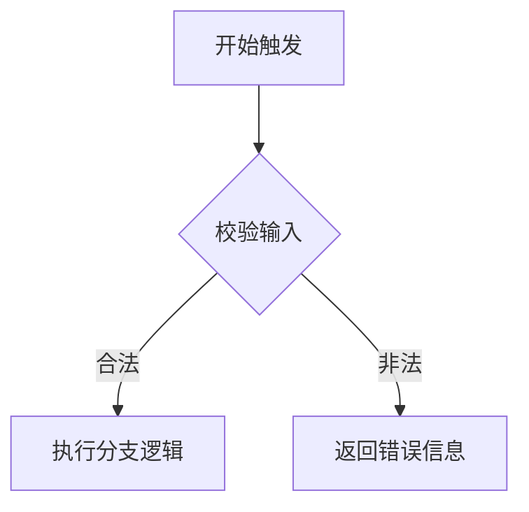
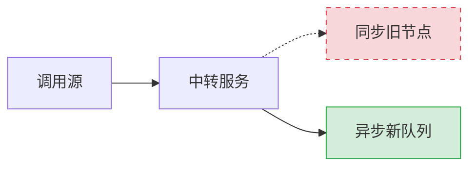

# 技术方案模板（参考 TECH-YYYYMMDD）

# 技术方案 YYYYMMDD: <项目名> - 技术设计

## 文档信息

- **编号**: TECH-YYYYMMDD
- **标题**: <项目名>
- **版本**: 1.0.0
- **创建日期**: YYYY-MM-DD
- **状态**: 待实现
- **依赖**: REQ-YYYYMMDD (<项目名> 需求)
- **分支**: <branch-name>

## 1. 技术架构概述

### 1.1 整体设计思路

<!-- 核心理念、技术路线 -->
<!-- 强约束原则：在阐述系统架构、数据流向、组件交互和复杂状态流转时，必须优先采用 Mermaid 图表展示。尽量精简大段的纯文本叙述。 -->
<!-- 强约束原则：涉及到的数据结构与参数配置枚举等必须采用 Markdown Table 展示，禁止使用无序的文本列表。 -->

### 1.2 架构设计与实体设计

<!-- 强约束：此处的应用层级关系与架构流向必须借助 Mermaid（flowchart, sequenceDiagram, classDiagram 等）呈现。 -->
<!-- 强约束：针对数据库设计与实体模型必须使用 Mermaid 的 erDiagram 绘制。 -->
```text
<project-root>/
├── <component>/
└── <component>/
```

## 2. 核心技能详细设计

### 2.1 <技能名称> (说明)

**功能职责**：
- <!-- 职责 -->

**数据与参数定义**：
<!-- 强约束：属性及配置请使用 Table 呈现，如下所示 -->
| 字段名 | 类型 | 必填 | 说明 |
| --- | --- | --- | --- |
| exampleField | string | 是 | 示例说明 |

**逻辑执行机制**：
<!-- 强约束：必须使用 Mermaid 流程图或时序图展示核心执行逻辑 -->


**规则/约束**：
- <!-- 规则 -->

## 强制性开发工作流程

<!-- 如需固定流程请描述 -->

## 约束条件与改动说明

<!-- 约束条件 -->
<!-- 强制约束：在任何涉及技术方案变更、结构调整的章节，禁止将“改前”与“改后”分别独立成段/表/图。强制要求在同一图表/表格中使用内联样式标识差异。 -->

**【改动展现示例 - 图表】**
若要表示组件 A 从同步调用 D 切换到了异步队列 C：


**【改动展现示例 - 表格】**
| 字段名 | 说明 | 变更状态 |
| --- | --- | --- |
| `~~oldField~~` | 冗长的旧字段 | <span style="color:red">(-废弃)</span> |
| `newField` | 清晰的新字段 | <span style="color:green">(+新增)</span> |

## 3. 工作流程设计

### 3.1 插件执行流程

<!-- 执行流程 -->

### 3.2 技能调用策略

<!-- 调用策略 -->

### 3.3 分支策略与缺陷处理

- 分支命名：`req-YYYYMMDD-feature-name`（需求实现）
- 缺陷修复：同一需求内 bug 优先在原需求分支继续提交
- 同分支继续开发时，先确认是否为原需求 bug
- 若不是原需求 bug：新建需求文档并创建新分支

## 4. 数据流设计

### 4.1 技能间数据传递

<!-- 数据流说明 -->

### 4.2 文件系统交互

<!-- 文件系统交互说明 -->

## 5. 性能优化策略

### 5.1 缓存机制

<!-- 缓存策略 -->

### 5.2 并行处理

<!-- 并行策略 -->

## 6. 扩展性设计

### 6.1 模板系统

<!-- 模板系统 -->

### 6.2 插件接口

<!-- 插件接口 -->

## 7. 质量保证

### 7.1 测试策略

<!-- 测试策略 -->

### 7.2 质量指标

<!-- 质量指标 -->
