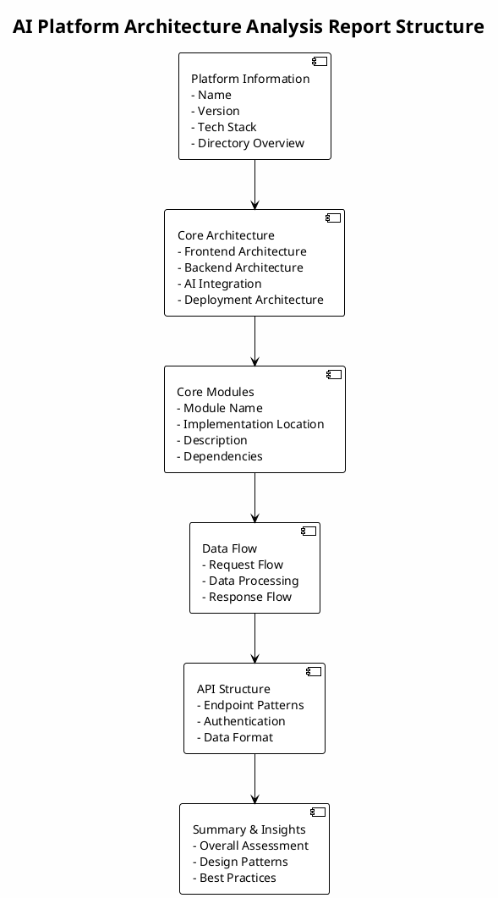

> **[NOT AVAILABLE]** This command is not yet implemented

# Analyze AI Platform

Analyze the architecture and core functionality of AI application platforms such as Coze, Dify, and FastGPT.

## Description

This command performs comprehensive analysis of AI application platform source code to discover and explain the overall architecture and core functionality. It explores the codebase systematically to identify modules, understand their interactions, and document the platform's design.

## Usage

```bash
claude analyze-ai-platform [options]
```

## Options

- `--module <name>` - Focus on specific module
- `--detailed` - Include detailed code snippets and analysis
- `--format <type>` - Output format (markdown/json)
- `--language <lang>` - Report language (en/zh/both, default: both)
- `--save <file>` - Save analysis report to file

## Examples

```bash
# Analyze entire platform architecture (bilingual reports)
claude analyze-ai-platform

# Focus on specific module
claude analyze-ai-platform --module chat

# Generate detailed analysis report (both languages)
claude analyze-ai-platform --detailed --save architecture-report

# Generate English report only
claude analyze-ai-platform --language en --save architecture-report-en.md

# Generate Chinese report only
claude analyze-ai-platform --language zh --save architecture-report-zh.md

# Output as JSON
claude analyze-ai-platform --format json --save architecture.json
```

## Analysis Process

1. **Platform Detection**: Identifies the AI platform type
2. **Architecture Exploration**: Scans directory structure to identify major modules
3. **Core Module Analysis**: Analyzes key modules and their implementation
4. **Interaction Mapping**: Documents how modules interact with each other
5. **Report Generation**: Produces a comprehensive architecture report

## Output Format

### Overall Structure



### Report Sections

#### Platform Information
- Platform name and version
- Technology stack
- Directory structure overview

#### Core Architecture
- Frontend architecture
- Backend architecture
- AI integration approach
- Deployment architecture

#### Core Modules
- Module names and purposes
- Implementation locations
- Module descriptions
- Inter-module dependencies

#### Data Flow
- Request flow patterns
- Data processing pipeline
- Response flow patterns

#### API Structure
- API endpoint patterns
- Authentication and authorization
- Data format specifications

#### Summary & Insights
- Overall architecture assessment
- Design patterns used
- Best practices and recommendations

### Language Support

The report is available in both English and Chinese versions:

**English Version** (`architecture-report-en.md`):
```markdown
# AI Application Platform Architecture Analysis

## Platform Information
- Platform: {name}
- Version: {version}

## Core Architecture
...
```

**Chinese Version** (`architecture-report-zh.md`):
```markdown
# AI应用平台架构分析

## 平台信息
- 平台名称：{name}
- 版本：{version}

## 核心架构
...
```

Both versions contain equivalent information and are generated simultaneously. Use `--language` option to specify language or generate both by default.

## Supported Platforms

- Coze - ByteDance's AI application building platform
- Dify - Open source LLM application development platform
- FastGPT - Knowledge-based Q&A platform based on LLM
- Other AI application platforms

## Related Commands

- `analyze-mf-isolation` - Analyze microfrontend isolation mechanisms
- `analyze-reactivity` - Analyze frontend framework reactivity systems
