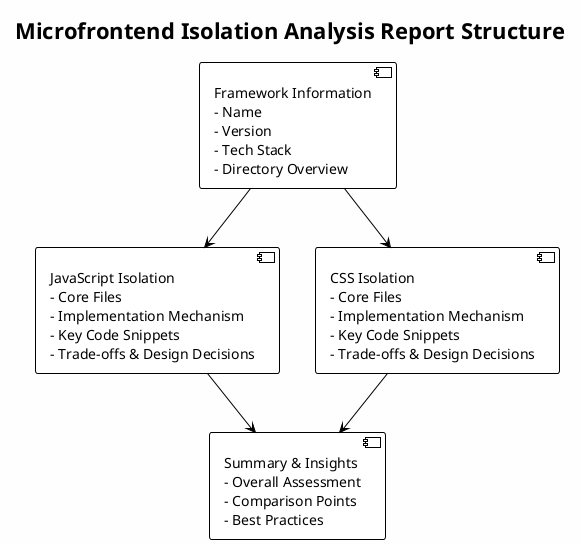

# Analyze Microfrontend Isolation

Analyze JavaScript and CSS isolation mechanisms in microfrontend frameworks such as qiankun, wujie, single-spa, and emp.

## Description

This command performs deep analysis of microfrontend framework source code to discover and explain how isolation is implemented. It explores the codebase without making assumptions, identifying the actual implementation strategies for both JavaScript and CSS isolation.

## Usage

```bash
claude analyze-mf-isolation [options]
```

## Options

- `--focus <type>` - Focus on specific isolation type (js/css/all)
- `--detailed` - Include detailed code snippets and analysis
- `--format <type>` - Output format (markdown/json)
- `--language <lang>` - Report language (en/zh/both, default: both)
- `--save <file>` - Save analysis report to file

## Examples

```bash
# Analyze both JS and CSS isolation (bilingual reports)
claude analyze-mf-isolation

# Focus only on JavaScript isolation
claude analyze-mf-isolation --focus js

# Generate detailed analysis report (both languages)
claude analyze-mf-isolation --detailed --save isolation-report

# Generate English report only
claude analyze-mf-isolation --language en --save isolation-report-en.md

# Generate Chinese report only
claude analyze-mf-isolation --language zh --save isolation-report-zh.md

# Output as JSON
claude analyze-mf-isolation --format json --save isolation.json
```

## Analysis Process

1. **Framework Detection**: Identifies the microfrontend framework type
2. **Keyword Search**: Searches for isolation-related keywords
3. **Core File Identification**: Locates files containing isolation logic
4. **Mechanism Analysis**: Analyzes the actual implementation
5. **Report Generation**: Produces a comprehensive analysis report

## Output Format

### Overall Structure



### Report Sections

#### Framework Information
- Framework name and version
- Technology stack
- Directory structure overview

#### JavaScript Isolation
- Core files and their purposes
- Implementation mechanism explanation
- Key code snippets with annotations
- Trade-offs and design decisions

#### CSS Isolation
- Core files and their purposes
- Implementation mechanism explanation
- Key code snippets with annotations
- Trade-offs and design decisions

#### Summary & Insights
- Overall assessment of the isolation strategy
- Key strengths and limitations
- Best practices and recommendations

### Language Support

The report is available in both English and Chinese versions:

**English Version** (`isolation-report-en.md`):
```markdown
# Microfrontend Framework Isolation Analysis

## Framework Information
- Framework: {name}
- Version: {version}

## JavaScript Isolation
...
```

**Chinese Version** (`isolation-report-zh.md`):
```markdown
# 微前端框架隔离机制分析

## 框架信息
- 框架名称：{name}
- 版本：{version}

## JavaScript 隔离实现
...
```

Both versions contain equivalent information and are generated simultaneously. Use `--language` option to specify language or generate both by default.

## Supported Frameworks

- qiankun - Based on single-spa
- wujie - Based on WebComponent + iframe
- single-spa - Microfrontend foundation framework
- emp - Based on Webpack 5 Module Federation
- Other microfrontend frameworks

## Related Commands

- `analyze-ai-platform` - Analyze AI application platform architecture
- `analyze-reactivity` - Analyze frontend framework reactivity systems
