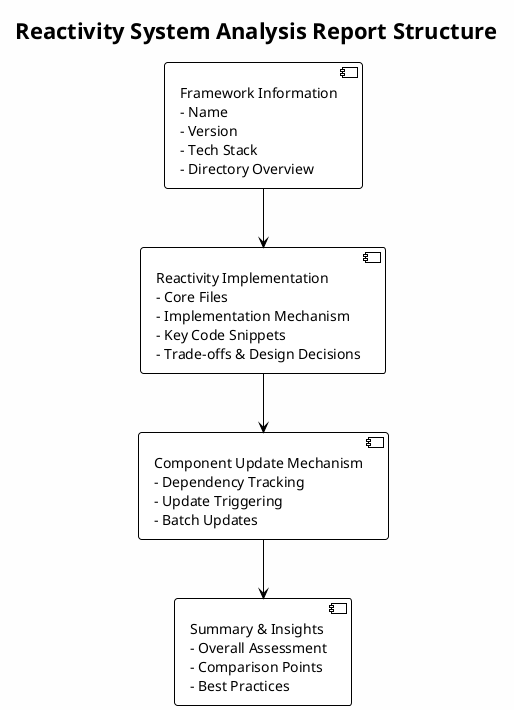

# Analyze Reactivity

Analyze the reactivity system implementation in frontend frameworks such as Vue, React, SolidJS, and Svelte.

## Description

This command performs deep analysis of frontend framework source code to discover and explain how the reactivity system is implemented. It explores the codebase without making assumptions, identifying the actual implementation strategies for reactive programming.

## Usage

```bash
claude analyze-reactivity [options]
```

## Options

- `--detailed` - Include detailed code snippets and analysis
- `--format <type>` - Output format (markdown/json)
- `--language <lang>` - Report language (en/zh/both, default: both)
- `--save <file>` - Save analysis report to file

## Examples

```bash
# Analyze reactivity system (bilingual reports)
claude analyze-reactivity

# Generate detailed analysis report (both languages)
claude analyze-reactivity --detailed --save reactivity-report

# Generate English report only
claude analyze-reactivity --language en --save reactivity-report-en.md

# Generate Chinese report only
claude analyze-reactivity --language zh --save reactivity-report-zh.md

# Output as JSON
claude analyze-reactivity --format json --save reactivity.json
```

## Analysis Process

1. **Framework Detection**: Identifies the frontend framework type
2. **Reactivity Keyword Search**: Searches for reactivity-related keywords
3. **Core File Identification**: Locates files containing reactivity logic
4. **Mechanism Analysis**: Analyzes the actual implementation
5. **Report Generation**: Produces a comprehensive analysis report

## Output Format

### Overall Structure



### Report Sections

#### Framework Information
- Framework name and version
- Technology stack
- Directory structure overview

#### Reactivity Implementation
- Core files and their purposes
- Implementation mechanism explanation
- Key code snippets with annotations
- Trade-offs and design decisions

#### Component Update Mechanism
- Dependency tracking mechanism
- Update triggering mechanism
- Batch update support

#### Summary & Insights
- Overall assessment of the reactivity system
- Comparison with other frameworks
- Best practices and recommendations

### Language Support

The report is available in both English and Chinese versions:

**English Version** (`reactivity-report-en.md`):
```markdown
# Frontend Framework Reactivity System Analysis

## Framework Information
- Framework: {name}
- Version: {version}

## Reactivity Implementation
...
```

**Chinese Version** (`reactivity-report-zh.md`):
```markdown
# 前端框架响应式系统分析

## 框架信息
- 框架名称：{name}
- 版本：{version}

## 响应式实现
...
```

Both versions contain equivalent information and are generated simultaneously. Use `--language` option to specify language or generate both by default.

## Supported Frameworks

- Vue - Progressive JavaScript framework
- React - User interface library
- SolidJS - Fine-grained reactive framework
- Svelte - Compile-time framework
- Other frontend frameworks with reactivity

## Related Commands

- `analyze-mf-isolation` - Analyze microfrontend isolation mechanisms
- `analyze-ai-platform` - Analyze AI application platform architecture
