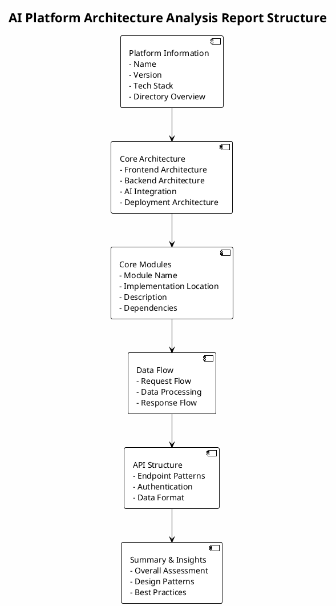

> **[NOT AVAILABLE]** This skill is not yet implemented

## Overview

This skill specializes in analyzing AI application platform source code to discover and explain the overall architecture and core functionality implementations. It explores the codebase systematically to identify modules, understand their interactions, and document the platform's design without making assumptions about specific implementations.

## How It Works

1. **Platform Detection**: Identifies AI platforms through package.json, directory structure, and configuration files
2. **Architecture Exploration**: Scans directory structure to identify major modules and their purposes
3. **Core Module Analysis**: Analyzes key modules to understand their implementation and responsibilities
4. **Interaction Mapping**: Documents how different modules interact with each other
5. **Architecture Documentation**: Summarizes discovered architecture in clear Chinese
6. **Bilingual Report Generation**: Generates comprehensive analysis reports in both English and Chinese with PlantUML structure diagrams

## When to Use This Skill

This skill activates when you need to:
- Understand the architecture of an AI application platform
- Identify core modules and their responsibilities
- Learn how different components interact in an AI platform
- Document platform architecture for learning or sharing

## Examples

### Example 1: Analyzing Dify Architecture

User request: "Analyze the architecture of Dify"

The skill will:
1. Scan the directory structure to identify major modules (api, web, core, etc.)
2. Analyze each module's purpose and implementation
3. Identify key services and their interactions
4. Document the overall architecture with module relationships

### Example 2: Understanding Core Functionality

User request: "How does this AI platform implement chat functionality?"

The skill will:
1. Search for chat-related files and keywords
2. Trace the implementation flow from API to backend
3. Identify key components (message handling, LLM integration, streaming, etc.)
4. Document the implementation with code examples

### Example 3: Comprehensive Platform Analysis with Bilingual Reports

User request: "Analyze this AI platform comprehensively and generate reports in both languages"

The skill will:
1. Identify the tech stack from package.json and configuration
2. Map out the overall architecture
3. Analyze core features (chat, knowledge base, workflow, etc.)
4. Document module interactions and data flow
5. Generate comprehensive architecture reports in both English and Chinese
6. Include PlantUML diagrams showing the overall report structure
7. Provide summary & insights with overall assessment, design patterns, and best practices

**Report Structure**:

**Output Files**:
- `architecture-report-en.md` (English version)
- `architecture-report-zh.md` (Chinese version)

## Best Practices

- **Systematic Exploration**: Start with directory structure, then dive into specific modules
- **Module-First Approach**: Identify modules before analyzing their implementation
- **Interaction Focus**: Pay attention to how modules communicate and interact
- **Bilingual Documentation**: Generate reports in both English and Chinese with equivalent content
- **PlantUML Diagrams**: Include PlantUML structure diagrams to visualize report organization
- **Clear Documentation**: Use clear Chinese and English descriptions for architectural concepts
- **Tech Stack Awareness**: Identify and document the technology stack used
- **Summary & Insights**: Always include assessment, design patterns, and best practices in reports

## Integration

This skill integrates with the `structure-explainer` skill to provide comprehensive codebase understanding and can be invoked through the `analyze-ai-platform` command.
