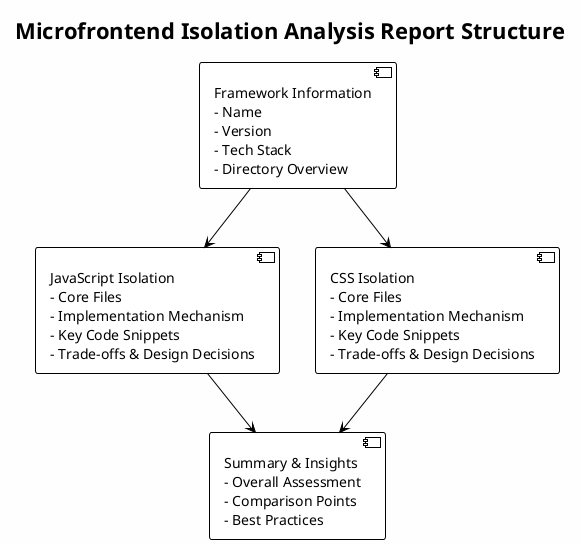

## Overview

This skill specializes in analyzing microfrontend framework source code to discover and explain how JavaScript and CSS isolation are implemented. It explores the codebase to identify core files, understand isolation strategies, and document the actual implementation mechanisms without making assumptions.

**MANDATORY OUTPUT FORMAT**: This skill MUST generate reports that strictly follow the predefined structure with ALL sections included:
- Overall Structure (with PlantUML diagram)
- Framework Information
- JavaScript Isolation
- CSS Isolation
- Summary & Insights

Reports that omit any of these sections are considered incomplete and unacceptable.

## How It Works

1. **Repository Detection**: Identifies microfrontend frameworks through package.json, directory structure, and key files
2. **Isolation Keyword Search**: Searches for isolation-related keywords (sandbox, shadow, scope, isolate, etc.)
3. **Core File Identification**: Locates files containing isolation implementation logic
4. **Code Relationship Analysis**: Maps dependencies and call relationships between core files
5. **Mechanism Documentation**: Summarizes discovered implementation mechanisms in clear language
6. **Bilingual Report Generation**: Generates comprehensive analysis reports in both English and Chinese with PlantUML structure diagrams

**CRITICAL REQUIREMENT**: The generated reports MUST strictly follow the predefined format structure including:
- **Overall Structure** section with PlantUML diagram
- **Framework Information** section
- **JavaScript Isolation** section with core files, mechanisms, code snippets, and trade-offs
- **CSS Isolation** section with core files, mechanisms, code snippets, and trade-offs
- **Summary & Insights** section with overall assessment, comparison points, and best practices

## When to Use This Skill

This skill activates when you need to:
- Analyze how a microfrontend framework implements JavaScript isolation
- Understand CSS isolation mechanisms in microfrontends
- Compare isolation strategies across different frameworks
- Document core implementation details for learning or sharing

## Examples

### Example 1: Analyzing qiankun JS Isolation

User request: "Analyze how qiankun implements JavaScript isolation"

The skill will:
1. Search for keywords like "sandbox", "proxy", "window", "context"
2. Identify core files such as `src/sandbox/*`, `src/loader/*`
3. Analyze the actual implementation (e.g., Proxy-based sandbox, snapshot sandbox)
4. Document the isolation mechanism with code examples

### Example 2: Analyzing wujie CSS Isolation

User request: "How does wujie isolate CSS styles?"

The skill will:
1. Search for CSS-related isolation keywords ("shadow", "style", "scoped")
2. Find style management code in the codebase
3. Explain the actual implementation (e.g., ShadowDOM, scoped styles)
4. Provide code snippets showing key implementation details

### Example 3: Comprehensive Analysis with Bilingual Reports

User request: "Analyze both JS and CSS isolation in this microfrontend framework and generate reports in both languages"

The skill will:
1. Perform parallel analysis of both isolation mechanisms
2. Identify relationships between JS and CSS isolation (if any)
3. Generate comprehensive analysis reports in both English and Chinese
4. Include PlantUML diagrams showing the overall report structure
5. Highlight any trade-offs or design decisions
6. Provide summary & insights with overall assessment, comparison points, and best practices

**Report Structure**:

**Output Files**:
- `isolation-report-en.md` (English version)
- `isolation-report-zh.md` (Chinese version)

## Best Practices

- **Exploratory Approach**: Don't assume implementation methods; discover them through code exploration
- **Keyword-Based Search**: Use diverse keywords to find isolation-related code
- **Code Tracing**: Follow function calls and imports to understand the complete flow
- **STRICT FORMAT ADHERENCE**: Always generate reports that include ALL required sections:
  1. **Overall Structure** with PlantUML diagram (MANDATORY)
  2. **Framework Information** section
  3. **JavaScript Isolation** section
  4. **CSS Isolation** section
  5. **Summary & Insights** section
- **Bilingual Documentation**: Generate reports in both English and Chinese with equivalent content
- **PlantUML Diagrams**: Include PlantUML structure diagrams to visualize report organization
- **Clear Documentation**: Use clear Chinese and English descriptions for technical concepts
- **Code Examples**: Include relevant code snippets to illustrate mechanisms
- **Complete Analysis**: Never skip sections or provide partial reports - all sections must be present

## Integration

This skill integrates with the `structure-explainer` skill to provide comprehensive codebase understanding and can be invoked through the `analyze-mf-isolation` command.
