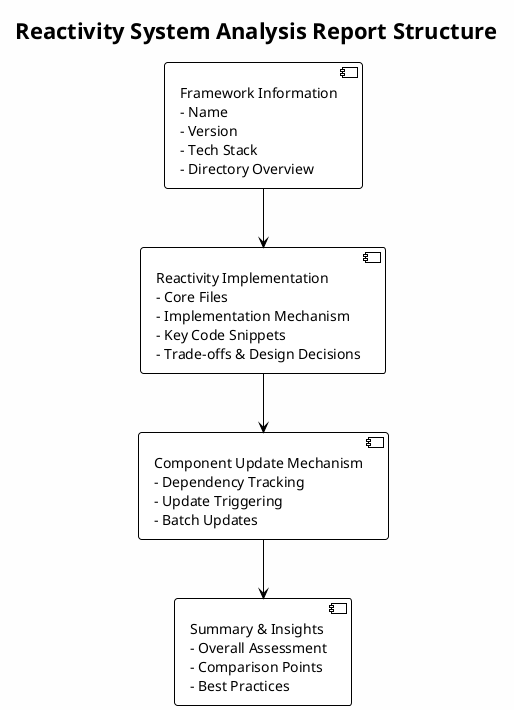

## Overview

This skill specializes in analyzing frontend framework source code to discover and explain how the reactivity system is implemented. It explores the codebase to identify core files, understand the reactive programming model, and document the actual implementation mechanism without making assumptions about specific approaches.

## How It Works

1. **Framework Detection**: Identifies frontend frameworks through package.json, directory structure, and key files
2. **Reactivity Keyword Search**: Searches for reactivity-related keywords (reactive, effect, watch, proxy, observable, etc.)
3. **Core File Identification**: Locates files containing reactivity implementation logic
4. **Code Relationship Analysis**: Maps dependencies and call relationships between core files
5. **Mechanism Documentation**: Summarizes discovered reactivity implementation in clear Chinese
6. **Bilingual Report Generation**: Generates comprehensive analysis reports in both English and Chinese with PlantUML structure diagrams

## When to Use This Skill

This skill activates when you need to:
- Understand how a frontend framework implements reactivity
- Compare reactivity implementations across different frameworks
- Learn about reactive programming patterns
- Document core reactivity implementation for learning or sharing

## Examples

### Example 1: Analyzing Vue Reactivity

User request: "Analyze how Vue implements its reactivity system"

The skill will:
1. Search for reactivity keywords in the codebase
2. Identify core files like `reactivity/*`, `core/observer/*`
3. Analyze the implementation (e.g., Proxy-based, effect tracking, dependency collection)
4. Document the reactivity mechanism with code examples

### Example 2: Analyzing SolidJS Reactivity

User request: "How does SolidJS implement fine-grained reactivity?"

The skill will:
1. Search for signal, effect, and reactivity-related code
2. Find the core reactivity implementation
3. Explain the fine-grained reactive system
4. Provide code snippets showing key implementation details

### Example 3: Comprehensive Reactivity Analysis with Bilingual Reports

User request: "Analyze the reactivity system of this framework comprehensively and generate reports in both languages"

The skill will:
1. Analyze the framework's reactivity implementation in detail
2. Identify key differences in approach and implementation
3. Document trade-offs and design decisions
4. Generate comprehensive analysis reports in both English and Chinese
5. Include PlantUML diagrams showing the overall report structure
6. Provide summary & insights with overall assessment, comparison points, and best practices

**Report Structure**:

**Output Files**:
- `reactivity-report-en.md` (English version)
- `reactivity-report-zh.md` (Chinese version)

## Best Practices

- **Exploratory Approach**: Don't assume implementation methods; discover them through code exploration
- **Keyword-Based Search**: Use diverse keywords to find reactivity-related code
- **Code Tracing**: Follow function calls and imports to understand the complete flow
- **Bilingual Documentation**: Generate reports in both English and Chinese with equivalent content
- **PlantUML Diagrams**: Include PlantUML structure diagrams to visualize report organization
- **Clear Documentation**: Use clear Chinese and English descriptions for technical concepts
- **Code Examples**: Include relevant code snippets to illustrate mechanisms
- **Summary & Insights**: Always include assessment, comparison points, and best practices in reports

## Integration

This skill integrates with the `structure-explainer` skill to provide comprehensive codebase understanding and can be invoked through the `analyze-reactivity` command.
